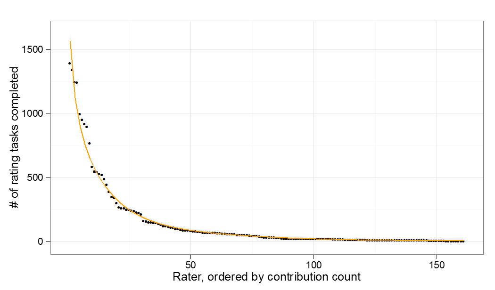

Interpreting Tasks for Objective Needs
=================================================

<!--
_Overview_
\begin{fullwidth}
\begin{quote}
Gathering annotations from non-expert online workers is an attractive method for quickly completing large-scale annotation tasks, but the increased possibility of unreliable annotators and diminished work quality remains a cause for concern.
In the context of information retrieval, where human-encoded relevance judgments underlie the evaluation of new systems and methods, the ability to quickly and reliably collect trustworthy annotations allows for quicker development and iteration of research.

In the context of paid online workers, this study evaluates indicators of non-expert performance along three lines: temporality, experience, and agreement.
It is found that user performance is a key indicator for future performance.
Additionally, the time spent by workers familiarizing themselves with a new set of tasks is important for worker quality, as is long-term familiarity with a topic being rated.

These findings may inform large-scale digital collections' use of non-expert workers for performing more purposive and affordable online annotation activities. 
\end{quote}
\end{fullwidth}-->

\newthought{Work supported through online} volunteer contributions or micropayment-based labor presents a strikingly different mode for annotating information items.
The accessibility of large groups of contributors online -- in the form of either interested volunteers or paid workers -- allows for large-scale annotation tasks to be completed quickly.
However, this approach also introduces new problems of reliability by problematizing assumptions about expertise and work quality.
The actual workers in these tasks are generally self-selected and unvetted, making it difficult to ascertain the reliability of the ratings.

Online annotations need to be both collected and interpreted.
Where later chapters focus on issues in collection, here the post-collection interpretative stage is considered.
In the absence of traditional measures of reliability, how do we know what online contributions can be trusted, and is it possible to improve their signal?

This chapter approaches a crucial problem: disambiguating the influence of unreliable annotators from natural uncertainty in multi-worker aggregation.[^ASISTcite]

[^ASISTcite]: A version of this chapter was previously published at ASIS&T 2012, with co-authors Miles Efron, Katrina Fenlon, and Megan Senseney [@organisciak_evaluating_2012]. Copyright retained by authors.

This goal is pursued for tasks with an expected truth -- that is, objective tasks.
However, a key assumption is made: that of a negotiated "ground truth" over an objective one.
By assuming that the truth-value is a negotiated truth, worker disagreement is not in itself a sign of bad workers, but should be considered in light of the agreement among workers.

This chapter makes the following contributions:

- Description of the problem of reconciling annotation contributions or work by non-expert, semi-anonymous workers.
- Evaluation of a number of approaches for separating worker quality from rating difficulty, including dwell time, worker experience, task difficulty, and agreement with other workers. 
- Introduction of an iterative algorithm that allows task difficulty (inherent disagreement) to be disambiguated from worker reliability (i.e. synthetic disagreement).

The scope of this study is in relevance assessment for information retrieval related to a cultural heritage aggregation.
Relevance assessments are a vital part of information retrieval evaluation and help in addressing the unique search challenges faced by large aggregators of cultural heritage content.

## Problem

Online annotation generally takes the form of short, fragmented tasks.
To capitalize on the scale and ephemerality of online users, services such as Amazon's Mechanical Turk (AMT) have emerged, which encourage the short task model as a form of on-demand human work.
Amazon describes the Mechanical Turk service as "artificial artificial intelligence," referring to the facade of computation with a human core.
The subtext here is that Turk enables the easy undertaking of tasks that require human perception – tasks such as encoding, rating, and annotating.

AMT has shown itself useful in information retrieval, where many individual human tasks benefit from parallelized contributions.
The workers are non-expert workers. 
However, their lack of domain or even task expertise is not inherently a problem: past studies have found that only a few parallel annotations are required to reach expert quality [@snow_cheap_2008] and that increasing the amount of parallel labor per item offers diminishing returns [@novotney_cheap_2010].
Training is possible on AMT, but the large workforce and transience of individual workers means that training conflicts with the cost and speed benefits of micropayment-based labor.[^Training]

As AMT has grown, however, the appeal of cheating has also grown.[^CheatingAppeal]
The workforce, who was originally a mix between those looking to pass time and those looking to earn money, has been shifting primarily to the latter[@eickhoff_increasing_2012].
Since reimbursement is done per task rather than per hour, contributors have a monetary incentive to complete tasks as quickly as possible.
The site's continued growth may attract more cheaters in the future, making it more important to be able to properly identify them within classification data.

[^Training]: The next chapter considers whether a small localized training can be effective on AMT, and whether it can be cost effective.

[^CheatingAppeal]: Anecdotal impressions by @mitra_comparing_2015 suggest that this is reversing.

Even among non-malicious workers, there is still the potential problem of varying expertise.
Workers begin a task with no prior experience and grow more experienced over time.
When there may be hundreds or thousands of workers, each one potentially following a learning curve, the effect of inexperience should be taken more seriously than in traditional settings with only one or a few workers.
Making decisions from majority voting is quite robust in many cases.
However, to safeguard against the presence of cheaters and their strengthened influence in low-consensus tasks, a less naive decision-making process may be valuable.

The problem of reconciling ground truth votes from unvetted and potentially unreliable workers is not limited to the use of Mechanical Turk.
Digital libraries now have the ability to interact with their users in ways that crowdsource the creation of new content or metadata.
Volunteer contributions may provide entirely new content – such as suggested labels or corrections – or feedback on existing content – such as rating the quality of an item's metadata.
While unpaid engagement does not have the same financial motivation for malicious workers, contributions that are open to the public are still susceptible to low-quality results: whether through recklessness, misunderstanding, mischief, or simply spam.
Furthermore, even when the ratings or annotations from unvetted semi-anonymous online workers are of a high quality, there is nonetheless a need to justify the quality of those ratings.

## Motivation

The impetus for the research in this chapter was a desire to improve the effectiveness of an information retrieval system for the Institute of Museum and Library Services Digital Collections and Content project (IMLS DCC).
The IMLS DCC is a large aggregation of digital cultural heritage materials from museums, libraries, and archives across the country. 
Originally launched in 2002 as a point of access to digital collections supported by the IMLS through National Leadership Grants and LSTA funding, it has since expanded its scope to provide more inclusive coverage of American history collections, regardless of funding source.
As a result of its position among the largest cultural heritage aggregations in the US, research through the IMLS DCC looks at the problems associated with reconciling content from thousands of different providers, including metadata interoperability, collection-item relationships, and access to materials.
One of the difficulties that IMLS DCC must address is information retrieval when the metadata records in its aggregation are of inconsistent length, style, and informativeness.
Overcoming these types of problems in order to improve subject access to the breadth of materials is an active problem [e.g. @efron_building_2011; @efron_improving_2012].
In doing so, human relevance ratings are an invaluable resource for evaluating document relevance in a given query.

## Related Work ^[Or, _what we already know_]

As non-expert classification has become more common, there have been a number of studies into the quality of its workers.
Generally, such studies have found that, while a single worker does not match the quality of an expert, aggregating votes from multiple earnest workers can match the quality of an expert. 

@snow_cheap_2008, found that for natural language processing tasks, only a few redundant classifications are necessary to emulate expert quality – their task required an average of four labels.
Similarly, @novotney_cheap_2010, looking at online transcription, found that the increase in quality from adding redundant annotations was small, and recommended allocation resources to collecting new data.
Additionally, they noted that disagreement measures are more effective for identifying and correcting for bad workers than they are for finding good workers, due to false positives among highly ranked workers.

In understanding the role of non-expert workers, a number of studies have taken differing approaches to ranking worker reliability and dealing with noise.
Some have attempted to model worker noise against gold standard labels [@hsueh_data_2009; @eickhoff_increasing_2012].
However, more commonly, researchers look at ways to understand worker quality without the presence of ground truth data. 
One common approach to separate the latent variable of worker quality from task difficulty enlists the Expectation Maximization (EM) algorithm, weighing worker judgments based on past performance [@whitehill_whose_2009; @welinder_online_2010; @wang_managing_2011].
The approach taken in this study is similar in principle to the EM algorithm. 

Raters have been treated as a mix of good or bad, where the nature of the problem is to identify the latter for removal [@dekel_vox_2009].
Other work has treated reliability not as an issue of replacing users, but rather of identifying low quality ratings to reinforce with additional ratings [@sheng_get_2008].

One notably unique concept of user quality was the assumption by @donmez_probabilistic_2010 that the quality of workers changes over time.
In other words, worker quality was considered a distribution over time, rather than an overall score.
Notable about this approach is that there are no assumptions about the direction of quality change by workers, allowing them to account not only for inexperience but also for occasional patches of low quality ratings by a worker.

Alongside prior work in representing non-expert workers, research has also considered using the information for deciding on future actions.
This has been considered both as an act of choosing the next tasks for a worker [@wallace_who_2011; @welinder_multidimensional_2010], and alternately an act of choosing the next workers for a task [@donmez_probabilistic_2010].

In 2011, the Text Retrieval Conference (TREC) held a Crowdsourcing track for the first time, which dealt directly with the evaluation of search engines by non-expert workers hired through micropayment services.
Teams looked at one or both of two tasks.
The first task was to effectively collect high-quality relevance judgments.
The second task, in line with the goals of this study, was to "compute consensus (aka ‘label aggregation') over a set of individual worker labels' [@lease_overview_2011].

There were two evaluation sets used with the second task of the TREC Crowdsourcing Track: one of consensus labels from among all the participating teams and one of ground truth gold labels done by professional assessors.
Accuracy rates – the number of properly labeled ratings divided by all ratings – spanned from 0.35 to 0.94 with a median of 0.835 against the crowdsourced consensus labels, while the runs against the gold labels spanned from 0.44 to 0.70 with a median of 0.66.
In achieving these results, the ten teams used a variety of approaches, including the EM algorithm, rules-based learning models, and topic-conditional naive Bayes modeling (ibid).

When measured by accuracy, the EM algorithm was among the most prominent.
The best performing team against each evaluation set – BUPT-WILDCAT and uc3m, respectively – both had an EM implementation in their submission, though the latter was paired with a number of additional rules.
However, uc3m's second, non-official run slightly outperformed the accuracy of their official submission with an approach using support vector machines (SVM) [@urbano_university_2011].

## Approach

The purpose of this study is to determine important factors in making truth value decisions from repeated ratings by non-expert workers.
In the context of paid microtask labor, this study looks to simultaneously interrogate worker quality and task difficulty, allowing the estimates of one to inform the estimates of the other. 

The factors that we consider are in the following three areas: 

-   _Temporality_.

    __RQ 1.1__: Does the length of time that a worker spends on a question reflect the quality of their rating?
 
-   _Experience_.

    __RQ 1.2__: Do workers grow more reliable over time?

    Can you account for the rating distribution given the worker's experience? In this study, tasks are grouped topically, by "queries".
    Workers were asked 'is this metadata record relevant to Query X' or 'what is the tone of Query X?'
    Subsequently, how a worker's experience with a query affects their performance was looked at.

-   _Agreement_.

    __RQ 1.3__: Does a worker's agreement or disagreement with other workers reflect their overall quality as a worker?

    __RQ 1.4__: If so, can disagreement be used for data improvements?

Most of the evaluations are measured through accuracy, which is percentage of correct classifications that are made:

$accuracy = \frac{\# of correct classifications}{total \# of classifications}$

There are two comparison sets of data by which ‘correct' classifications were taken.
The first was against consensus labels, which were simply generated by taking the majority vote for a given task.
Since these are derived from the actual dataset, they may not be completely reliable.
However, for comparative purposes, they offer us a metric by which to see trends in the data.

The cleaner set of ground truth data is a set of oracle ratings done by myself and the authors of @organisciak_evaluating_2012.
Since the authors are of known reliability and have a close understanding of both the rating task and the data being rated, the oracle judgments serve as an effective measure for evaluating the accuracy of the majority votes themselves.

## Data
Crowdsourced annotation is studied over two datasets in this study. 

In the dataset of primary focus, workers contributed judgements of the relevance of cultural heritage documents to a given query.
This data was rated with three-annotator redundancy, which means that for each document, there were three workers that completed the rating task.
There were three label options available to workers: _relevant_, _non-relevant_, and _I don't know_.
The unknown option was considered a skipped option and the data was removed from the final dataset. 

Annotations were collected through Amazon's Mechanical Turk service, using a custom rating interface.
When a worker accepted a judgment task, they were shown a page with a query, description of the task, description of the coding manual (i.e. what types of documents should be rated as relevant), and up to ten ribbons of documents to rate (see Figure @fig:ch3interface).

 {#fig:ch3interface}

The structured form of digital item records lends itself well to such tasks, which we represented through the title, description, and related image thumbnail.
To aid the task of scrolling through ratings and decrease the time spent on tasks, our interface automatically scrolled to the next tasks once the previous one was rated.

## Approach

The documents in the rating tasks were brief collection metadata documents, which workers annotated according to their relevance to a given query.
Workers contributed ratings ten items at a time.
The task set size was chosen for two reasons.
First, this allowed for less time loading and adjusting to new tasks.
If there was a learning curve for each query – as this study finds to be present, albeit minor – it seemed sensible to allow workers some time to rate once they grew comfortable with a task.
The second reason was to create a minimum usable profile of a worker's performance, which would have been difficult with fewer tasks.
Note that not all sets of tasks had ten items, as our system would track tasks that were completed or in progress, serving fewer than ten when ten were not available.

Originally $17700$ data points were collected, though this was later increased to just under $23000$.
The average amount of time spent on each individual item was $4.8$ seconds, with half of all ratings being done in less than $1.8$ seconds and full rating sets being completed in an average time of $37.3$ seconds.

 {#fig:ch3ratedist}

There were $157$ unique workers that contributed ratings, rating an average of $141.9$ tasks.
The most dedicated worker completed a total of 1404 ratings.
The distribution for contribution count resembles an inverse power law, a distribution commonly seen among contributions from online users (see Figure @fig:ch3ratedist).

For comparison with other tasks, a second dataset was also analyzed, in which workers classified the tone of a number of political tweets.
This Twitter sentiment dataset included more classification options - workers rated the tweet as having positive, negative, or neutral tone or whether it was incoherent or spam.

For both the primary and secondary datasets, there was an accompanying set of ground truth oracle judgments.
These were used for evaluation.

## Temporality

 > __RQ 1.1__: Does the length of time that a worker spends on a question reflect the quality of their rating?

Among the statistics collected for the relevance judgment dataset was _dwell time_: the time spent on each rating.
The hypothesis motivating this metric was that dwell time was not significant when understood independently, but might indicate the quality of workers when taking into account the order in which tasks were completed.
Since tasks were done in sets of ten, the order referred to where in this set they occurred.

 {#fig:ch3-dwell1}

Order served as a useful grouping factor because the time spent on the first rating is confounded with the time spent reading the rating instructions, which is to say that the two are inseparable.
Figure @fig:ch3-dwell1 shows the distribution of worker performance by dwell time alone.
As expected, a correct classification does tend to take slightly more time, 
but there is not enough evidence to reject the null hypothesis of equal distributions.
Thus, for this the setting of cultural heritage retrieval relevance judgments, dwell time alone is insignificant to performance (Wilcoxon rank sum $p=0.064$; $p=0.154$ when excluding extreme outliers).

However, dwell time considered alongside the order or task completion (i.e. how much time was spent on the first task? On the second?) tells a more complete story.

Consider first the amount of time that is spent on each $n^{th}$ task.
Pairwise Wilcoxon Rank Sum tests show that the amount of time spent on the first rating in a set is significantly different from all other ratings ($p<0.001$, with Bonferroni adjustment), as were all pairwise comparisons with the second rating in a set ($p=0.02$ vs order 3, $p<0.001$ vs all others; Bonferroni adjustment).
Notably, however, we fail to reject the null hypothesis for all other ratings in a set.

This means that there is extremely little difference in time spent between a worker's third and tenth ratings, as well as all comparisons in between.
This is more abrupt than the gradual decline that was expected, and suggests that the learning curve for a worker to rate comfortably is only the first two ratings.

Comparing the accuracy of ratings by dwell time, the time spent on the first rating of a set is significantly higher for ratings that are correct than those that are incorrect (Wilcoxon Rank Sum one-sided $p=0.01$).
This stands in contrast to every rating after the first one, none of which show significant difference in time spent on ratings that are true and ones that are false.

The measurement of dwell time for the first item in an item set is confounding with the readying of instructions^[Which is to say, we had no measurement for when a worker's attentions turn away from the background material at the start of a task toward the first task in the set of ten.]
The fact that a worker spending more time on the first rating indicates a higher likelihood of correctness suggests that there is a latent effect in how closely people read the description, 

If this is in fact what accounts for the significant different, it should be an effect that lingers across the full set of data.

 {#fig:ch3-prob-after-first}

Figure @fig:ch3-prob-after-first shows this to be the case, with workers that make a correct rating on the first item are much more reliable in the rest of the rating set.

As part of the rating instructions, workers were presented with a description of what types of results are relevant to the given query (see screenshot in Figure @fig:ch3ratedist).
If a worker does not read this section carefully, their ratings would be more interpretive, possibly resulting in inconsistencies with workers that followed the instructions more carefully.

With regard to _RQ 1.1_, the amount of time that a user spends on each task is not, by itself, an indicator of a quality contribution.
However, workers that spend more time at the start of a task set, particularly before their first contribution, _are_ shown to perform better.

### Experience

 > __RQ 1.2__: Do workers grow more reliable over time?

An extension of the order grouping factor, the next factor considered was the long-term experience of a worker.
Experience was looked at in two forms: lifetime experience and query experience.

_Lifetime experience_ is the overall number of tasks that a worker has completed.^[_Lifetime_ refers to the task type, such as _all relevance judgments_, not all tasks completed on the platform.]
Is a worker's 100th task more likely to be correct than their first task?
The hypothesis motivating this was that over time workers would grow more reliable.
However, this hypothesis proved to be incorrect.

 {#fig:ch4-lifeexp}

Lifetime experience was not an indicator of contribution quality.
Plotting makes the case emphatically: Figure @fig:ch4-lifeexp shows the distribution of ratings across lifetime experience.
Each point represents the percentage of the $n^{th}$ ratings that were correctly rated.
If a point at position $x$ shows an accuracy of 0.80, this means that 80% of tasks which were workers' $x^{th}$ rating agreed with the majority, our estimated value for the correct label.
As is apparent, there is no trend with increased lifetime experience, or it is confounded by other things.

The second measure of experience, query experience, refers to the number of tasks that a worker has completed within a single topical domain.
In information retrieval relevance judgments, workers are asked to judge whether a document is relevant to a given query; thus, the query experience.
Similarly, in the secondary dataset of Twitter sentiment ratings, workers were asked to annotate the opinion of the tweet regarding a given topic; i.e. what is the sentiment toward entity _Q_.

 {#fig:query-experience}

Query experience proved to be an indicator of worker quality among the most experienced users, but not notable otherwise (Figure @fig:query-experience).
For approximately the first thirty tasks which workers completed with a single query, they did not demonstrate any meaningful difference in quality.
However, ratings beyond that point showed a sharp increase in quality.
What is unclear, is whether this is an effect of improvement through experience, or self-selection by better workers.
Regardless, for the purposes of determining what information to trust from a data perspective, this distinction is not greatly important.

With regard to RQ 1.2, workers do not appear to improve with practice for the type of task studied.
The sole exception is the most experienced experienced workers, which may be a factor related to the self-selection of which workers stay around for that long.
<!-- TODO: redraw chart with stardard error bars -->
As noted above, it only took about two ratings for most workers to get into the groove of relevance judgments.

## Worker Agreement and Task Difficulty

 > __RQ 1.3__: Does a worker's agreement or disagreement with other workers reflect their overall quality as a worker?

 > __RQ 1.4__: Can disagreement be used for data improvements?

Finally, in addition to worker experience and time spent per tasks, this chapter looks at the ability of worker agreement and task difficulty to discern the accuracy of ratings.
The reason that these were considered together is that they are invariably confounded: a task has as little as three ratings informing any estimates of the quality, and those ratings are each biased by the quality of the specific workers involved.
There were two approaches looked at: identifying and replacing low quality workers, and an iterative algorithm for weighing workers and tasks.

### Replacing Problem Workers

One of the immediate problems with our primary data was a low-worker agreement (Fleiss' Kappa = 0.264).
In our first attempt to improve the agreement between workers, we identified low-quality workers and replaced their contributions.
First, a confusion matrix was calculated for all workers and an accuracy rate was taken as a measure of a worker's reliability.
Raters below a certain threshold were removed and new workers replaced their ratings.
The threshold chosen was $0.67$, meaning workers whose ratings agreed with their co-annotators on a task less than two-thirds of the time were removed.

The threshold for removing workers was supported by a simulation where an undiscerning worker was emulated, replacing randomly selected classifications in the data with its own random ratings.
While a worker in an environment completely populated by random workers would be in the majority two-thirds of the time, inserting random workers alongside the real workers in the data provides a more realistic estimate.
Across $100$ runs, the mean accuracy rate of the random worker was $0.680$, with a median of $0.677$ and standard deviation of $0.080$.
In other words, the workers whose data was removed -- with an accuracy less than 67% -- were less likely to be in the majority opinion on a rating than a randomized bot.
This accuracy rate also puts our data in perspective, falling somewhere between the $0.75$ agreement that would be expected of a random worker in a completely random triple-redundancy labeling system and the $0.50$ agreement expected of a random worker in an ideal human setting with all other workers agreeing on ratings.

There were $23$ workers below or at the threshold that were removed, accounting for $2377$ ratings ($17.7\%$ of the data).
Notably, there were $10$ workers with a total of $1069$ ratings that had accuracy rates right at the threshold, meaning that nearly half of removed ratings would not have been taken out with a slightly lower threshold.

After removing problem workers, there was an increase in kappa score from $0.264$ to $0.358$.
The increase in intercoder agreement is expected, given that our metric for problematic workers is how much they agreed with other workers.
However, since these workers were by definition already in the minority much of the time, their influence on actual votes was not high.
Thus, the assumption to test is whether, when low-agreement workers do end up in the majority, they cause damage by influencing votes in the wrong direction.

In fact, the negative quality impact of problem workers proved to be very small.
The accuracy rate of final votes after replacing them increased from $0.856$ to $0.862$.

An alternative to selective replacement of problem workers is selective redundancy.
Rather than removing data, one can take the approach of adding more labels, as encouraged by @sheng_get_2008.
This approach resulted in an increase to $0.859$, a smaller increase than that of removing problem workers.
In other words, majority rating proved fairly efficient at smoothing over individual bad workers, limiting their influence.

In order to further increase worker agreement, one could presumably run the replacement process again.
However, when non-expert labels are being paid for, removing problematic workers can grow quite costly – especially given the low payoff in accuracy.
A cheating or sloppy worker can also rate many ratings quickly, making the potential lost profit even higher.
However, the removal and blocking of low-agreement workers can be automated fairly easily, making it possible to incorporate in real time within a rating interface. 

Why were some workers correct – or at least in the majority opinion of what a correct rating is – less than chance?
One possibility is sincere workers misunderstanding the task.
@wang_managing_2011 refer to such situations as recoverable error and offer a method for identifying consistently incorrect workers and correcting their votes.
In the case of binary data such as our relevance judgments, this would simply mean inverting relevant votes to non-relevant, and vice-versa.
However, none of the workers in our data would improve with such an approach, and it seems like an unlikely occurrence for a worker to make such a drastic mistake systematically.
However, it is possible that less drastic misinterpretations can lead to problems with difficult tasks due to misunderstanding the delineation between categories.
As we found in our tests on dwell time, workers that appear to spend less time on instructions tend to make more errors: perhaps subtle misunderstandings can lead to consistently poor performance.

### Iterative Optimization

While removing workers based on their error rate has a positive effect on the data, it does not take into account the difficulty of the task that is being completed by the worker.
If a worker has the misfortune of being assigned a particularly difficult or debatable set of results to rate, their error rate may prove to be quite high.
More unfortunate still, a worker may be rating alongside numerous low quality workers.
If two low quality workers disagree with one higher quality worker, the dissenting worker's reliability should reflect the circumstances.
There may be latent variables that are not accounted by our system which adversely affect the data.

To account for unknown variables and separate out signal from noise, an iterative algorithm was developed to simultaneously weigh worker votes and the difficulty of the task.
In line with the purpose of this study, this approach allows one to not only evaluate workers, but to separate out the effect of the task itself.

\newthought{The algorithm iterates over two steps.}

In the first step, an expected truth for each document is calculated, given the information that is available about that document, the possible labels for that document, and the workers evaluating that document.
Early on, that information is limited: while it is known how often each option was chosen for each document rating and how often each worker used each option, there is no information about the quality of the ratings or the workers making them.

In the second stage of the algorithm, the assigned labels of the expected votes are used to update the parameters that are used in step one.
This involves assigning values of confidence for the results and determining worker quality based on that confidence value.
After this stage, the algorithm was iterated again, returning to the first stage for voting on the expected true value.

This algorithm converges or approaches a convergence limit after a number of iterations.
The number of iterations that are required before the data converges varies, but only a few are generally needed for relatively simple data such as information retrieval relevance judgments.

The anticipated benefit to this approach is that worker quality is less dependent on circumstance.
Consider the following scenarios:

- A worker makes a dissenting rating on a difficult task.
To form an opinion only on whether they agreed or disagreed with other workers would be unfair to this worker and possibly remove authority from a good worker.
For example, in an instance with five workers, there is a difference in whether a worker is the lone dissenter against a majority of four or one of two dissenters against a majority of three.
In the latter case, there is a more uncertainty in what the truth value really is.
Unfortunately, this scenario is limited for instances with only two categories and three workers, such as a large portion of this study's relevance judgment dataset.

- A cheating worker is correct by chance.
As the earlier simulation found, a random voting worker will be correct 67% of the time in the relevance judgment dataset.
By weighing this worker's vote according to their overall reliability, their votes, even if correct, will hold less sway.
By setting their reliability score based on the confidence in their ratings, their influence will be even lower in subsequent iterations.

For confidence scores $C_{i} \in C_{i1},C_{i2},\ldots C_{il}$ where $l$ is a set of all possible labels – $L \in {0,1}$ for the cultural heritage relevance judgements and $L \in {0,1,2,3,4}$ for the Twitter sentiment ratings – the truth value vote is always chosen as the highest confidence label: 

$V_i=\max{j}{C_i}$

As the vote can change in subsequent iterations, it is a _soft label_.

Since voting is always done on the highest confidence label, a number of methods were evaluated for assigning a confidence value to a rating.
For calculating vote confidence, we looked at the following approaches:

-   Probability of worker agreement for label $j$ of rating task $i$.
    This approach represents simple majority voting and was used
    for comparison.
It counts the number of $i$ category labels,
    $|l_{i}|$, and divides it by the total number of labels received by
    the task:

$C_{ij} = \frac{|l_{ij}|}{|l_{i}|}$

> Due to the lack of worker influence in the expression, this does not
> require iteration, as it will not change.

-   Probability of worker agreement for task $i$ given a worker of quality
    $U$.
This approach, taken before in @sheng_get_2008, weighs confidence
    $C$ according to the mean worker reliability scores of the workers
    choosing each label:

$C_{ij} = \sum_{j}U_{ij}\frac{|l_{ij}|}{|l_{i}|}$

-   A weighted ranking function previously described in @organisciak_iterative_2012. 
    This heuristically-determined approach accounts for higher numbers of
    redundant workers, while also offering diminishing returns on each worker added.

$C_{ij} = log(1 + \left| l_{ij} \right|*\prod_{k = 1}^{|l_{i}|}\frac{\left| l_{i} \right|}{\left| l_{i} \right| + \left| l_{ik} \right|*U_{ik}})$

In addition to task confidence, numerous approaches were evaluated for weighing worker scores.
The basic approach is to use the mean confidence for every single rating that a worker has made before.
However, there are two problems with doing so.
First, since task confidence is bound between zero and one, setting workers' scores based on confidence alone will result in continuously declining worker reliability scores between iterations, without any sort of convergence.
Such an inequality would also be unevenly distributed, algorithmically punishing workers with more completed tasks.
Secondly, since a random worker has an average accuracy of 0.67 in our dataset, the range between good and bad workers is small and skewed upward, making it ineffective for weighing votes.
Ideally, on a task where two theoretical cheaters disagree with a near-perfect worker, an early iteration should flip the vote in favor of the better voter.

Rater quality was weighed in the following ways:

- Exponential decay.
Reliability scores are calculated by the mean confidence of a worker's tasks and then raised exponential, to the power of two or three, depending on how aggressively the algorithm's confidence weighting is.
A decay function can disrupt an algorithm's convergence and requires lower boundaries.

- Reliability score normalization.
The mean of all reliability scores is normalized to a value of 1.0.
This weighting is calculated as the sum of all reliability scores divided by the number of workers: 

$U_{i} = U_{i}\frac{1}{|U|}\sum_{j}^{}U_{j}$

- Relative scoring.
Reliability scores are calculated on the confidence of their ratings relative to the highest rating in each set.

For comparison, we also ran a worker reliability scoring function as described in @wang_managing_2011, which is based on the accuracy rate of the workers (i.e., how many they rated correctly compared to incorrectly) without any weight given to the confidence in the tasks that they completed.
The various techniques for calculating confidence and setting worker reliability scores were combined in sensible ways and evaluated. 

Accuracy rates were recorded for the number of correct labels applied at the fifth iteration of each algorithm. 

Robustness was also tested, by emulating malicious workers.
Bots replaced random workers' ratings with their own undiscerning ratings.
The false ratings consisted of 5% of the data and were used to see whether there were differences in how the algorithms handled clear cheaters. 

The algorithm combinations were as follows:

*Majority*: The baseline vote based on majority labels.

*Basic Algorithm*: Described by @wang_managing_2011.
Confidence is weighed by worker reliability, and worker reliability is dependent on basic accuracy rate.

*Basic with Reliability Decay*: Modification of basic algorithm, with exponential worker reliability score decay.

*Regular with Reliability Decay / Normalized / Relative Scoring*:
Confidence is weighed by worker reliability, and worker reliability is weighed in one of the ways introduced above.

*Alternate Algorithm*: Confidence is calculated using the approach previously described in @organisciak_iterative_2012.

+----------------------------------------+-----------+-----------+------------+
|                                        | IMLS DCC  | Twitter   | IMLS DCC   |
|                                        | Relevance | Sentiment | Relevance  |
|                                        | Ratings   |           | Ratings w/ |
|                                        |           |           | cheater    |
+========================================+===========+===========+============+
| Majority Vote (baseline, no iteration) | 0.8573    | 0.5618    | 0.8479     |
+----------------------------------------+-----------+-----------+------------+
| Basic Algorithm [@sheng_get_2008]      | 0.8590    | 0.5876    | 0.8494     |
+----------------------------------------+-----------+-----------+------------+
| Basic w/ Reliability Decay             | 0.8669    | 0.6082    | 0.8605     |
+----------------------------------------+-----------+-----------+------------+
| Regular w/ Reliability Decay           | 0.8590    | 0.5979    | 0.8557     |
+----------------------------------------+-----------+-----------+------------+
| Regular w/ Reliability Normalization   | 0.8590    | 0.5876    | 0.8494     |
+----------------------------------------+-----------+-----------+------------+
| Regular w/ Relative Reliability        | 0.8621    | 0.5825    | 0.8479     |
+----------------------------------------+-----------+-----------+------------+
| Alt. Algorithm                         | 0.8637    | 0.5928    | 0.8510     |
+----------------------------------------+-----------+-----------+------------+

Table: Accuracy rates of iterative algorithms on different datasets. All iterated data shown at 5th iteration. {#tbl:ch4-accuracy}

Table @tbl:ch4-accuracy displays the accuracy ratings for the various runs.
This can inform a number of observations.

Again, the majority voting appears to be quite effective.
Consider the baseline majority accuracy of 0.8573 in comparison to the similar task of relevance judgment in the TREC Crowdsourcing Track, where the best algorithms peaked at $0.70$ accuracy [@lease_overview_2011] of the gold label set, and it becomes clear that our dataset is fairly clean from the start.
The effectiveness of the baseline majority vote for the primary data is also accentuated by the relatively small gains in accuracy that is gained by the algorithm combinations.

In contrast, the Twitter sentiment dataset has a much lower baseline.
The bandwidth of contribution with this data is considerably more spread out — where with the binary categories the worst case scenario for three workers is agreement between only two, the five-category Twitter data can result in no agreement.
With the Twitter data, workers also showed an aversion to administrative categories: when the oracle worker would rate a message as "spam" or "incoherent", the online workers avoided doing so.
In our IMLS DCC data, this worker coyness was seen with the "I don't know" ratings, but those were treated as missing data and removed.

For its lower starting point accuracy, the Twitter data showed greater improvements in accuracy with the iterative algorithms than the relevance ratings.
Similarly, the iterative algorithms proved more robust against the cheaters that were artificially inserted into the data.
This seems to point to their usefulness with particularly problematic data.

The iterative algorithms did not have the same effects, however.
Notably, the basic algorithm with an exponential decay performed better than expected.
This algorithm weighs voting according to worker reliability scores, but rather than weighing worker reliability by the confidence in the rating that the worker makes, it simply uses the worker's accuracy rate.
By applying an exponential decay to the worker reliability scores, it gives the generally conservative algorithm more power to pull down low quality workers.
Still, one possibility for this surprising result is that it is not as aggressive in separating out workers as the other versions.
A future direction worth exploring would be a deeper look into the individual votes that flip or do not flip with these algorithms, and how often good votes are accidentally overturned.

Investigating an iterative algorithm for optimizing worker quality and task difficulty, we found that it held limited usefulness for three-annotator two-category annotation.
This is likely due to the limited amount of variance allowed by the structure.
There are only two states of majority opinion –three-annotator consensus or a two agree/one disagree– meaning that when a worker disagrees there is little information on whether it is because they are a bad worker or because it is inherently a difficulty to agree-upon tasks.
More information can become available by including more categories or increasing the number of workers.
However, including more workers also has a positive effect on quality.
Thus, the experience of this study is that for binary labels, majority rating is generally robust enough.

With regard to RQ 1.3: agreement does seem to indicate quality for objective-normative tasks. However, while removing high disagreement workers improves, well, measures of agreement, for low granularity tasks like relevance judgments it more fruitful to collect multiple independent contributions rather that seeking to punish the black sheep workers.
Still, for more complex data like the Twitter sentiment ratings, correcting judgments based on measures of a worker's quality (by proxy of agreement) is effective.

## Conclusion

This study looked at the growth of online annotation microtasks and the problems of non-expert workers, looking at indicators of performance among non-expert performance.

Most significantly, it was found that workers who spend more time on the first rating of a task set are significantly better performers on that task.
This points to a latent variable in the instructions of the task.
Indeed, the effect of extra time on the first rating seems to follow throughout a task, and *annotators that are correct on the first task are more likely to be correct on subsequent tasks in a set*.

We also looked at the effect of experience on a worker.
Generally, the amount of overall rating experience a worker had at the point of a rating did not reflect on their quality.
However, a worker's *query* experience does result in better performance, though after some time.

Finally, this study looked at agreement as an indicator of worker quality.
For simple tasks, there is a notable robustness in the basic agreement measure of whether a worker is in the majority opinion of a multi-annotator annotation.
For more complex tasks or noisier data, an iterative algorithm can offer slight improvements on majority opinion.

Just because there is disagreement does not mean that the data is problematic, however.
It was found that high disagreement among non-expert workers is not necessarily indicative of problematic results.
Low inter-rater agreement may indicate a difficult task or individual rogue workers.
While inter-rater agreement can be increased significantly by replacing the work of low quality workers, the improvement in accuracy is less defined.

\newthought{These results shed light on} the characteristics of workers on a simple relevance judgment tasks. However, the most interesting finding seems to suggest the importance of a worker's time spent internalizing the codebook. Are there ways to encourage this sort of behavior? What other changes can we make through collection-time tweaks? The next chapter shifts focus to these issues.
