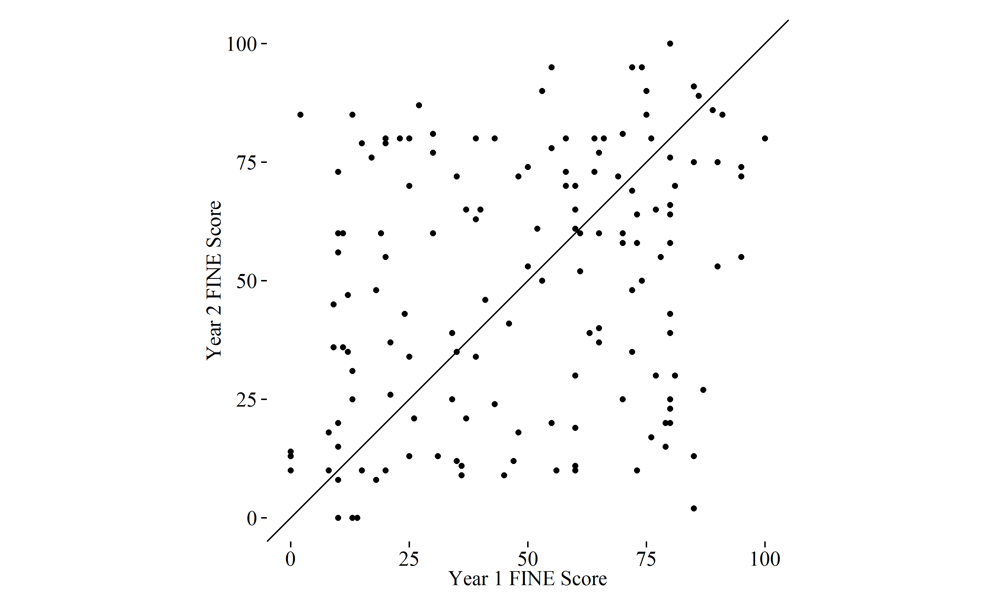
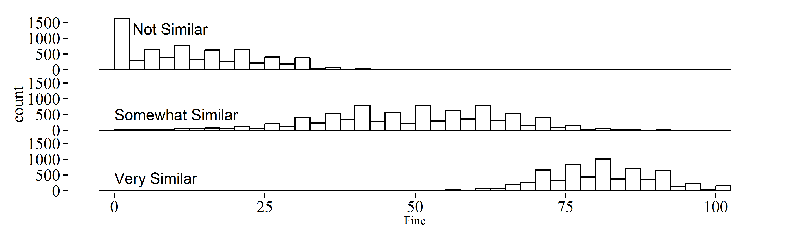

# Designing Tasks for Objective Needs 2

The next chapter will turn to more subjective settings.
Before continuing, however, it is worth reported on one more study of objective task design, one which has been extracted to its own section because the study looks at both posterior data correction and task design corrections, as discussed in the two chapters prior, while the findings bridge the shift in focus from objective task design to subjective.

\newthought{Judging the similarity of audio} is a difficult and time-consuming task.
Since 2006, the Music Information Retrieval Evaluation eXchange (MIREX) has been using volunteer human judges for evaluating the performance of
music systems submitted to the Audio Music Similarity and Retrieval (AMS) task.[^JCDLCite]

[^JCDLCite]: A version of this work was previously presented at JCDL 2015, with co-author J. Stephen Downie [@organisciak_improving_2015]. Copyright held by ACM, permission provided for dissertation reuse.

After analyzing four years of crowd judgments from AMS, finding that the consistency across different raters and years is remarkably poor, this chapter looks at the role of crowdsourcing design and modeling choices in this data variable.
Following from the previous chapter and especially the first half of this chapter, the low inter-coder consistency is tackled from both a collection approach perspective and a post-collection perspective. 
Specifically, user normalization, collection instrument design changes, and multiple independent judgments are pursued.

The primary contribution here is a better understanding of data issues that stem from crowdsourced music evaluation datasets, and methods to avoid data quality pitfalls.
Particularly, our case study of music information retrieval judgments generalizes to a class of evaluation tasks that are subjective-biased.

Music similarity is desired by music digital library users [@lee_survey_2004], and other digital libraries deal with a comparable form of *normative* task where there is no absolutely correct ground truth but a desire to reach a consensus or
a generally agreeable classification; e.g. item similarity ratings,
information quality judgments, and information retrieval relevance
judgments.
The findings are also important to understanding the reliability of Audio Music Similarity evaluation, and we provide recommendations to improve future tasks.

## Background

MIREX is an annual evaluation event where techniques tailored to a variety of Music Digital Library (MDL) and Music Information Retrieval
(MIR) tasks are submitted by research laboratories from all over the world.

The Audio Music Similarity and Retrieval (AMS) task was started in 2006.
AMS resembles a classic information retrieval scenario, whereby the systems being evaluated are expected to return a ranked list of audio items that are considered similar to a given query [@downie_music_2010].
It is also desired by digital library users: in a survey of MDL users, 54% said they were likely to use music similarity functions [@lee_survey_2004].
AMS relies on human judgments for evaluation, recruiting volunteers each year to judge the similarity of song “candidates” to randomly selected queries.

For each query song, each retrieval system under evaluation gives MIREX a list of candidate similar songs.
These query–candidate sets are presented randomly to evaluators in a judging system called 'Evalutron 6000' (E6K) [@downie_music_2006; @gruzd_evalutron_2007].
To avoid exhaustion, E6K saves judgments continuously, so that judges can step away and return without losing data.

## Data

$26024$ human judgments of audio similarity were compiled, comprising four years of MIREX's AMS judgments.
The candidate songs were selected for judgment by 8 submitted systems in 2010, 18 in 2011, 10 in 2012, and 8 in 2013.
Until 2011, 100 queries were evaluated each year, after which MIREX shifted to 50 queries per year.

All the candidates for a query were graded on two scales of similarity:

 - The __BROAD__ scale is a categorical ranking from three choices: "not similar", "somewhat similar", and "very similar".
 - The __FINE__ scale is a 101-point numerical rating, from 0-100.

The judges were generally trusted volunteers from the MIR community, and multiple keying was not done.

To understand the consistency of judgments across years of MIREX, we need to look at song pairs that have recurred in judging.
Since AMS evaluation queries are randomly selected each year, there are only two instances where a query has recurred.
However, $80\%$ of queries have also occurred as candidates for other songs.
As a result, there are
$156$ judgments of the same song pairs across the years, with the caveat that the query-candidate relationship is inverted.[^inverted]

[^inverted]: Indeed, the initial spark that led to this study was a curiosity in whether the query-candidate assignment of a song pair -- i.e. which song is presented as the query, which song is presented as the candidate -- was meaningful. By studying other possible sources for the variance in the data, as will be seen, a significant portion of the error was accounted for, not precluding but certainly limiting the potential magnitude of a query order effect.

\newpage

## Problem

There is a concerning lack of agreement between judges in the set of reciprocal song pairs.
Since our best prediction for the true similarity of two songs is the mean of both judgments, we can measure the deviation from the expected value as Root Mean Squared Error (RMSE).
In this case, $RMSE=16.58$ against a prediction assuming symmetric similarity.

RMSE is generally meaningful in comparison, but for a sense of the variance with an RMSE of 16.58, consider that it is in the same unit as the scale, which only has a max range of 101 points[^STDdev].
Alternately, the FINE scale judgements are plotted in Figure {@fig:recip-fine}, which shows this variance clearly.
The slope shows the expected relationship if similarity was an agreeable metric independent of "which song is listened to first" order effects – an assumption implicitly made in treating similarity as something that can be evaluated.

 {#fig:recip-fine}

[^STDdev]: It may be helpful in approximating the severity of the problem to remember that RMSE aligns with sample standard deviation in a normal distribution. No assumptions are made about distribution in this case, but in a normal distribution, a range of about 53 points on the scale would be required to represent 95% of contributions.
 Alternately, the RMSE of uniformly distributed random judgments would be approximately 40-41.

The noise presented here suggests a great deal of circumstance and randomness in evaluating music similarity algorithms for MIREX.

Comparing the BROAD category of reciprocal pairs tells a similar story (Table {@tbl:amscorr}): only $35\%$ of judges agreed on the category and nearly half was agreement on “somewhat similar” item.
While some of this is to be expected, it also suggests that *SS* functions as a catch-all category where judges hedge their bets.
This is supported by its much wider range (Figure @fig:all-dist).

  ---------------------- ---- ---- ----
                         NS   SS   VS
  Not Similar (NS)       5    —    —
  Somewhat Similar (SS)  20   14   —
  Very Similar (VS)      10   21   8
  ---------------------- ---- ---- ----

Table: Relationship of categorical judgments for pairs of songs that have been judged twice over a four-year span of AMS. {#tbl:amscorr}

The weak correlation in re-judging makes it difficult to assess the extent to which the evaluation is actually reflecting the 'truth' of what songs are similar.

What are the reasons for this weak correlation?
This study considers this question in the context of crowdsourcing choices, looking at collection format and data treatment as possible sources for the variance.
First, lets consider some possible explanations.

\clearpage

- **Order and priming effects**.
  Perhaps there is an order effect based on either which song a judge listens to first, or a priming effect caused by a judge listening consecutively to a set of song pairs with the same query.
  Research in other contexts has noted the possibility of asymmetrical effects [@tversky_features_1977; @polk_rating_2002; @hiatt_role_2013].

- **Different interpretations of the scale**.
  Do different people treat the rating scale differently? This would be a user bias, but a predictable one.

- **Bad intercoder reliability due to task design**.
  Perhaps the E6K system does a poor job controlling for consistency?

- **Bad judges**.
  Much crowd research looks at malicious or unreliable contributors.
  This is possible, but unlikely to happen systematically since the volunteers are trusted members of the MIR community.

- **An inherently subjective task**. Does this task present challenges to agreement?

It is likely that the noisy, high-variance MIREX music similarity judgments stem from multiple sources.
In line with the thrust of this dissertation, I focus on measuring how much of that is recoverable: what can be improved by changes to practice.
The rest of this chapter will at consider 1) corrections for user-specific biases, 2) multiple-keyed judgments, and 3) a task design.
While order effect are not focused on, partially because their measurement is possibly confounded by the other issues, this chapter's positive results -- showing improved judgment consistency -- provide a better sense of the magnitude at which such effects might exist.

 {#fig:all-dist}

## Related Work

The feasibility of scoring melodic similarity has been challenged by
@marsden_interrogating_2012, who noted high variation in MIREX 2005 similarity judgments.
Though on different MIREX data, our study is able to identify collection instrument design as one such factor source of variance.

An alternative to the form of graded similarity judgment that MIREX uses is partially ordered lists, introduced by @typke_ground_2005.
This form of judgment has been shown to be effective for judging the relative similarity of candidates to a query.
However, it is more time-consuming to create, a factor in the decision to use a graded scale for MIREX.
Also, it suffers from similar inconsistency problems to what we observe in this paper
[@urbano_crowdsourcing_2010].

Despite the inconsistency observed in this study, research into the power of AMS evaluation for a year not overlapping with our study concluded that the relative rankings of AMS systems in MIREX are sound, with contention on about 4% of pairwise system comparisons [@urbano_audio_2011].
This chapter turn to Mechanical Turk for additional judgments, an option shown as a viable approach to music similarity judgments in multiple studies [@urbano_crowdsourcing_2010; @lee_crowdsourcing_2010].

@urbano_crowdsourcing_2010 looked to paid crowdsourcing for lowering the difficulty of finding human labor for *ranked* similarity judgments.
They use an approach similar to ordered lists, inferring an order through pairwise preference judgments, whereby judges choose the more similar option between two candidates.
Additional research has also looked at *graded* similarity judgments in the context of the AMS task [@lee_crowdsourcing_2010], finding that the MIREX style of evaluation does not suffer significant drops in quality with paid workers.

## Approach

To address possible sources of the error in MIREX's crowdsourced relevance judgments, four approaches are taken:

 1. Normalizing workers by their personal habits;
 2. Asking new, different judges for judgments;
 3. Adding additional redundant judges[^languageAMS];
 4. Testing an alternate interface that gives judges more guidance on what rating is appropriate.

[^languageAMS]: Since this chapter involves volunteer contributions, contributors are not uniformly referred to as _workers_, as in the other chapters, except when discussing paid contributors.

## Normalizing for Grader-Specific Effects {#normalizing-workers}

  > _RQ1_: Are intra-judge inconsistencies responsible for the lack of reciprocation in AMS similarity judgments?

The human judges are given a large amount of leeway regarding how they perform a task.
We set out to see if this contributes to superficial variance, and whether correcting for it can address the poor reciprocation in AMS.
While the BROAD categories are fairly clear, the
FINE scale does not constrain judges to follow a specific codebook.
This is appears to be done by design: workers are told, 

>> You have the freedom to make whatever associations you desire between a
particular BROAD Category score and its related FINE Score.
>> In fact, we expect to see variations across evaluators with regard to the
relationships between BROAD Categories and FINE Scores as this is a
normal part of human subjectivity.

Instructions continue to suggest that judges apply a level of 'reasonableness' regarding what is intuitively sensible.
For example, a low FINE score when the BROAD category is 'very similar' is not reasonable.

This type of error is commonly seen in collaborative filtering for recommendation, where users' opinions are often treated as a mixture of their nominal rating, adjusted by user-specific and item-specific biases [@koren_bellkor_2009].
To normalize judges against their specific biases, FINE judgments were translated to z-score values, represented as standard deviations from the judge's mean rating habit.
This approach was previously seen in
@hofmann_latent_2004; in our case, adjusted ratings were blocked by a judge's BROAD score, resulting in three values for each judge: deviation from their typical FINE score for "not similar", "somewhat similar", and "very similar" candidates.

The adjusted rating $r^{'}_{u,b}$ for judge $u$ and BROAD category $b$ was calculated in the following way:

$$r^{'}_{u,b} = \sqrt{\frac{1}{N}* \sum\nolimits_{i=1}^N{ r_{u,b} - \mu_{u,b} } }$$
 where $b \in B$ and $B=\left\{ {``NS'',``SS'',``VS''}\right\}$.
Since this normalization provides ratings against three different scales, we mapped it back into a new FINE score by assuming a normal distribution for each category.
With this mapping, 95% of not similar ratings occur between $FINE=0-27.63$; somewhat similar ratings between $30.21-67.80$; and very similar ratings between $68.74-92.17$.

### Results

Normalizing user FINE judgments weighted against their BROAD judgments resulted in variance of $RMSE=16.15$, a non-significant change.
Thus, there is no evidence that greatly different internal scales by judges were the reason for the low consistency.
In other words, the notion that judges were internally consistent in a way that can be normalized globally is not tractable.

## Verifying Judgments with New Graders

  > _RQ2_: Are problem judges responsible for inconsistent reciprocal ratings?

  > _RQ3_: Is subjectivity or disagreement of the grading task responsible for inconsistent reciprocal ratings?

Would the same low consistency be seen if new judges were asked?
Getting a second opinion addresses two possibilities: expected error (good judges, biased task) and unexpected error (agreeable task, bad judges).

To answer these two research questions, $156$ tasks were posted on Mechanical Turk.
Asking paid workers *individually* provides an insight into MIREX judge quality, while asking *multiple* workers helps to see if it is simply a task that is not easily agreed upon, regardless of how well-intentioned a judge is.

In parameterizing the task for this study, worker judges were presented with a query and a single candidate.
The audio files were the same clips used in MIREX.

Restrictions were not placed how fully the clips were listened to, and in fact the average task time was lower than the length of the clips.
The task was carefully designed to mimic the question phrasing and level of guidance from the original task.
As a result, Turk workers are potentially less fatigued [@lee_crowdsourcing_2010], but may also be less experienced.
This was done both due to the conventions of Mechanical Turk and because our MIREX data was not rich enough to emulate the order or continuity of task sets.
Thus, any priming effects from the series of songs would not translate here.

### Results

Asking individual paid amateur judges to provide judgments yielded an average $RMSE=15.53$, a comparable level of inconsistency.
With regards to *RQ2*, the low consistency when asking a new group of judges for judgments suggests that the MIREX volunteers are not unreliable compared to other workers.

In contrast, aggregating multiple worker judgments toward a normative opinion results in drastic improvements: aggregating two workers by mean judgment improved the RMSE to $9.72$ ($41.4\%$ improvement), while three judge judgments improved the RMSE to $7.45$
($55.1\%$ improvement).
This means that, as asked in *RQ3*, the task is too subjective to trust a single judge and has a high natural variance in judgment.

+---------------------------+----------------+
| Approach                  | RMSE           |
+===========================+================+
| Baseline (AMS Graders)    | 16.58          |
+---------------------------+----------------+
| Normalizing Graders       | 16.15 (-0.03%) |
+---------------------------+----------------+
| Second-opinion            |
| (Individual turk workers) | 15.53 (-6.3%)  |
+---------------------------+----------------+
| Aggregating workers:      |                |
| 2 votes/judgment          | 9.72 (-41.4%)  |
+---------------------------+----------------+
| Aggregating workers:      |                |
| 3 votes/judgment          | 7.45 (-55.1%)  |
+---------------------------+----------------+
| Alternate design          |                |
| (individual judgments)    | 11.44 (-31.0%) |
+---------------------------+----------------+
| Alternate design          |                |
| (2 votes/judgments)       | 7.55 (-54.5%)  |
+---------------------------+----------------+
| Alternate design          |                |
| (3 votes/judgments)       | 5.40 (-66.1%)  |
+---------------------------+----------------+

Table: Deviation (in RMSE) of similarity judgments from expectation.{#tbl:rmse-vals}

## Improving task guidance

  > _RQ4_: Does the task design affect the quality of judgments?

One of the threats to grading reliability is a hard to understand or poorly defined coding scheme [@neuendorf_content_2002].
Following from earlier discussion, we turn to the effect of a task's design on the consistency of judgments by evaluating a different collection interface.

New judgments are again collected on Mechanical Turk.
In contrast to the previous evaluation's fidelity to the original collection interface, here the task design is changed to more carefully guide graders.

Previous literature notes that the similarity ratings can be biased because the perceived distance between points in a rating scale is not linear, and word choice can affect interpretation of the task [@katter_influence_1968; @eisenberg_measuring_1988].
This motivated us to measure some changes to the rating scale: BROAD scores were no longer collected, and FINE scores gave textual descriptions for ranges of the 0-100 scale, serving as anchors.
We also tested this interface with colloquial language to make the instructions more broadly accessible, with the wording shown in Table @tbl:colloquial.

+-------+----------------------------------------------------------+
| Range | Description                                              |
+=======+==========================================================+
| 0-20  | The candidate couldn’t be more different from the query. |
+-------+----------------------------------------------------------+
| 20-40 | The candidate is not really similar to the query song.   |
+-------+----------------------------------------------------------+
| 40-60 | The candidate doesn’t sound like the query too much, but |
|       | shares some themes                                       |
+-------+----------------------------------------------------------+
| 60-80 | The candidate has a similar sound or feel to the query   |
|       | song                                                     |
+-------+----------------------------------------------------------+
| 80-99 | The candidate sounds like the query song.                |
+-------+----------------------------------------------------------+
| 100   | They are the same song!                                  |
+-------+----------------------------------------------------------+

Table: The colloquial wording presented to graders in the alternative task interface {#tbl:colloquial}

### Results

When workers used the modified FINE rating scale, they averaged an RMSE of $11.44$.
In light of the gains observed earlier with multi-worker aggregation, this interface was also looked at in conjunction with 2- and 3-worker judgments, which yielded additional improvements still: respectively RMSE=$7.55$ and $5.40$.
As seen in Table @tbl:rmse-vals, this means that the alternate design offered consistent per-worker improvement without increasing cost.

## Discussion

The poor consistency in crowdsourced similarity judgments in MIREX results can be greatly attributed to difficulties inherent to the task of grading music.
This set of experiments show that MIREX does not have a problem with poor or misguided judges.
However, notable improvements to the evaluation data quality can be made by changes to the collection and treatment of judgments.
For AMS and similarly semi-subjective tasks, there are two changes that can be implemented to greatly improve the evaluation quality:

**Collecting multiple judgments.** Despite the added complexity or cost of collecting multiple judgments for each query-candidate pair, it is an important step toward collecting consistent results.
While finding enough volunteer judges in the MIR community is a restricting factor, amateur paid crowds offer similar performance [@lee_crowdsourcing_2010;@urbano_crowdsourcing_2010] and may be one way to augment the volunteer judgments. 

**Providing a more specific codebook.** While it is important to acknowledge the subjectivity of similarity judging, providing structure for graders to anchor their interpretations into a score improves the reliability of their contributions.[^EarlyAMS]
Unlike multiple judgments, these sorts of task design changes do not add to the cost of evaluation.

[^EarlyAMS]: There was purportedly great discussion at the conception of the AMS task around the expected subjectivity, which may have motivated the loose instructions stating that "we expect to see variations across evaluators... as this is a normal part of human subjectivity." However, I would argue, in light of the results here, that there is a confounding between natural, expected subjectivity of the task, and artificial variance stemming from the treatment of the task itself.

For the benefit of further study, it would be also beneficial for MIREX to retain information about judgment order and time taken for each judgment.
While the poor consistency is improved through multiple judgments and stronger instructions, an outstanding question is whether a judge's approach to a task evolves over time.

Normalizing for systematic user-specific biases did not improve the consistency of the data.
However, when graders were provided a rating scale that gave them more guidance, they performed better.
Why did the former not improve consistency, while the latter did?
One possibility is that, in addition to intra-grader differences in interpreting the FINE scale, graders were also internally less strict, something that the task design might have corrected.

## Conclusion

Finding human graders for a time-consuming task is difficult.
However, since music similarity tries to derive a consensus for a quality that people do not always agree on, it is imperative to collect multiple judgments for reliable evaluation.
Judging music similarity is normative: it does not have a clear truth but it is possible to strive for a rough consensus that strives to satisfy most opinions.
This type of task is important to building better information systems: it can apply to certain contexts of information retrieval relevance, or ratings of item quality in online collections, or even in crowd-curated lists, but as we found with audio similarity, it is important to treat it as such.

The next chapter follows this thread further, to highly subjective contexts. It considers how to collect subjective data on Mechanical Turk and introduces two protocols for designing such tasks.
