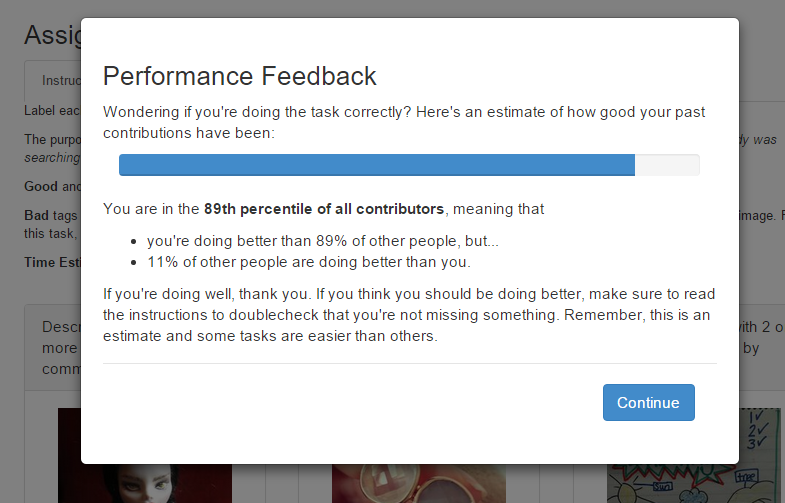

Designing Tasks for Objective Needs
=====================================

<!-- Planned structure

Introduction
Problem
  Why design matters

Overview

Related Work
  Financial Tweaking
  Bonuses
  Task Description

Research Questions

Design Space (RQ1)
    Gedanken Experiments
    So, what do I study

Approach
  Training Interface (TRN)
  Feedback Interface (FEED)
  Fast Interface (FAST)
  Other, small experiments
    Performance Bonus (BON)  

Experiment #1: Tagging
  Data
  Measurements
    Quality, Variance
    Cost
    Satisfaction
Experiment #2: Relevance Judgments
  Data
  Measurements
    Quality, Variance
    Cost
    Satisfaction
Experiment #3: Music Similarity Judgments

-->

\newthought{Humans don't operate with the formality of computers}.
Many of the benefits of crowdsourcing follow from that fact: human contributions are valuable specifically because they are not easily automated.
However, when using crowd contributions to inform an algorithmic system, as in information retrieval, the inconsistencies of human work present a challenge.

This chapter investigates how the design of crowdsourcing tasks for collecting useful metadata for information retrieval metadata affects the quality of the content.

In a controlled set up, crowdsourcing in information retrieval usually follows a typical design: a task, description, and a set of one or more documents that are reacted to.
This type of design is common for creating custom evaluation datasets through relevance judgments [@alonso_crowdsourcing_2008], but has been used for encoding and verifying indexing information [e.g. @chen_improving_2013].

Evidence suggests that the design of a data collection interface affects the quality and distribution of user contributions [@alonso_crowdsourcing_2008; @howe_crowdsourcing_2008; @mason_financial_2010; @mitra_comparing_2015].
The manner to improve on a basic task/description/items interface design is not immediately clear, though: some success has been attained by slowing workers down, while other times it has been beneficial to encourage cheaper, more impulsive contributions in larger numbers.

\newthought{If we consider crowdsourcing data quality} as something that can be addressed not only through post-collection modeling but through the choices made in designing the collection task, the latter approach is surely the lesser studied problem.
  However, in cost-time considerations, design promises more efficient improvements.
A design that is more interesting to workers or less prone to error may result in better contributions at no extra cost, while designs that offer bonuses or training include short-term costs.
When studying intrinsic motivation in Mechanical Turk tasks, @mason_financial_2010 found that a small change in instrumentation -- changing remuneration to less tightly govern the task -- resulted in more work contributed with happier contributors.
<!-- TODO is there work about whether it is better to go cheaper with a bonus, or higher with no bonus?
-->

[<!--Gilbert paper-->]

## Problem

<!-- Some related work, while the beefier stuff is later -->
\newthought{A similar approach was been taken by @mitra_comparing_2015 have taken a similar approach to this chapter, in pursuing "person-oriented strategies" over process-oriented strategies".
Their study is a unique precedent for a controlled experiment of different collection-time strategies for paid crowdsourcing contributions.
They consider the following strategies: (1) screening workers, (2) providing examples and training workers, (3) offering financial incentives for improved quality (bonuses), and (4) aggregating or filtering multiple independent workers.

Screening (1) and aggregation (4) are strategies discussed further and employed respectively in the previous and next chapter, and performance bonuses (3) are a parameterization manipulation that has been studied before <!-- TODO, cite refs from mitra paper, and others-->. ^[We also used a performance-based bonus in the 'taste-grokking' personalization approach detailed in Chapter 6. Though we hypothesized it may have a self-competitive effect, it was not the focus of that study and a controlled comparison was not performed to see if it was exerted an inordinate bias on the results. Appropriately, @mitra_comparing_2015 did not find this type of incentive to improve quality, for the most part.]
Pertinent to this study, however, @mitra_comparing_2015 found that training contributors on task expectations improved contribution quality on nearly all tasks, generally compounding improvements on top of other conditions.
Similar to this study, @mitra_comparing_2015 compare interaction against a set of tasks that range in their subjectivity.
<!-- TODO how do we differ?-->

## Overview

In this chapter, multiple interfaces for encouraging less deviation between contributors are evaluated against identical controlled tasks.
Two design manipulations are intended to slow down workers and make them aware of how their perception of the task deviates from the standard.
A third design encourages quicker responses.[^whyint]
These are compared to a realistic baseline interface which follows typical Mechanical Turk conventions.
Afterward, an applied experiment is presented, where both apriori and posterior methods are applied to a music information retrieval evaluation. The design changes that are made improve the quality of results drastically, with negligible cost differences.

[^whyint]: Why are these design manipulations chosen? Later in this chapter, various possibilities for design manipulation are considered, and compared to the existing literature. As will be seen, prior work has lent insight on the effect of 'parameter manipulations' such as payment variation [@mason_financial_2010; @harris_youre_2011], wording changes [@grady_crowdsourcing_2010], while more drastic design manipulations are only beginning to be studied in the context of crowds [@mitra_comparing_2015].

## Related Work

### Financial Tweaking
### Bonuses
### Task Description

<!-- TODO
Explain various conditions _before_ related work
Move other lit review (i.e. for feedback) to this section.
More lit review on training, on feedback (Mitra has some suggestions)

Or.. should I move /this/ section /into/ the more granular sections?

-->

## Research Questions

This chapter compares the effect of task design on the quality of crowdsourced objective data.
Scoped to a reasonable parameterization of crowdsourcing as it is commonly practiced in information science -- a typical encoding task performed by paid crowds, the following questions will be pursued:

 * __RQ1__: Which approaches to collection interface design are worth pursuing as alternatives to the basic designs commonly employed in paid crowdsourcing?^[The _design space_ question.]

 * __RQ2__: Is there a significant difference in the quality, reliability, and consistency of crowd contributions for the same task collected through different collection interfaces?^[The primary _data quality_ question.]

 * __RQ3__: Is there a qualitative difference in contributor satisfaction across different interfaces for the same task?^[The secondary _satisfaction_ question.]

 * __RQ4__: Do the findings generalize to different tasks, task types, and contexts (i.e. outside of paid platforms)?^[The _generalizability_ question.]

RQ1 is the question of design, on synthesizing prior work and brainstorming directions to explore.
It is a partially subjective question, but one still worth pursuing with diligence.
As research by @komarov_crowdsourcing_2013 found, the effects seen in traditional user studies are still present in online crowd markets.
Their finding suggests that non-crowdsourcing research in human-computer interaction is informative for our purposes.
This chapter explores some possible design decisions and argues why they should be studied.

RQ2 and RQ3 are the primary questions being explored in this chapter of the proposed dissertation, on quality for computational use and on satisfaction.
While this dissertation is explicitly pursuing the former question, collecting computationally useful contributions needs to be understood in the context of contributor satisfaction.
The trade-off between contributions that crowds want to make and the reliability of the data is a central consideration for fostering sustainable, or alternately affordable, crowdsourcing.

RQ4 is the question of generalizability. It expands beyond a scope than can reasonably be answered, but it should nonetheless be addressed as thoroughly as possible.

## Design Space

Commonly, a paid crowdsourcing worker goes through the following steps:

 1. Worker $w$ arrives at task page
 2. $w$ is shown a preview of task $t$
 3. Worker $w$ accepts the task $t$
 4. Work performs task $t$ and submits
 5. A new task $t'$ is chosen and, worker is taken back to _step 2_ or _step 3_

<!--TODO research on structure?-->
<!-- TODO cite Amazon docs -->
<!--TODO screenshot of a normal task-->

The above steps are the model used by Amazon Mechanical Turk when a task is followed through to completion.
Workers are also given escape options, to skip, reject or return tasks.

Metadata encoding tasks generally consist of the following parts:

 * __Goal__ statement/question. _e.g. "Is this page relevant to query `q`?", "Find the topic of a tweet."_
 * __Instructions__ for performing the task.
 * One or more __Items__ that worker responds to. _e.g. webpage snippets, microblogging messages_
 * __Action__, one per item: the data collection mechanism.

\newthought{Within this framework}, a number of factors are observable that may potentially affect how our microblog encoding task is completed.
First are the parameterizations of the task within its existing structure -- changes to the goal, instructions, item, action, and even the task itself.
Ways that these can change from task to task include:

 * __Task__
    * Payment.
    * Bonuses.
    * Number of tasks available.
 * __Goal__
 * __Instructions__
    * Clarity.
    * Restrictive versus open-ended.
    * Length.
 * __Item__
    * Number of items in a task.
 * __Action__
    * Complexity of action. e.g. granularity.

There are also intangibles such as the appeal of the topic and the visual layout.

Of course, we're not constrained to the task structure provided above.
We can add elements to the task design before the task is accepted, at the start of the task, during or in response to individual interactions, or after the task is completed.
Taking away elements might also be possible, such as the instructions, though it is hard to imagine that doing would would have a positive effect on the reliability or variance of the data.

The possibilities are endless for adding parts to the basic task.
To inspire useful ones, it is helpful to consider one final, naturalistic set of factors that may affect the outcome of a paid crowdsourcing task: worker behaviours.

A worker's contribution may be affected by factors such as experience, skill, time spent per task, and attentiveness.
Which of these can be influenced by external factors?

 - _Experience_. Experience is a product of sustained interaction with the current type of task.
   It can affecting indirectly by focusing on methods to extend the length of a user's interaction, such as bonus payments for staying around.
 * _Skill_. Skill is developed over time and is mostly affected by factors internal to the worker.
   To the extent that we could affect it, most functionality would encourage greater experience.
   Teaching workers by reinforcing their successes and failures might also have an effect.
 - _Self-confidence and decisiveness_. Contributors or workers that second-guess themselves more often may be less internally consistent. <!-- TODO2: advice from Diane Kelly on lit? -->
 - _Attentiveness and fatigue_. Environmental distractions or fatigue can change how consistently a task is completed.
The microtasking design pattern in paid crowdsourcing is meant to negate some of the fatigue seen in traditional classification labour, but there is no way to anticipate other outside factors, such has how many tasks from other requesters were completed. It is possible to affect attentiveness and fatigue within a task, however, with higher- or lower-effort tasks.
 - _Perceived importance of task_. The perceived importance of a task might affect some other factors, such as attentiveness or self-confidence.
 - _Time spent on each task_. The time spend on a task does not always translate to an indicator or quality, but might encourage greater numbers of contributions or more decisive contributions when controlled.

With these in mind, consider this study's image tagging task.
How would the contribution change if:

- Tasks were 100 items long?
  200? 1000? Only 1?
* Instructions were written very tersely?
  Verbosely, with many examples?
- Contributors were tested on the instructions at the beginning of the task?
  If there were gold labelled items throughout the task?
  If everything had a known answer and workers were inconvenienced (e.g. with a time delay) when they got an answer wrong?
- Contributors were asked to volunteer their time?
  Were paid 1c per task? Were paid 10c per task?
  Were paid by the hour?
* Contributors were paid bonuses for performance against a ground truth or internal consistency?
  For continued task completion?
  For difficulty of their classification?
* Contributors were shown their performance (or estimated performance)?
  What if they were ranked against other workers?
  What if they gained levels or earned badges for performance?
- Contributors had tasks/time quotas to meet for bonuses?
  What if they were forced into these quotas (with tasks automatically moving forward)?
  What if a timer ticked away until their task disappear?
- Contributors were told when they got something wrong? What if you lie to them?

\newthought{Some of these ideas of exciting}, others are unfeasible.

Designs to encourage longer-term engagement from individuals do not appear to be a promising direction.
As the previous chapter found with regard to relevance judgments, worker experience was not found to be significant.
It is unclear whether this relates to the relative simplicity of the task or if it is indicative of a broader rule, though pushing against the on-demand nature of Mechanical Turk would likely be more effective for significantly more complex tasks than the basic information science ones considered here.

Other areas are already well-tread. The effect of incentive structures, payment and bonuses, has been studied frequently, notably by @mason_financial_2010.

With regards to designs that mislead workers about their performance, there are ethical and trust issues that limit such an approach, in addition to the warning by @kraut_building_2011 that feedback is only effective when contributors believe it is sincere.

## Approach

While parameterization studies have compared how shifts in description [e.g. @grady_crowdsourcing_2010] or payment structure [e.g. @mason_financial_2010] affect contribution, very few studies looking at more drastic design manipulations have been performed on a controlled task [^The recent paper by @mitra_comparing_2015 a notable exception]. [^TODO add more citations above]

Still, some unresolved questions in the area are necessary to understand in the pursuit of quality crowd contributions.
For example, it is still unclear whether simple encoding tasks benefit more from workers' gut instincts or careful consideration.
Designs that can change a worker's attentiveness may help -- or perhaps hinder -- the quality of contributions.

Having found in the previous chapter that reading instructions slowly is important for properly performing work, it should be seen whether a task can push a worker into internalizing the codebook rather than interpreting it.
Understanding that many reliability errors are introduced by honest workers that intend to do well, it may also be important to keep workers informed of their performance, at least when they are not performing well. Other work, to be reported in later chapters, finds that a task redesign for an evaluation task can improve collected data immensely at little extra cost, while in the case of simple item ratings, over-thinking the task is actually detrimental.

With those considerations in mind, this study compares data collected through three interfaces for crowdsourced data collection: a training interface, a feedback interface, and a time-limited interface.
The training interface takes more care to slow down the task and walk new workers through the codebook and the style of a good contribution.
The feedback interface tries to reflect performance back to workers, to check their understanding of the codebook.
Finally, the time-limited interface contrasts the introspective approach of the other interface by encouraging quicker contributions.

### Basic interface (Baseline)

The basic interface resembles an archetypal task, following conventions seen in Mechanical Turk usage.
It shows workers a task with a goal, description, and ten items to perform actions on.
Prior to submission, there is also an optional feedback form.
Though it is a baseline, it is not a hobbled baseline, designed around recommended practices.

The _goal_ is the summarized statement for the task requirement, such as 'Tag images with descriptive words' or 'judge the relevance of documents in a search'.

The _instructions_ describe, clearly but succinctly, the parameters of the task and any necessary details about completing the task.
Part of doing so is explaining what a good contribution is: that is, delineating between good and bad tags in the tagging task, or explaining what a relevant or non-relevant document is for the relevance judgment task.
The reason that instructions are intended to be succinct is again by convention.
Amazon's advice for designing good tasks states that the task should not require scrolling to start [@_requester_2011].
In addition to conciseness, the instructions for this study's basic interface strive to follow other recommendations in a conservative and uncontroversial manner: specificity, examples, and clarity about poor work [@_requester_2011; @_guidelines_2014].

It is difficult to balance the various needs of a good instruction set.
With concern to succinctness and ease of readability, key information was italicized, examples were added as mouse-over popups, and secondary information (e.g. 'Tips') was hidden behind a tab.
Another tab held a reference copy of the IRB disclosure (which, for this condition and all others, was shown fully when a worker was previewing the task before acceptance).
Finally, an empty 'tab' to collapse the instructions completely was added. This is not a common feature of archetypal tasks, but given the difficulty of scrolling in the embedded window on Mechanical Turk, was deemed a humane addition.
Figure {@fig:basic-inturk} shows the limited task space when it is embedded within the Mechanical Turk interface.[^TagDifficulty]
Collapsible instructions have been recommended previously [@chen_making_2012; @chen_mechanical_2012].

 {#fig:basic-inturk}

[^TagDifficulty]: Incidentally, Figure {@fig:basic-inturk} also shows some of the more challenging images to tag. How would you tag them? 

[^TaggingInterface]: TODO: Add figure of instructions from basic condition of tagging task. The substance of the instructions is discussed in the Tag Task section.

Following the advice laid out by the unofficial Guidelines for Academic Requesters[@_guidelines_2014][^Workers], a time estimate for task completion was also provided.
The time estimate was determined based on testing and updated following an initial batch of tasks.

It is recommended to be clear about what work is rejected [@_requester_2011; @_guidelines_2014].<!--_-->
Given that an underlying premise of this chapter is investigating whether the work requester is sometimes to blame for poor work, it would be a troublesome foregone conclusion to actually reject work, so for ethical reasons no work was rejected.
Instead, even for the basic interface, improper work that would have been rejected in other settings was validated by the system when possible.
For example, workers were asked for a minimum of two tags in the tagging task; as shown in Figure @fig:basicvalidation, they could not submit before entering two tags.
To account for instances where a second tag was too difficult to create, workers could also add a placeholder 'TOOHARD' tag, which the interface alerted a worker to if their cursor was inactive for a few seconds (Figure @fig:tippopup).

 {#fig:basicvalidation}

 {#fig:tippopup}

[^Validation1]: TODO - Add figure of validation

[^Validation2]: TODO - Add info popup

[^Workers]: These unofficial guidelines, on the Dynamo Wiki, were written collaboratively by academic researchers and Mechanical Turk workers.

The _task set_ of items to perform work on, again followed a basic archetypal pattern, listing each item in a grid.
The tasks themselves were small and did not require context shifting, as Amazon recommends [@_requester_2011].

Finally, the basic interface included an open-ended feedback form at the end.
While this is far from a standard convention, many have recommended it as a standard element in task design [<!-- TODO cite Chen, cite dynamo, cite alonso? -->].
The ability to respond easily provides valuable information on worker satisfaction and task problems.[^feedback]

[^feedback]: I have treated feedback forms as a necessity for the past few years.
 Based on my experiences, feedback forms provide a space for critical information, such as broken tasks, and qualitative information, such as worker satisfaction. Most importantly, they provide a qualitative connection to workers, which is contrary to Amazon's purposes as 'artificial artificial intelligence' but which encourages requesters to respect their workers.
 Interestingly, as noted earlier, when @alonso_design_2011 tried to mandate feedback form responses, they found that their quality fell relative to volunteered feedback.

### Training interface (TRAIN)

In the training interface, the worker is walked through their first task slowly.
As they complete the tasks, their answers are evaluated against a gold standard and they are informed if they completed it correctly or incorrectly.
Incorrect answers will also be given an explanation of why the actual answer is correct.

<!-- TODO2 Justification for this design: who else has done it?
Ask Mike, possible Jaime for advice, my lit review is failing.
-->

The training tasks were hand-designed, based on a random sample of items.
One can imagine an optimal sample, where the training set starts with easy tasks and quickly turns focus to the items that are most difficult.
However, removing the most difficult items from the post-training pool would unfairly bias the training condition: this is why a random sample for training was selected.

During the training interface, workers were greeted with a message noting that their first task will be atypical, in that answers will be provided.
The tasks set itself appears similar to a basic interface taskset, except that the individual items have a 'Check your Answer' button (Figure @fig:trainexample1).

 {#fig:trainexample1}

To better guide workers and for a clearer understanding of how the worker is performing, the 'Check Answer' button is disabled until a submission is made, and the submission interface is disabled after the answer is checked.
This helps explain to workers the intended order of contribution with minimal text: we want workers to try a contribution before checking their answer, and we don't want them changing the answer afterward.

### Feedback Interface (FDBK)

In the previous chapter, it was found that workers that did not spend enough time reading instructions did not perform as well overall, even when their typical task completion time looked the same as well-performing workers.
Since in this case the poorer workers did not exhibit any time-optimization wage-maximizing behaviours, a possible reason is that they were performing in an honest manner and simply did not internalize the codebook adequately.

If this is the case, is it possible to improve the performance of poor workers but simply letting them know of issues with their work?
The feedback condition of this study attempted to do just that, with a intervention at the start of tasks, after a worker's first task, estimating the worker's performance.

In the feedback interface, a worker is shown feedback about their estimated performance on past tasks.
The first task that they complete is identical to the basic interface.
Starting with the second task, however, the interface gives them a window with their estimated performance, relative to other workers.

 {#fig:showperformance}

The estimate of performance was determined differently for the different task types, image tagging and image relevance judgments, and is described in those respective sections.

As seen in Figure @fig:showperformance, feedback was given in the form of ranked percentile information relative to actual workers. 
The underlying measures or the exact estimate were not revealed.
Unlike the training interface, it did not provide any feedback on what was done wrong and what was performed corrected.
This black box approach was because this interface was not intended to train, simply to inform and -- it was hypothesized -- encourage a return to the task instructions if a worker needed to recalibrate their understanding of the task.

Though it would have been trivial to adapt the text relative to performance, it was deliberately decided that the written copy stay the same, and that this information is clear to workers.
The intention was to avoid a perception of scolding, leaving the _interpretation_ of the performance feedback to the worker; "_If you're doing well..._", or "_If you think you should be doing better_".

The expectation was that showing feedback may trigger an external motivation, simply in seeing that these statistics are kept, as well as intrinsic motivation, trying to perform better for self-competitive reasons.
The former cannot be discounted, but the design tried to encourage more of the latter.

@mccreadie_crowdsourcing_2011 attempted a similar approach, where contributors were shown a sidebar color-coding all their contributions based on their agreement with other raters and the authors.
Showing this information with such granularity encourages workers to go back to reconsider debated answers, whereas this study's take tries to encourage more care and competition moving forward.

As with the training condition, workers were encouraged to continue performing tasks with a plea and a bonus (Figure @fig:staybonus).
This is because feedback was only applied starting with the second task.
Base payment was $0.05 lower than was provided for the basic interface, while the continued engagement bonus was $0.10 per task.

 {#fig:staybonus}

In sum, of the ample ways to design a feedback mechanism, this study's condition:

- Positioned workers relative to the workforce, rather than absolute measures.
- Tried to focus on worker self-motivation over the observer effect.
- Focused on intervention at a start of a new task

### Time-Limited Interface (FAST)

Not all crowdsourcing contribution cases may require more focus; sometimes a worker in a quicker mode of thinking contributes more consistent and reliable work.
This was the case in an incidental finding reported in Chapter 6, where asking workers performing subjective opinion-based tasks to explain their judgment seemed to change the judgment habits themselves.

In contrast to the training and feedback interfaces, which served, in a way, to slow down workers and make them more focused on their contributions, the final data collection interface pursues the opposite approach.
The time-limited interface encourages quicker interactions by giving users a timer to complete all tasks.

The goal and instructions do not differ greatly from that of the basic interface, with the exception of text explaining the limited amount of time that a worker has.

The amount of time workers actually had differed between task types, because relevance judgments are completed more quickly than item tags. The former task lasted for 90 seconds, while the latter lasted for 60 seconds.

It is important not to distress the worker when trying to push them into a visceral form of task completion, as this might have the opposite effect.
Instead, this design encourages _flow_ ^[TODO citation], where a user moves seamlessly through the tasks without over-thinking their answers.
To avoid the potential distress of thinking about what is to come, this interface does not show a list of tasks to complete (e.g. "complete these ten tasks in a minute").
Instead, tasks are shown one at a time (e.g. "See how many tasks you can complete in a minute"), with bonuses paid for each complete task and increased for correct answers.

<!--
TODO2
 * To explain: how does the timer cut off slow workers? (With bonuses that are only given per item of task-set finished within time limit)
 * What is the time limit? This needs to be measured to determine a good value
 * Add mockup of interface-->

### Evaluation

 <!--Talk about Mechanical Turk. -->
 <!--Talk about the real world use of crowdsourcing. Google has internal systems, so does MS. Researchers are using it for on-demand data -->

 The experiments in this study were run in a naturalistic setting, running directly on a paid crowdsourcing platform, Amazon Mechanical Turk, with real workers.

 There are trade-offs to this setting.
 It is easy to instrumentalize and properly captures the actual skills and attentiveness of paid crowd workers.
 However, working within the conventions of the system means that some parts cannot be controlled.
 For example, workers cannot be forced to perform multiple tasks, simply encouraged to do so.
 Also, the actual user pools testing the different interfaces are not necessarily the same individuals.
 Thus, it is important that the users are similarly representational: it would be problematic if one interface was used mainly by Indian residents while another was performed mainly by American residents (the second and first largest nationalities on Mechanical Turk, respectively).

 For this reason, each interface was be evaluated with temporal and geographic restrictions.
 Workers were restricted to American workers, and most tasks were during the American work day, with only slight deviations.

### Implementation

The experiments were performed on Amazon's Mechanical Turk, using an API that allows external pages to be hosted within the Mechanical Turk interface.

The system for design manipulation was developed using JavaScript on the front end, built on top of the AngularJS library[^angularjs].
The software is released with an open-source MIT license[^crowdy].

The back-end of the stack also runs on JavaScript, with a Node.js[^nodejs] server run on the Express[^express] web application framework.
Because of the complexity of the logic in serving tasks, this code was optimized toward asynchronous operations whenever possible.
Data storage uses the MongoDB[^mongodb] database.
The task serving code is also released online[^crowdybackend].

Details of the experimental system, including design documents, model descriptions, and logic, are provided in the Appendices. <!-- TODO2 add proper link. -->

[^angularjs]: https://angularjs.org/
[^nodejs]: https://nodejs.org/
[^express]: http://expressjs.com
[^mongodb]: https://www.mongodb.com
[^crowdy]: https://github.com/organisciak/crowdy
[^crowdybackend]: https://github.com/organisciak/crowdy-backend

### Tagging

## Experiment #1: Relevance Judgments

Lowering the barrier to custom evaluation is one of the most important uses of crowdsourcing for information retrieval research.
While production systems benefit from actual humans in the machine to identify topics and correct algorithmic quirks^[TODO cite Twitter, Google, Bing], research aiming to improve pure information retrieval performance still needs ways to appropriately evaluate different models and approaches.
Paid crowdsourcing platforms offer a way to tap into large and diverse groups of people for relevance judgments, making custom evaluation datasets -- and subsequently research over novel corpora -- greatly more accessible.^[Previously]

^[Previously]: The role and value of crowdsourcing for information retrieval evaluation was discussed at length in the previous chapter.
  For brevity, it is only lightly recalled here.

To judge the effect of design manipulations on relevant judgment collection, a set of experiments were set up for image information retrieval results.

### Related Work

### Data

The dataset being evaluated consisted of XXX^[TODO] query -- image document pairs, evaluating 20 results each^[TODO confirm] for 15 queries, against a corpus of 185.6k documents from image-sharing social network Pinterest.
All the data, control and experiments, were collected specifically for this study, allowing for a fair comparison of design manipulations against a baseline that was competently implemented.

This section details the process of developing the test corpus.
Basically, the process was as follows:
 - Collecting a large randomized sample of documents from Pinterest (_pins_).
 - Sampling realistic queries, collected from Pinterest's query auto-suggestions.
 - Implementing a retrieval system with the sampled documents, and retrieving results against the sampled queries.

 The retrieval results are used for measuring the efficacy of 

<!-- What is pinterest -->
\newthought{Pinterest is a social network} centered on the saving, sharing, and curation of online images
It is built entirely on crowd contributions.
On Pinterest, the document unit is a 'pin': an image, associated with a web URL and page title, and a required text description provided by the user.
Though the most common type of pin is saved from an external website, it is also possible to upload personal content.
The 'descriptions' are required but free-text, meaning they do not necessarily _describe_ the image.

Pins are sorted into curated lists, referred to as 'boards'.
Like pins, classification into boards is not controlled.
While adding a pin to a board is an act of classification, the classes are user-defined and can be created for various reason, such as quality judgments (e.g. "Neat stuff"), thematically descriptive (e.g. "dream wedding"), or miscellany of various sorts (e.g. "inspiration", "funny").
Boards are user-specific, created by a user with a title, description, category, and optional map.

In the words of the company materials, Pinterest features three primary purposes: saving (as pins), organizing (into boards), and discovery [@_about_].
In this way, it is organized in a way familiar to library and archival communities, distribution online images with an eye toward discoverability and curation.

It is also a large-scale site of descriptive crowdsourcing, recalling past trends in social bookmarking (i.e. the eventually doomed _del.icio.us_) but with a visual spin to the bookmarking activity.
Users describe pins and categorize them into boards; describe, title, and categorize boards; and contribute various social information, such as comments, repins[^repin], and voting (in the form of 'heart'-ing).

[^repin]: To _repin_ is to save a new pin from an existing pin, using the same source URL and image, but applying a new description and saving to a new board.
A document's repin count can be interpreted as a measure of a document's internal influence among the Pinterest community.

<!--Why study Pinterest?-->
i\newthought{Pinterest is a novel website} for studying ways to incorporate crowdsourced information into web retrieval.
This study, concerned with the methodology of crowdsourcing, is not dependent on Pinterest, but Pinterest is nonetheless an appropriate site to underpin it.
Structurally, it resembles the archival form of many library and museum systems, albeit at a larger scale, it is itself a product of [volunteer] crowdsourcing, and it deals in the type of sparse, simple content that crowdsourcing is appropriate for.

 * The organizational form of Pinterest, grouping documents into curated lists called 'boards', is a interface pattern that is relevant to many forms of information repository.
   Social OPACs, for example, allow library patrons to collect books into similarly uncontrolled lists.
 * Pinterest contains very little information about the source web document.
   It is feasible to crawl the full text of the source, but as it stands, a Pinterest 'pin' alone offers a record of a _human's interpretation_ of the source.
   It is simple, and helps us avoid confounding the focus on crowd contributions.
 * Since the primary form of Pinterest document is a human reaction to a web document, the user contributions on the site may have possible future use for web retrieval.
 * For the purpose of this study, collecting relevance judgments for retrieved pins, the image-centric form is the type of task that crowds should be capable at.
   Good tasks should focus on one thing, with little context switching [@_guidelines_2014], and understanding an image is a quick, natural activity for people.^[Even when it is not so for machines (TODO citation].

Finally, Pinterest is an interesting but understudied website.
Demographically there is a female skew, interesting precisely it counter-balances the typical male-heavy community demographic.

<!-- TODO talk about TREC crowdsourcing track -->

<!-- data collection-->
Two types of information were collected from Pinterest for this experiment: pins and boards.

Sampling was done according to Pinterest's provided sitemap.
An initial survey (August 2014) suggested that Pinterest had approximately 107.5 million users, with 207.5 million pins and 572 million boards containing those pins.

<!--
Users: 107.5m 	4300 packages of 25000 users, 1.1 MB each
Boards: 571.95m 22878 packages of 25k boards
Pins: 207.5m 	8300 packages of 25k pins --> 

This is a very large amount of data, and only a sample was needed for this study. For the sample, 

- Random 25000 pin sitemap listings were downloaded
- A process randomly pulled out pin listings, with each listing holding a 1% of being preserved
- The collected pins were randomly ordered, and the full metadata of pins was collected against this master list.

For the information retrieval system underlying this experiment's relevance judgments, a sample of 195k pins was collected and indexed.^[Attrition]

^[Attrition]: This sample was collected in 40k pin batches, and not all at once.
  As a result, the final number of pins successfully downloaded was lower, at 184583 document. The time difference between batches provides a sense of attrition on Pinterest.
  The first two batches of pins were collected against a five-month old sitemap, and 1.4-1.5k pins were no longer accessible per batch ($~3.4\%$ attrition). 
  Another batch was scraped when the sample list was 9 months old, and $6.4\%$ of the links were no longer active, the final two batches were collected 2 months later, with $7.2\%$ links missing.

\newthought{Queries were sampled} from auto-complete suggestions on Pinterest.
When a user starts to type in a query, five suggestions appear.
For example, typing 'r' will suggest 'recipes', 'red hair', 'rings', 'relationship quotes', and 'rustic wedding'.
These appear to be the most probable queries starting with the provided string.
For an insight of what types of queries are in the sampling frame and more generally what topics are popular among Pinterest users, Table {@tab:pop-pinterest} \ref{pop_pinterest} lists the auto-complete suggestions when each letter of the alphabet is entered into the search box.

It should be noted, however, that a sample frame of just the most popular terms is too general.
To shift the sample away from the head of the distribution, the sampling frame will also include 500 queries derived from auto-complete suggestions based on two character strings: specifically, the one hundred most common two-character pairs occurring at the start of the English language.[^twoletter]

[^twoletter]: Using the frequencies calculated by @norvig_english_, these are: TH, OF, AN, IN, TO, CO, RE, BE, FO, PR, WH, HA, MA, WI, HE, IS, NO, WA, ON, DE, ST, SE, AS, IT, CA, HI, SO, WE, AR, DI, MO, AL, SU, PA, FR, ME, OR, SH, LI, CH, WO, PO, EX, BY, AT, FI, PE, BU, LA, NE, UN, LE, SA, TR, HO, YO, LO, DO, FA, SI, GR, EN, AC, MI, TE, BO, BA, GO, SP, OU, PL, EV, AB, TA, RA, US, BR, CL, DA, GE, TI, FE, AD, MU, IM, AP, RO, NA, SC, PU, EA, CR, VI, CE, OT, AM, AG, UP, RI, VE.

For each query, a description of what constitute the different levels of relevance will be written by myself, and the relevance of the first one hundred results will be rated by paid workers on a graded relevance scale.

It is likely that Pinterest's own retrieval model incorporates additional implicit feedback from users in the form of click-through data.
This is a useful indicator of a item's quality, itself a form of crowd-contributed retrieval evidence, but is well-studied and too removed from the scope of this study to undertake.

###  Measurements

TODO 
 - Quality, Variance
 - Cost
 - Satisfaction

### Results

\newthought{A measurement of time spent} on each task was taken, in seconds.

It should be noted that, unlike the later tagging experiment, where a worker's time spent focused on an input box could be measured, there is no easy proxy for measuring per-task time in a set.
Since the relevance judgment options are a set of radio buttons, we do not capture the *start* of a worker's attention, just the moment that they actually make their contribution.
As a proxy, a measure was taking of the amount of time that the *previous* item was in focus; i.e. worker clicks item A, and while they think about item B, A is still in focus.
This provides a rough estimate of the time spent, good enough for broad comparisons, though not robust enough to tie time to a specific item.

<!-- Feedback -->
\newthought{Workers were given the option} to rate the task and their satisfaction with the payment, on a scale from 1-5.

Figure @rel-task-satisfaction shows the distribution of satisfaction score for each condition.
In all cases, they were skewed toward the upper end -- the median is 5 for each condition -- as may not be surprising.

TODO Write up

 {#fig:rel-task-satisfaction}

 {#fig:rel-pay-satisfaction}

A final question looked at was whether a person's rank -- as given in the feedback condition -- affected their satisfaction.
There were not enough measurements for a non-parametric comparison, but it did not appear to be a notable factor.
Binning workers in quartiles by rank, those in the second quartile had a comparable task satisfaction ($mean=4.25$, $median=5$, $N=4.5$, _note low N_) to those in the third performance quartile ($mean=4.81$, $median=5$, $N=11$) and the upper quartile ($mean=4.62$, $mean=5$, $N=16$).
Given a larger sample, one interest quirk to pursue is that the lowest pay satisfaction was among the best contributors ($mean=4.375$, $median=4$, $N=16$).

## Experiment  #2: Tagging

<!--Why tagging-->
Tagging is a type of free-text labelling often applied in online social contexts.
It allows a system to collect more metadata about its records than the system may have, and representing different _types_ of description.
Such open-ended contribution can grow unwieldy and hard to protect against vandalism, but public good institutions such as libraries and museums can use them for a sense of how the people they serve are interpreting the materials of their collections. 
Tags are also useful for augmenting large encoding efforts.
For example, on business recommendation system Yelp, tags allow users to contribute data about the type of business[^Foursquare].

[^Foursquare]: A competing service, Foursquare, also uses tags, but in a more structured way.
their libraries and museums to collect more metadata about their

<!--Limited metadata-->

Trant and Wyman argue that tagging from online users "appears to fill gaps in current documentation practice" [~@trant_investigating_2006].
Following from this, tagging is particularly helpful for difficult to model formats (i.e. non-text) and when corpus sizes surpass the ability to formally classify works.
Tagging has been used to encode scans of text [@TODOciteRecaptcha], improve information retrieval retrieval document modelling [@lamere_social_2008; @citeBao], augment personalized search [@lermancite; @nollcite].

Tagging also offers a break from the Vocabulary Problem [@furnas_vocabulary_1987].
@furnas_vocabulary_1987 performed a set of term generation experiments in 1987 where the asked participants to describe functions or objects.
They found that the amount of spontaneous consensus was very low, arguing that this problem of vocabulary becomes a user issue because different users expect different vocabularies.
However, it's the designers who get to choose the primary vocabulary and, "as heavy users, grow to find [their] terms obvious and natural" (ibid).

The proposed solution to the vocabulary problem was to allow 'essentially unlimited numbers of aliases'[^At least when those aliases are not more popular for other functions.] [@furnas_vocabulary_1987] -- something that tagging functionally allows.
With tags, the descriptors for an information object are not one centralized viewpoint, but an amalgam of different viewpoints and different vocabularies.

This is the ideal setting.

However, there are numerous difficulties with tagging, especially when reliant on volunteers.

While tagging seems to address the vocabulary problem in its potential, the multiple alias approach does not guarantee that they will be approaches reliably.
In instances of low contributor engagement and sparse tags, the fact that people's vocabularies differ can be aggravated by the loose contribution style of tagging.

Additionally, volunteers tagging practices often do not match the needs of system designers.
Of all the contribution approaches enabled by The Commons on Flickr, for example, @springer_for_2008 found that tags were the least fulfilling type of information contributed to the Library of Congress account on Flickr.
Likewise, in a look at social features used in library online catalogues, @spiteri_social_2011 finds tagging to be among the least used.
That finding does suggest that features which are arguably more self-serving, such as curating lists of library materials and starring liked works, are easier to collect than more pragmatic features for item description.

Finally, while it has been suggested that tags with the most general usefulness also tend to be those that are applied by the most _different_ users [@sen_quest_2007], volunteer tagging does not necessarily reflect that diversity.
On The Commons, it was noted that 40% of the tags were contributed by 10 'power taggers'; nonetheless, with over 59 thousand tags contributed, this still meant that other users still contributed a notable amount [@springer_for_2008].

Due to the discord between the promise of tagging and difficulties of volunteer-based implementation, paid crowdsourcing is an appealing approach to collecting tags.
While it does not includes some tertiary benefits related to community engagement, it allows us to control for quality by enforcing a codebook and to make us of many diverse viewpoints in practice.

Following from the experiments on information retrieval relevance judgments, this section evaluates our design manipulations over an image tagging task.
Image tagging is an interesting departure from relevance judgments in that there is no _clear_ correct contribution.
A good contribution is dependent on the need.
For this reason, designs that help guide a worker in relevance judgments may mislead for tagging.
<!--TODO Finish once I can write about results -->

<!--### Related Work-->

\newthought{There are different interpretations on tagging}, what types are desired, how much variance is acceptable, and what the role of tagging is.

With tagging, some degree of variability is desired, because that diversity is central to many benefits of tags.
However, it would be ill-advised to view tagging as a fully relativist activity.
It has been found that tagging begins to converge on a set of popular, common tags [@golder_usage_2006] and there certainly are notions of 'good' or 'bad' tags [@sen_quest_2007].

For museums, tagging is considered not only in pragmatic subject access terms, but as a medium for critical value and engagement, according to @trant_investigating_2006.
Indeed, they note the value in tagging for understanding the tagger: a way to understand how patrons react and interact with museum collections.[^TagAssert]

[^TagAssert]: "A tag is a user's assertion that a work of art is about something." - @trant_investigating_2006

@sen_quest_2007 study the quality of community tags in the MovieLens film recommendation system, toward methods to prioritize tags in the interface.
They find that high-quality tags, as determined by survey, are not necessarily the most-applied tags, likely because the most common tags are locally useful 'personal' tags.
However, tags that are applied by many _unique_ users are more likely to be useful, as are tags that are clicked by many unique users.
While this form of usage-based quality indicator does not help in collecting good tags, it does affect how to determine quality tags for ground truth in this study.

When @sen_tagging_2006 compared different approaches to collecting tags -- an interface where prior tags are seen, an interface where only popular prior tags are seen, an interface that shows recommended prior tags -- the interface that did not show prior tags had a much larger proportion of never before seen tags.
This is an unsurprising phenomenon, given that tagging habits appear to be influenced by the community [@golder_structure_2007; @sen_tagging_2006]; however, it is a factor influencing our approach to tag collection through paid crowdsourcing.

A crowd marketplace is emphatically not a community, at least not in the service of a requester's particular task, and generally the pragmatic system-oriented uses
are underlaid by a desire for convergence and minimal redundancy.
This is to say, a requester looking to pay for image tags may not want a vocabulary explosion, but also may be looking to avoid the added complexity and cost of collecting prior tags to show to workers.

<!--##### Tagging Instruction-->

<!-- What is a 'good' tag, what is a bad tag? -->

\newthought{If the goal is to collect high quality tags}, it must first be clear what a 'good' or 'bad' tag is.
When studying tag quality in a film recommendation system, @sen_quest_2007 found that only 21% of tags are worthy of display to other users.

This study looks to augment image record data and metadata with additional information that cannot be trivially inferred without human contribution.
Particularly, we look to information retrieval uses, to help in findability, filtering, and organization.

One typology for types of tags was offered for tagged bookmarks by @golder_usage_2006.
They present seven kinds of bookmarking tags: those for identifying what the item is about (i.e. topical), for identifying what the item is (e.g. blog), for identifying the creator of the item, for qualifying or refining other tags, for labeling subjective characteristics of the content, for establishing a relationship to the tagger (e.g. 'my post'), and for organization.

@sen_tagging_2006 collapse the seven classes from @golder_structure_2007 into three: _factual_ tags conveying objective information, _subjective_ tags conveying opinions, and _personal_ tags that are intended only for the tagger.
As expected, factual tags were found to be most generally useful, particularly for learning and finding, although personal and subjective tags were useful for self-expression and organizing, respectively.

These are uses that matter to users of online communities, though for the organization purposes of this study's image tagging task, and perhaps more generally for the controlled paid setting, factual tags are the most desired.

Finally, @springer_for_2008 analyzed a sample of tags and derived a number of non-exclusive categories for image tags, including tags derived from the description, new descriptive tags, new subject words, commentary, emotional/aesthetic responses, personal knowledge or research, machine tags, variant forms, foreign language tags, and miscellaneous tags [@springer_for_2008]. Of these, description-derived and image subject tags were the most common.

These studies informed how this study presented the tagging task.
First, the underlying criteria motivating a good or bad tag was directly stated, that the purpose is to help people find images.
"If somebody was searching for this tag, would this be an image that they would want to find?"

Of the typologies studied, the types of tags that would inform this task are factual and descriptive (new descriptive). Machine tags, variant forms, these can be generated without crowdsourcing; on the other end of the spectrum, personal tags are not useful here.

The examples of good and bad tags to anchor workers were as follows:

 > **Good** and interesting tags describe _actions_ and _objects_ in the image. Tags can be multiple words, and should _stand alone_.
 > **Bad** tags don't describe what is in the image, describe things _too generally_, or describe things that are _not the focus_ of the image. For this task, _personal tags_ are not helpful.

The words italicized above were presented as links, showing a pop-up box with examples on hover (a note made this fact clear to workers).
Emotional/aesthetic tags were neither explicitly encouraged or discouraged; they can be useful tags, but an adequate explanation that did not confound subjective and personal tags would have violated attempts at brevity.TODO

The relative usefulness of the TODO

<!--##### Tagging - Training Interface-->

Given the more detailed, specific approach taken in the training interface condition, more prior work on tagging is used in guiding users.
It has been found that user tagging habits resemble other tags that they see [@sen_tagging_2006].
Given this, the training interface offers a set of examples, with good and bad tags shown.
The quality of these tags was determined through a Mechanical Turk task, where workers rated previously submitted tags.
<!--TODO this hasn't been done yet... aspirational text -->
<!-- TODO details -->

<!--##Fast Interface-->

\newthought{For the timed interface}, ...

<!--#### Fast Interface design-->
<!--#### Fast Interface Payment-->
The payment structure was developed to approximate the payment of the basic interface if completion behaviors were equal.
That is, since the first batch of basic tagging contributions averaged 23 seconds each for 10 tasks at $\$0.50$, the payment for the timed interface was intended to match that reimbursement rate at 4 tasks
<!-- TODO: trailed off while writing... go back in the morning and finish-->

### Results

\newthought{In completion time}, the most drastic difference was in the fast condition.

 {#fig:tag-time1}

The relative difference in per-item tagging tasks is shown in Figure @fig:tag-time1.
To avoid misleading graphics due to difficulties in controlling for N, the kernel density estimates are shown. Additionally the associated measures for each distribution are shown in Table @tbl:tag-time2.

+--------------+-------+--------+---------+-----+
| condition    | mean  | median | std.dev | N   |
+==============+=======+========+=========+=====+
| basic        | 22.89 | 18.35  | 17.65   | 846 |
+--------------+-------+--------+---------+-----+
| fast         | 11.46 | 6.94   | 11.46   | 500 |
+--------------+-------+--------+---------+-----+
| feedback     | 10.75 | 9.78   | 5.66    | 264 |
+--------------+-------+--------+---------+-----+
| postTraining | 25.03 | 19.85  | 19.88   | 490 |
+--------------+-------+--------+---------+-----+

Table: Metrics for time spent per task, in seconds. {#tbl:tag-time2}

The fast condition improved the mean time spent on tasks to approximately twice as fast as the basic condition.
The feedback condition was similarly fast, though the reasons for this are unclear. [^TODO run more experiments for feedback at a different time of the day to increase N. Might be a fluke.]

While the time-limited condition and feedback condition changed worker behavior, the tasks completed after training were done at the same pace as the baseline.
Pairwise comparisons between the distributions reject the null hypothesis of equal distributions in all cases except the comparison between the baseline and the post-training distributions[^tagTimeSig].
This came as a surprise, as it was expected that workers in this condition would perform more confidently.

[^tagTimeSig]: $p==0.02$, Mann-Whitney U with continuous correction, fail to reject at $/alpha=0.05$ with Bonferroni correction.
  Since six comparisons were performed, the test for significant would be $>0.0083$.
  All other comparisons with highly significant.

\newthought{In the fast interface}, the payment struc

## Evaluation

- Ground Truth creation
  - tags that are applied by many unique users are likely to be better tags [@sen_quest_2007]
  - In rating tag quality, both positive and negative ratings are important [@sen_quest_2007]
