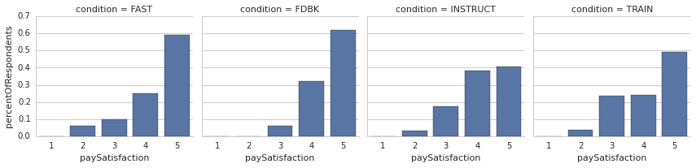
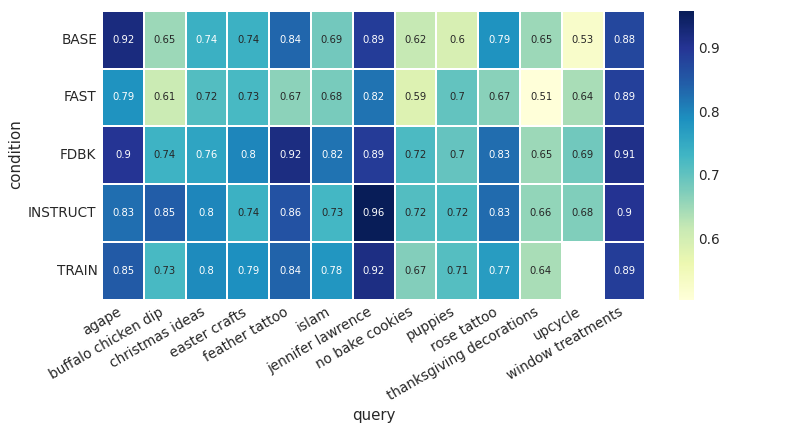
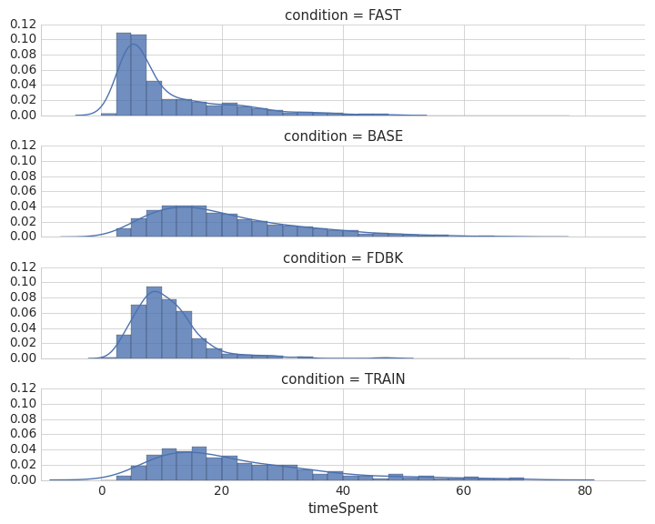
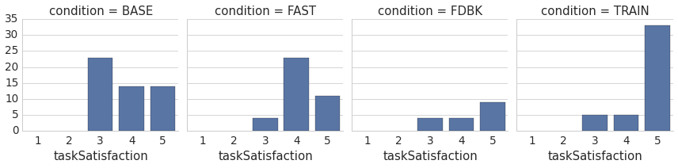

# Designing Tasks for Objective Needs

This chapter investigates how the design of crowdsourcing tasks for collecting useful metadata for information retrieval metadata affects the quality of the content.

\newthought{Humans don't operate with the formality of computers}.
Many of the benefits of crowdsourcing follow from that fact: human contributions are valuable specifically because they are not easily automated.
However, when using crowd contributions to inform an algorithmic system, as in information retrieval, the inconsistencies of human work present a challenge.

In a controlled set up, crowdsourcing usually follows a common design: a task, description, and a set of one or more documents that are reacted to.
This type of design is common for creating custom evaluation datasets through relevance judgments [@alonso_crowdsourcing_2008], but has been used for encoding and verifying indexing information [e.g., @chen_improving_2013].

Evidence suggests that the design of a data collection interface affects the quality and distribution of user contributions [@alonso_crowdsourcing_2008; @howe_crowdsourcing_2008; @mason_financial_2010; @mitra_comparing_2015].
However, the manner to improve on a basic task/description/items interface design is not immediately clear, a problem that this chapter seeks to address.

\newthought{If we consider crowdsourcing data quality} as something that can be addressed not only through post-collection modeling but through the choices made in designing the collection task, the latter approach is surely the lesser studied problem.
  However, in cost-time considerations, design promises more efficient improvements.
A design that is more interesting to workers or less prone to error may result in better contributions at no extra cost, while designs that offer bonuses or training include short-term costs.
For example, @mason_financial_2010 found that a small change in instrumentation -- changing remuneration to less tightly govern the task -- resulted in more work contributed with happier contributors.
<!-- TODO is there work about whether it is better to go cheaper with a bonus, or higher with no bonus?
-->

This chapter looks at collection-time task design manipulations or interventions for collecting objective data through paid crowdsourcing.
Multiple interfaces for encouraging less deviation between contributors are evaluated against identical controlled tasks.
Two of these design manipulations are intended to slow down workers and make them aware of how their perception of the task deviates from the standard.
A third design encourages quicker responses.[^whyint]
These are compared to a realistic baseline interface which follows Mechanical Turk conventions and best practices.
These design manipulations are measured against two control tasks: image tagging and image-based information retrieval relevance judgments.

It is found that training interventions improve collected contribution quality, and performance feedback improves quality in certain circumstances.

Afterward, an applied experiment is presented, where both a priori and posterior collection quality optimization methods are applied to a music information retrieval evaluation. The design changes that are made improve the quality of results drastically, with negligible cost differences.

[^whyint]: Why are these design manipulations chosen? Later in this chapter, various possibilities for design manipulation are considered, and compared to the existing literature.

## Related Work

Grady and Lease previously explored the effect of changing human factors on information retrieval relevance judging through Mechanical Turk [-@grady_crowdsourcing_2010]. They considered four factors: terminology, base pay, offered bonus, and query wording.
Their findings were inconclusive; however their study provides guidance on the issues related to this form of study.

The effect of wording and terminology, one of Grady and Lease's focal points, has often been alluded to as a factor in crowdsourcing, including in Library and Information Science work.
In writing about The Commons, a successful museum crowdsourcing project with Flickr, the Library of Congress reported that the "text announcing the Commons ('This is for the good of humanity, dude!!') struck just the right chord" [@springer_for_2008].

Grady and Lease's work is in the space of parameterization studies, that look at how changes to the parameters of typical tasks -- title, description, payment -- affect the outcome.
Another notable parameterization study, by @mason_financial_2010, contributed insights on the relationship between payment and worker satisfaction.
In one experiment, they found that increased payment does not improve the quality of results, only the duration of engagement.
This was attributed to an anchoring effect where, in paying workers more, a worker's perception of the task's value increased with the payment.
In a second experiment, they found that tying payment too closely to a task, in this case paying by word in a word search, lowered the intrinsic motivation and satisfaction of workers.
This chapter builds upon parameterization studies to evaluate slightly more drastic deviations for the typical structure of a paid crowdsourcing task.

Alonso and Baeza-Yates have also written about the effect of different parameterizations of paid crowdsourcing tasks, considering the quality of relevance judgments with varying numbers of contributors evaluation each task, topics per task, and documents per query.
In doing so, they cite interface design as the most important part of experimental design on Mechanical Turk and recommend following survey design guidelines and provided clear, colloquial instructions [@alonso_design_2011].
This study agrees with their sentiment, and strives to formally understand and articulate the differences that interface design influences in crowdsourcing.

In the TREC crowdsourcing track [@lease_overview_2011; @smucker_overview_2012], much much of the focus was on identifying and accounting for lower quality workers.
However, there were also some efforts which built novel interfaces to try to streamline contributions or increase reliability.
For example, the Glasgow team encourage fast turnaround, reducing rating click counts, pre-loading pages, and floating the assessment question [@mccreadie_university_2011].
Earlier, the same team crowdsourced judgments for the TREC Blog track with a design that color coded completed tasks based on whether they matched other raters and a gold standard [@mccreadie_university_2011].

One novel approach to information retrieval evaluation was performed by @eickhoff_quality_2012.
They created a game for collecting labels, finding that it resulted in more contributions for substantially less cost.
Akin to @mason_financial_2010's word search in the paid-by-task condition, @eickhoff_quality_2012 found that workers continued playing even after they the completed the required portion of the task.
This chapter does not study the use of games, but uses elements of gamification indirectly in studying the effect of communication quantified worker performance.

The collection-time design problem has been previously pursued by @mitra_comparing_2015, who looked at "person-oriented strategies" over "process-oriented strategies".
Their study is a unique precedent for a controlled experiment of different collection-time strategies for paid crowdsourcing contributions.
They consider the following strategies: (1) screening workers, (2) providing examples and training workers, (3) offering financial incentives for improved quality (bonuses), and (4) aggregating or filtering multiple independent workers.

Screening (1) and aggregation (4) are strategies discussed further and employed respectively in the previous and next chapter, and performance bonuses (3) are a parameterization manipulation that has been studied before[^PerformanceBonus].
Pertinent to this study, however, @mitra_comparing_2015 found that training contributors on task expectations improved contribution quality on nearly all tasks, generally compounding improvements on top of other conditions.
Similar to this study, @mitra_comparing_2015 compare interaction against a set of tasks that range in their subjectivity.

Finally, @kazai_crowdsourcing_2011 approach the problem of HIT design quality improvement by inputting various trap mechanisms for inattentive workers.
Tasks were completed by a survey flow, where the set of questions to be answered depended on the answers, allowing peculiar flows to be filtered.
Captchas were also used to confirm human input and, perhaps most amusing, questions were planted that had workers check a box if they "did not pay attention" or "did not read the instructions".
This is a direct solution to some problems this chapter looks at.
@kazai_crowdsourcing_2011 tested a number of confounded features, but these quality control metrics appeared to improve worker agreement with gold standard data.

[^PerformanceBonus]: We also used a performance-based bonus in the 'taste-grokking' personalization approach detailed in a later chapter (_Designing Tasks for Subjective Needs_).
Though we hypothesized it may have a self-competitive effect, it was not the focus of that study and a controlled comparison was not performed to see if it was exerted an inordinate bias on the results. @mitra_comparing_2015 did not find this type of incentive to improve quality.

## Research Questions

This chapter compares the effect of task design on the quality of crowdsourced objective data.
Scoped to a reasonable parameterization of crowdsourcing as it is commonly practiced in information science -- a typical encoding task performed by paid crowds -- the following questions are pursued:

 * __RQ 2.1__: Which approaches to collection interface design are worth pursuing as alternatives to the basic designs commonly employed in paid crowdsourcing?^[The _design space_ question.]

 * __RQ 2.2__: Is there a significant difference in the quality<!--, reliability, and consistency--> of crowd contributions for the same task collected through different collection interfaces?^[The primary _data quality_ question.]

 * __RQ 2.3__: Is there a qualitative difference in contributor satisfaction across different interfaces for the same task?^[The secondary _satisfaction_ question.]

 <!--* __RQ 2.4__: Do the findings generalize to different tasks, task types, and contexts (i.e., outside of paid platforms)?^[The _generalizability_ question.]-->

RQ 2.1 is the question of design, on synthesizing prior work and brainstorming directions to explore.
It is a partially subjective question, but one still worth pursuing with diligence.
As research by @komarov_crowdsourcing_2013 found, the effects seen in traditional user studies are still present in online crowd markets.
Their finding suggests that non-crowdsourcing research in human-computer interaction is informative for our purposes.
This chapter explores some possible design decisions and argues why they should be studied.

RQ 2.2 and RQ 2.3 are the primary questions being explored in this chapter of the proposed dissertation, on quality for computational use and on satisfaction.
While this dissertation is explicitly pursuing the former question, collecting computationally useful contributions needs to be understood in the context of contributor satisfaction.
The trade-off between contributions that crowds want to make and the reliability of the data is a central consideration for fostering sustainable, or alternately affordable, crowdsourcing.

<!--
RQ 2.4 is the question of generalizability. It expands beyond a scope than can reasonably be answered, but it should nonetheless be addressed as thoroughly as possible. 
-->

## Design Space

Commonly, a paid crowdsourcing worker goes through the following steps:

 1. Worker $w$ arrives at task page
 2. $w$ is shown a preview of task $t$
 3. Worker $w$ accepts the task $t$
 4. Work performs task $t$ and submits
 5. A new task $t'$ is chosen and, worker is taken back to _step 2_ or _step 3_

The above steps are the model used by Amazon Mechanical Turk when a task is followed through to completion.
Workers are also given escape options, to skip, reject or return tasks.

Metadata encoding tasks generally consist of the following parts:

 * __Goal__ statement/question (e.g., "Is this page relevant to query `q`?", "Find the topic of a tweet.")
 * __Instructions__ for performing the task.
 * One or more __Items__ that worker responds to (e.g., webpage snippets, microblogging messages).
 * __Action__, one per item: the data collection mechanism.

\newthought{Within this framework}, a number of factors are observable that may potentially affect how our microblog encoding task is completed.
First are the parameterizations of the task within its existing structure.

The *task* can be modified, changing parts such as payment [e.g., @mason_financial_2010], bonuses [e.g., @grady_crowdsourcing_2010], or number of tasks available.

The *goal* can also be modified; as discussed in the introductory chapter, worker and system goals can and often do vary.

The *instructions* can change: changes can be made to the clarity, the restrictiveness or open-endedness, or the length.

The *item* can change, such as modifying the presentation or the size of the single assignment set.

Even the *contribution* action can change: for example, the granularity of the contribution mechanism (e.g., free text, multiple choice, single button).

There are also harder to qualify elements such as the appeal of the topic and the visual layout.

Of course, there is no constraint insisting on the task structure provided above.
We can add elements to the task design before the task is accepted, at the start of the task, during or in response to individual interactions, or after the task is completed.
Taking away elements might also be possible, such as the instructions, though it is hard to imagine that doing so would have a positive effect on the reliability or variance of the data.

There are countless possibilities for adding parts to the basic task.
To inspire useful ones, it is helpful to consider one final, naturalistic set of factors that may affect the outcome of a paid crowdsourcing task: worker behaviours.

A worker's contribution may be affected by factors such as experience, skill, time spent per task, and attentiveness.
Which of these can be influenced by external factors?

 - _Experience_. Experience is a product of sustained interaction with the current type of task.
   It can be affected indirectly by focusing on methods to extend the length of a user's interaction, such as bonus payments for staying around.
 * _Skill_. Skill is developed over time and is mostly affected by factors internal to the worker.
   To the extent that we could affect it, most functionality would encourage greater experience.
   Teaching workers by reinforcing their successes and failures might also have an effect.
 - _Self-confidence and decisiveness_. Contributors or workers that second-guess themselves more often may be less internally consistent.
 - _Attentiveness and fatigue_. Environmental distractions or fatigue can change how consistently a task is completed.
The microtasking design pattern in paid crowdsourcing is meant to negate some of the fatigue seen in traditional classification labour, but there is no way to anticipate other outside factors, such has how many tasks from other directors were completed. It is possible to affect attentiveness and fatigue within a task, however, with higher- or lower-effort tasks.
 - _Perceived importance of task_. The perceived importance of a task might affect some other factors, such as attentiveness or self-confidence.
 - _Time spent on each task_. The time spent on a task does not always translate to an indicator or quality, but might encourage greater numbers of contributions or more decisive contributions when controlled.

With these in mind, consider this study's image tagging task.
How would the contribution change if:

- Tasks were 100 items long?
  200? 1000? Only 1?
* Instructions were written very tersely?
  Verbosely, with many examples?
- Contributors were tested on the instructions at the beginning of the task?
  If there were known (gold label) items throughout the task?
  If everything had a known answer and workers were inconvenienced (e.g., with a time delay) when they got an answer wrong?
- Contributors were asked to volunteer their time?
  Were paid 1c per task? Were paid 10c per task?
  Were paid by the hour?
* Contributors were paid bonuses for performance against a ground truth or internal consistency?
  For continued task completion?
  For difficulty of their classification?
* Contributors were shown their performance (or estimated performance)?
  What if they were ranked against other workers?
  What if they gained levels or earned badges for performance?
- Contributors had tasks/time quotas to meet for bonuses?
  What if they were forced into these quotas (with tasks automatically moving forward)?
  What if a timer ticked away until their task disappear?
- Contributors were told when they got something wrong? What if you lie to them?

\newthought{Some of these ideas of exciting}, others are unfeasible.

Designs to encourage longer-term engagement from individuals do not appear to be a promising direction.
As the previous chapter found with regard to relevance judgments, worker experience was not found to be significant.
It is unclear whether this relates to the relative simplicity of the task or if it is indicative of a broader rule, though pushing against the on-demand nature of Mechanical Turk would likely be more effective for significantly more complex tasks than the basic information science ones considered here.

Other areas are already well-tread. The effect of incentive structures -- payment and bonuses -- has been studied frequently, notably by @mason_financial_2010.

With regards to designs that mislead workers about their performance, there are ethical and trust issues that limit such an approach, in addition to the warning by @kraut_building_2011 that feedback is only effective when contributors believe it is sincere.

\marginnote{Summary (\em{RQ 2.1})}

 > __Summary (RQ 2.1)__: Different human factors may affect how people perform microtasks. This RQ formalized the design space for paid task design and explored possible manipulations that might change worker behaviors.
 Following from findings in previous work as well as promising areas that have not been previously well studied, this chapter will focus on interventions rather than parameterizations, designing manipulations around attentiveness and worker confidence.

## Approach

While parameterization studies have compared how shifts in description or payment structure affect contribution, very few studies looking at more drastic design manipulations have been performed on a controlled task [A few of the exceptions have already been notes, such as @mitra_comparing_2015; @eickhoff_quality_2012].

Still, some unresolved questions in the area are necessary to understand in the pursuit of quality crowd contributions.
For example, it is still unclear whether simple encoding tasks benefit more from workers' gut instincts or careful consideration.
Designs that can change a worker's attentiveness may help -- or perhaps hinder -- the quality of contributions.

Having found in the previous chapter that reading instructions slowly is important for properly performing work, it should be seen whether a task can push a worker into internalizing the codebook rather than interpreting it.
Understanding that many reliability errors are introduced by honest workers that intend to do well, it may also be important to keep workers informed of their performance, at least when they are not performing well. Other work, to be reported in later chapters, finds that a task redesign for an evaluation task can improve collected data immensely at little extra cost, while in the case of simple item ratings, over-thinking the task is actually detrimental.

With those considerations in mind, this study compares data collected through three interfaces for crowdsourced data collection: a training interface, a feedback interface, and a time-limited interface.

The training interface takes more care to slow down the task and walk new workers through the codebook and the style of a good contribution.

The feedback interface tries to reflect performance back to workers, to check their understanding of the codebook.

Finally, the time-limited interface contrasts the introspective approach of the other interface by encouraging quicker contributions.

For comparison, a carefully designed baseline follows conventions and best practices for paid microtasking platforms.

### Basic interface (Baseline)

The basic interface resembles an archetypal task, following conventions seen in Mechanical Turk usage.
It shows workers a task with a goal, description, and ten items to perform actions on.
Prior to submission, there is also an optional feedback form.
Though it is a baseline, it is not a hobbled baseline, designed around recommended practices.

The _goal_ is the summarized statement for the task requirement, such as 'Tag images with descriptive words' or 'judge the relevance of documents in a search'.

The _instructions_ describe, clearly but succinctly, the parameters of the task and any necessary details about completing the task.
Part of doing so is explaining what a good contribution is: that is, delineating between good and bad tags in the tagging task, or explaining what a relevant or non-relevant document is for the relevance judgment task.
The reason that instructions are intended to be succinct is again by convention.
Amazon's advice for designing good tasks states that the task should not require scrolling to start [@_requester_2011].
In addition to conciseness, the instructions for this study's basic interface strive to follow other recommendations in a conservative and uncontroversial manner: specificity, examples, and clarity about poor work [@_requester_2011; @_guidelines_2014].

It is difficult to balance the various needs of a good instruction set.
With concern to succinctness and ease of readability, key information was italicized, examples were added as mouse-over popups, and secondary information (e.g., 'Tips') was hidden behind a tab.
Another tab held a reference copy of the IRB disclosure (which, for this condition and all others, was shown fully when a worker was previewing the task before acceptance).
Finally, an empty 'tab' to collapse the instructions completely was added. This is not a common feature of archetypal tasks, but given the difficulty of scrolling in the embedded window on Mechanical Turk, was deemed a humane addition.
Figure {@fig:basic-inturk} shows the limited task space when it is embedded within the Mechanical Turk interface.[^TagDifficulty]
Collapsible instructions have been recommended previously [@chen_making_2012; @chen_mechanical_2012].

 {#fig:basic-inturk}

[^TagDifficulty]: Incidentally, Figure {@fig:basic-inturk} also shows of the more challenging images to tag. How would you tag them? 

[^TaggingInterface]: TODO: Add figure of instructions from basic condition of tagging task. The substance of the instructions is discussed in the Tag Task section.

Following the advice laid out by a notable set of best practices [@_guidelines_2014][^Workers], a time estimate for task completion was also provided.
The time estimate was determined based on testing and updated following an initial batch of tasks.

It is recommended to be clear about what work is rejected [@_requester_2011; @_guidelines_2014].<!--_-->
Given that an underlying premise of this chapter is investigating whether the work director is sometimes to blame for poor work, it would be a troublesome foregone conclusion to actually reject work, so no work was rejected.
Instead, even for the basic interface, improper work that would have been rejected in other settings was validated by the system when possible.
For example, workers were asked for a minimum of two tags in the tagging task; as shown in Figure @fig:basicvalidation, they could not submit before entering two tags.
To account for instances where a second tag was too difficult to create, workers could also add a placeholder 'TOOHARD' tag, which the interface alerted a worker to if their cursor was inactive for a few seconds (Figure @fig:tippopup).

 {#fig:basicvalidation}

 {#fig:tippopup}

[^Workers]: These unofficial guidelines, on the Dynamo Wiki, were written collaboratively by academic researchers and Mechanical Turk workers.

The _task set_ of items to perform work on, again followed a basic archetypal pattern, listing each item in a grid.
The tasks themselves were small and did not require context shifting, as Amazon recommends [@_requester_2011].

Finally, the basic interface included an open-ended feedback form at the end.
While this is far from a standard convention, many have recommended it as a standard element in task design [@chen_mechanical_2012; @_guidelines_2014].
The ability to respond easily provides valuable information on worker satisfaction and task problems.[^feedback]

[^feedback]: Most feedback form practice is anecdotal, because its value is qualitatively palpable but quantitatively intangible.
 Based on my own experiences, feedback forms provide a space for critical information -- such as broken tasks -- and qualitative information -- such as worker satisfaction. Most importantly, they provide a more human interface between workers and directors.
 This runs contrary to Amazon's purposes as 'artificial artificial intelligence' but encourages directors to respect their workers.
 Interestingly, as noted earlier, when @alonso_design_2011 tried to mandate feedback form responses, they found that their quality fell relative to volunteered feedback.

### Training interface (TRAIN)

In the training interface, the worker is walked through their first task slowly.
As they complete the tasks, their answers are evaluated against a gold standard and they are informed if they completed it correctly or incorrectly.
Accompanying the 'evaluation', incorrect answers are also given an explanation of why the actual answer is correct.

The training tasks were hand-designed, based on a random sample of items.
One can imagine an optimal sample, where the training set starts with easy tasks and quickly turns focus to the items that are most difficult.
However, removing the most difficult items from the post-training pool would unfairly bias the training condition: this is why a random sample for training was selected.

During the training interface, workers are greeted with a message noting that their first task will be atypical, in that answers will be provided.
The tasks set itself appears similar to a basic interface taskset, except that the individual items have a 'Check your Answer' button (Figure @fig:trainexample1).

 {#fig:trainexample1}

To better guide workers and for a clearer understanding of how the worker is performing, the 'Check Answer' button is disabled until a submission is made, and the submission interface is disabled after the answer is checked.
This helps explain to workers the intended order of contribution with minimal text: we want workers to try a contribution before checking their answer, and we don't want them changing the answer afterward.

\newthought{The two task settings looked at here}, image tagging and relevance judgments, have different levels.
While the tagging task stands alone, each image functioning independently of the others, relevance judgments are grouped within queries.
This means an initial interaction training task focuses on teaching specific to a query, teaching in-depth the mode of thinking associated with conducting the judgments, while not particularly training workers for the specific queries they will see.^[In this study, workers had a $1/19$ chance of getting a task set where they judged documents for the same query as they saw in the training task.]

To also measure query-specific training, albeit at a smaller scale, the relevance judgment experiment is also evaluated against a training intervention (INSTRUCT).
This intervention amounts to a full screen window with the task instructions as well as visual examples of very relevant, somewhat relevant, and non-relevant images (Figure @fig:instruct-modal).
Contrary to the main training condition, workers do not have their own choices evaluated; instead, INSTRUCT focuses on recontextualizing the standard training instructions in a direct manner, one that has to be explicitly dismissed.
However, it is also applied alongside each task set, rather than existing solely as a first-interaction task.

 {#fig:instruct-modal}

To summarize, the TRAIN condition:

- Introduces a training set on a worker's first task set.
- Pursues an answer-checking mechanism, where worker make a contribution and have it verified.
- Walks the worker through a set of tips and examples.

Additionally, the INSTRUCT condition:

- Uses a start of task set intervention, for each task set.
- Forefronts instructions, with demonstrative examples.
- Requires user input to continue past the instructions.

### Feedback Interface (FDBK)

In the previous chapter, it was found that workers that did not spend enough time reading instructions did not perform as well overall, even when their typical task completion time looked the same as well-performing workers.
Since in this case the poorer workers did not exhibit any time-optimization wage-maximizing behaviours, a possible reason is that they were performing honestly but simply did not internalize the codebook adequately.

If this is the case, is it possible to improve the performance of poor workers but simply letting them know of issues with their work?
The feedback condition of this study attempted to do just that, with an intervention at the start of tasks, after a worker's first task, estimating the worker's performance.

In the feedback interface, a worker is shown feedback about their estimated performance on past tasks.
The first task that they complete is identical to the basic interface.
Starting with the second task, however, the interface gives them a window with their estimated performance, relative to other workers.

 {#fig:showperformance}

The estimate of performance was determined differently for the different task types, image tagging and image relevance judgments, and is described in those respective sections.

As seen in Figure @fig:showperformance, feedback was given in the form of ranked percentile information relative to actual workers. 
The underlying measures or the exact estimate were not revealed to workers.
Unlike the training interface, it did not provide any feedback on what was done wrong and what was performed correctly.
This black box approach was because this interface was not intended to train, simply to inform and -- it was hypothesized -- encourage a return to the task instructions if a worker needed to recalibrate their understanding of the task.

Though it would have been trivial to adapt the text relative to performance, it was deliberately decided that the written copy stay the same, and that this was clear to workers.
The intention was to avoid a perception of scolding, leaving the _interpretation_ of the performance feedback to the worker; "_If you're doing well..._", or "_If you think you should be doing better_".

The expectation was that showing feedback may trigger an external motivation, simply in seeing that these statistics are kept, as well as intrinsic motivation, trying to perform better for self-competitive reasons.
The former cannot be discounted, but the design tried to encourage more of the latter.

@mccreadie_crowdsourcing_2011 attempted a similar approach, where contributors were shown a sidebar color-coding all their contributions based on their agreement with other raters and the authors.
Showing this information with such granularity encourages workers to go back to reconsider debated answers, whereas this study's take tries to encourage more care and competition moving forward.

As with the training condition, workers are encouraged to continue performing tasks with a plea and a bonus (Figure @fig:staybonus).
This is because feedback is only applied starting with the second task.
Base payment was \$0.05 lower than was provided for the basic interface, while the continued engagement bonus was \$0.10 per task.

 {#fig:staybonus}

In sum, of the ample ways to design a feedback mechanism, this study's condition:

- Positions workers relative to the workforce, rather than absolute measures.
- Is designed with focus on worker self-motivation more than the observer effect.
- Focuses on intervention at a start of a new task.

### Time-Limited Interface (FAST)

Not all crowdsourcing contribution cases may require more focus; sometimes a worker in a quicker mode of thinking contributes more consistent and reliable work.
This was the case in an incidental finding reported in Chapter 6, where asking workers performing subjective opinion-based tasks to explain their judgment seemed to change the judgment habits themselves.

In contrast to the training and feedback interfaces, which serve in a way to slow down workers and make them more focused on their contributions, the final data collection interface pursues the opposite approach.
The time-limited interface encourages quicker interactions by giving users a timer to complete all tasks.
Providing a time-limit is expected to encourage less second-guessing of the contribution.

The goal and instructions do not differ greatly from that of the basic interface, except for text explaining the limited amount of time that a worker has.

The amount of time workers actually had differed between task types, because relevance judgments are completed more quickly than item tags. The former task lasted for 90 seconds, while the latter lasted for 60 seconds.

It is important not to distress the worker when trying to push them into a visceral form of task completion, as this might have the opposite effect.
Instead, this design seeks to encourage _flow_ [@csikszentmihalyi_flow_1991], where a user is in an uninterrupted state on concentration on the task.
To avoid the potential distress of thinking about what is to come, this interface does not show a list of tasks to complete (e.g., "complete these ten tasks in a minute").
Instead, tasks are shown one at a time (e.g., "See how many tasks you can complete in a minute"), with bonuses paid for each complete task and increased for correct answers. Figure @fig:fast-screen shows an example of the interface.

 {#fig:fast-screen}

Determining a payment is nuanced for this condition.
Bonuses are bound in promises: there is no system restraint to guarantee payment other than the director's word.
To assure workers that they will be paid, it is important to still have a notable base payment.
At the same time, an effort-optimizing worker might realize that it is favourable to avoid the per-contribution bonuses, and keep completing 'do as many as you can in X seconds' tasks with only one contribution.
To counter such a possibility, the per-item bonuses ramp up; e.g., no bonus for the first task, \$0.01 for the second, \$0.02 for the third.[^FastExample]
This provides incentive to actually try to maximize time.

[^FastExample]: The screenshot in figure @fig:fast-screen was taken for the first item in a set, so it shows a zero-sum bonus.

### Evaluation

 The experiments in this study were run in a naturalistic setting, running directly on a paid crowdsourcing platform, Amazon Mechanical Turk, with real workers.

 There are trade-offs to this setting.
 It is easy to instrumentalize and properly capture the actual skills and attentiveness of paid crowd workers.
 However, working within the conventions of the system means that some parts cannot be controlled.
 For example, workers cannot be forced to perform multiple tasks, simply encouraged to do so.
 Also, while sampled from the sample pool, the actual workers testing the different interfaces are not necessarily the same individuals, given that it is a workers choice whether to complete a task (or even when to be on the platform performing tasks).
 Thus, it is important that the users are similarly representational: it would be problematic if one interface was used mainly by Indian residents while another was performed mainly by American residents (the second and first largest nationalities on Mechanical Turk, respectively).

 For this reason, each interface was evaluated with temporal and geographic restrictions.
 Workers were restricted to American workers, and most tasks were during the American work day, with only slight deviations.

Finally, restrictions implemented into the system restricted workers from participating in multiple conditions.

### Implementation

The experiments were performed on Amazon's Mechanical Turk, using an API that allows external pages to be hosted within the Mechanical Turk interface.

Experiments were run using a custom system called Crowdy.
Crowdy was developed using JavaScript on the front end, built on top of the AngularJS library[^angularjs].
The software is released with an open-source MIT license[^crowdy].

The back-end of the stack also runs on JavaScript, with a Node.js[^nodejs] server run on the Express[^express] web application framework.
Because of the complexity of the logic in serving tasks, this code was optimized toward asynchronous operations whenever possible.
Data storage uses the MongoDB[^mongodb] database.
The task serving code is also released online[^crowdybackend].

<!--
Details of the experimental system, including design documents, model descriptions, and logic, are provided in the Appendices. TODO2 add proper link. -->

[^angularjs]: https://angularjs.org/
[^nodejs]: https://nodejs.org/
[^express]: http://expressjs.com
[^mongodb]: https://www.mongodb.com
[^crowdy]: https://github.com/organisciak/crowdy
[^crowdybackend]: https://github.com/organisciak/crowdy-backend

## Experiment #1: Relevance Judgments

Lowering the barrier to custom evaluation is one of the most notable contributions of crowdsourcing to information retrieval research.
While production systems benefit from actual humans in the machine to identify topics and correct algorithmic quirks[^NonEvaluation], research aiming to improve pure information retrieval performance still needs ways to appropriately evaluate different models and approaches.
Paid crowdsourcing platforms offer a way to tap into large and diverse groups of people for relevance judgments, making custom evaluation datasets -- and subsequently research over novel corpora -- greatly more accessible.[^Previously]

[^NonEvaluation]: Discussion of crowdsourcing in information retrieval beyond evaluation uses is in _Introduction to Crowdsourcing_ (Chapter 5).

[^Previously]: The role and value of crowdsourcing for information retrieval evaluation was discussed at length in the previous chapter.
  For brevity, it is only lightly recalled here.

Continuing from the previous chapter's look at contribution behaviours and post-collection indicators of quality for relevance judgments, this chapter judges the effects of collection-time design manipulations[^order], starting again with information retrieval relevance judgments as a experimental setting on which to compare these manipulations.
In this experiment, judgments are collected for image retrieval results.

[^order]: One may wonder about the order of chapters, from focusing on post-collection to collection-time. The reason is that the preceding post-collection modeling work motivates approaches seen in this chapter.

### Data

The dataset being evaluated consists of 389 query--image document pairs, evaluating 30 results each for 13 queries^[With one result removed for sensitive content.], against a corpus of $185.6k$ documents from image-sharing social network Pinterest.
All the data, control and experiments, were collected specifically for this study, allowing for a fair comparison of design manipulations against a baseline that was competently implemented.

This section details the process of developing the test corpus.
The process was as follows:

 - Collecting a large randomized sample of image documents from Pinterest (_pins_).
 - Sampling realistic queries, collected from Pinterest's query auto-suggestions.
 - Implementing a retrieval system with the sampled documents, and retrieving results against the sampled queries.

 The retrieval results are used for measuring the efficacy of different designs for collecting relevance judgments.
 As such, there was a desire for some heterogeneity in the results, which motivated the creation of a custom sample.
 With over 200 million documents, it was worried that the alternate approach of scraping the results from Pinterest's own search system would results in a set highly skewed toward very relevant documents, making it difficult to separate a signal in the experiment.

<!-- What is pinterest -->
\newthought{Pinterest is a social network} centered on the saving, sharing, and curation of online images
It is built entirely on crowd contributions.
On Pinterest, the document unit is a 'pin': an image, associated with a web URL and page title, and a required text description provided by the user.
Though the most common type of pin is saved from an external website, it is also possible to upload personal content.
The 'descriptions' are required but free-text, meaning they do not necessarily _describe_ the image.

Pins are sorted into curated lists, referred to as 'boards'.
Like pins, classification into boards is not controlled.
While adding a pin to a board is an act of classification, the classes are user-defined and can be created for various reason, such as quality judgments (e.g., "Neat stuff"), thematically descriptive (e.g., "dream wedding"), or miscellany of various sorts (e.g., "inspiration", "funny").
Boards are user-specific, created by a user with a title, description, category, and optional map.

In the words of the company materials, Pinterest features three primary purposes: saving (as pins), organizing (into boards), and discovery [@_about_].
In this way, it is organized in a way familiar to library and archival communities, distributing online images with an eye toward discoverability and curation.

It is also a large-scale site of descriptive crowdsourcing, recalling past trends in social bookmarking (i.e., the eventually doomed _del.icio.us_) but with a visual spin to the bookmarking activity.
Users describe pins and categorize them into boards; describe, title, and categorize boards; and contribute various social information, such as comments, repins[^repin], and voting (in the form of 'heart'-ing).

[^repin]: To _repin_ is to save a new pin from an existing pin, using the same source URL and image, but applying a new description and saving to a new board.
A document's repin count can be interpreted as a measure of a document's internal influence among the Pinterest community.

<!--Why study Pinterest?-->
\newthought{Pinterest is a novel site} for studying crowdsourcing in the context of retrieval.
This study, concerned with the methodology of crowdsourcing, is not dependent on Pinterest, but Pinterest is nonetheless an appropriate site to underpin it.
Structurally, it resembles the archival form of many library and museum systems, albeit at a larger scale, it is itself a product of [volunteer] crowdsourcing, and it deals in the type of sparse, simple content that crowdsourcing is appropriate for.

 * The organizational form of Pinterest, grouping documents into curated lists called 'boards', is an interface pattern that is relevant to many forms of information repository.
   Social OPACs, for example, allow library patrons to collect books into similarly uncontrolled lists.
 * Pinterest contains very little information about the source web document.
   It is feasible to crawl the full text of the source, but as it stands, a Pinterest 'pin' alone offers a record of a _single person's interpretation_ of the source.
 * Since the primary form of Pinterest document is a human reaction to a web document, the user contributions on the site may have possible future use for web retrieval.
 * For the purpose of this study, collecting relevance judgments for retrieved pins, the image-centric format is the type of task that crowds should be adept at.
   Good tasks should focus on one thing, with little context switching [@_guidelines_2014], and understanding an image is a quick, natural activity for people [@von_ahn_games_2006].

Finally, Pinterest is an interesting but understudied website.
Demographically there is a female skew, interesting precisely it counter-balances the typical male-heavy community demographic.

<!-- TODO talk about TREC crowdsourcing track -->

<!-- data collection-->

\newthought{Sampling was done against} Pinterest's provided sitemap.
An initial survey (August 2014) suggested that Pinterest had approximately 107.5 million users, with 207.5 million pins and 572 million boards containing those pins.

<!--
Users: 107.5m     4300 packages of 25000 users, 1.1 MB each
Boards: 571.95m 22878 packages of 25k boards
Pins: 207.5m     8300 packages of 25k pins --> 

This is a very large amount of data, and only a sample was needed for this study. For the sample, random $25k$ pin sitemap listings were downloaded, a process randomly pulled out approximate $1\%$ pin listings, the collected pins were randomly ordered, and the full metadata of pins was collected against this master list.

For the information retrieval system underlying this experiment's relevance judgments, a sample of 195k pins was collected and indexed.[^Attrition]

[^Attrition]: This sample was collected in 40k pin batches, and not all at once.
  As a result, the final number of pins successfully downloaded was lower, at 184583 documents. The time difference between batches provides a sense of attrition on Pinterest.
  The first two batches of pins were collected against a five-month old sitemap, and 1.4-1.5k pins were no longer accessible per batch (~3.4\% attrition). 
  Another batch was scraped when the sample list was 9 months old, and 6.4\% of the links were no longer active, the final two batches were collected 2 months later, with $7.2\%$ links no long online.

\newthought{Queries were sampled} from auto-complete suggestions on Pinterest.
When a user starts to type in a query, five suggestions appear.
For example, typing 'r' will suggest 'recipes', 'red hair', 'rings', 'relationship quotes', and 'rustic wedding'.
These appear to be the most probable queries starting with the provided string.

The top queries for each letter of the alphabet were collected for the sampling pool.
To shift the sample list away from the most-popular queries, the sampling frame also included 500 queries derived from auto-complete suggestions based on two character strings: specifically, the one hundred most common two-character pairs occurring at the start of the English language [via @norvig_english_].

\newthought{Thirteen queries were sampled.}
For each query, a description of what constitute the different levels of relevance was written by myself.
Three point categorical relevance was used, with 'not', 'somewhat', and 'very' relevant as the options.

Results to judge were generated using a Dirichlet-smoothed language modeling system.
A basic form of query expansion was used wherein the original query was run, and a word list consisting of the top results was resubmitted as a secondary query.
Given the short nature of these documents, document expansion in this style would have been appropriate [@efron_improving_2012], but the query expansion sufficed for widening the net for results.

### Measurements

Across all conditions, $12037$ relevance judgments were collected, approximately $30$ redundant judgments per document.
For every condition except the time-limited (FAST) condition, these were completed in randomly selected batches of up to ten.

<!-- TODO confirm numbers at end: db.tasksets.aggregate({$match:{'meta.type':'relevance judgments'}}, {$unwind:'$tasks'}, {$group:{_id:'$meta.condition', count:{$sum:1}}}) -->

The ground truth data is constructed from the majority vote label for the documents; that is, the most common judgment made by the 30+ workers that have judged each document.

Additional information was gathered on satisfaction and time spent.

Regarding feedback, workers had an optional free text response form, an optional five-point colloquially-worded 'pay satisfaction' input, and a similar optional 'task satisfaction' input.

Time spent was gathered in seconds.
It should be noted that, unlike the later tagging experiment, where a worker's time spent focused on an input box could be measured, there is no easy proxy for measuring per-task time in a set.
Since the relevance judgment options are a set of radio buttons, we do not capture the *start* of a worker's attention, just the moment that they actually make their contribution.
As a proxy, a measure was taking of the amount of time that the *previous* item was in focus; i.e., worker clicks item A, and while they think about item B, A is still in focus.
This provides a rough estimate of the time spent, good enough for broad comparisons, though not robust enough to tie time to a specific item.

### Results

This section present the results for performance, time, and satisfaction.
Analysis will follow after.

\newthought{The performance of workers across conditions} is shown in Table @tbl:byItemRelStats, with the primary statistics for the likelihood of a document's relevance being correctly judged in each condition.
All the judgments were collated by query-document pair, so each datum represents that condition's mean 'correctness' on a given query-document pair, for all 389 pairs.
Significance tests are also shown for the condition's equality with the baseline, which is rejected at 0.01 for FAST and INSTRUCT, at 0.05 for FDBK, and not rejected for TRAIN.

The distribution of this data is shown as violin plots in Figure @fig:byItemRelChart, with the lower quartile and median marked.
The upper quartile is at $100\%$, meaning that even for the worst condition, FAST, at least one-quarter of documents were always correctly judged.

condition   mean     median   std.dev   sig
----------- -------- -------- --------- ----
BASE        0.734    0.800    0.269     /
FAST        0.693    0.800    0.267     **
FDBK        0.796    0.875    0.216     *
INSTRUCT    0.791    0.857    0.259     **
TRAIN       0.780    0.800    0.214     

Table: Statistics for the likelihood of a document's relevance being correctly judged, by condition. Significance marks rejection of equal distribution to the baseline (Mann-Whitney U, Bonferroni-adjusted significance at 0.05 - \*, 0.01 - \*\*, and 0.001 - \*\*\*). {#tbl:byItemRelStats}

 {#fig:byItemRelChart}

How good were the workers on average? Table @tbl:byWorkerRelStats shows the median and mean quality of worker, scored by their accuracy rate.
This does not take into account whether workers were given easy or difficult tasks to perform or if some documents were judged more than others, but it reflects the same order of INSTRUCT, FDBK, TRAIN, BASE, as was seen above.

condition  mean    median     std
---------- ------- ---------- --------
BASE        0.750    0.759    0.179
FAST        0.685    0.716    0.197
FDBK        0.783    0.800    0.119
INSTRUCT    0.782    0.817    0.172
TRAIN       0.775    0.791    0.101

Table: Mean and median quality of workers in each condition, by accuracy rate -- the proportion of all judgments performed correctly. {#tbl:byWorkerRelStats}

\newthought{A measurement of time spent} on each task was taken, in seconds.
Figure @fig:relevance-time shows the distributions of time spent per task, faceted by the experimental condition.
Interestingly, the time-limited condition, FAST, was found to be _slower_ than the baseline (Table @tbl:relTime)
This finding stands in stark contrast to what is seen later for the tagging experiment.
There are some possible reasons for this, which are discussed later.

condition    mean    median  std     N    sig
------------ ------- ------- ------- ---- -----
BASE         2.98    1.79    3.92    1894  /
FAST         3.59    2.91    2.30    1921 ***
FDBK         2.90    1.79    3.15    3318 **
INSTRUCT     2.90    1.76    3.53    1629 
TRAIN        4.06    2.58    5.72    3906 ***

Table: Time spent per relevance judgment in each condition. Significance marks rejection of equal distribution to the baseline (Mann-Whitney U, Bonferroni-adjusted significance at 0.05 - \*, 0.01 - \*\*, and 0.001 - \*\*\*). {#tbl:relTime}

<!-- TODO update instruct values if more data collected -->

\clearpage

 {#fig:relevance-time}

Considering this data by mean user time, to reduce the influence of outliers, tells a comparable story.
Viewed in this manner, the time-limited interface and the baseline were comparable, while feedback and training shortened the mean time of the average worker.

While this data tells us how quick the actual tasks in a task set are completed, there is also the time spent in-between contributions, which can be assumed to primarily time spent on instructions.
Table @tbl:RelNonContrib shows the time spent in these moments.

Notably, FDBK appears to be considered in much less time than other conditions.
Recalling that FDBK and TRAIN are never a worker's first interaction, Table @tbl:RelNonContrib also shows values excluding first-time interactions, for a better comparison.
The results do not change much, other than showing that the baseline tasks are completed quicker in later interactions.
In contrast to FDBK, training intervention INSTRUCT compelled people to spend the most time on the instructions.

condition  mean            median           std      N
---------- --------------- ---------------- -------- -----
BASE       30.79 (22.93)   18.03 (12.66)    36.09    200
FAST       34.86 (31.54)   23.45 (21.09)    35.86    132
FDBK       19.58 (--)      13.17 (--)       19.35    359
INSTRUCT   48.64 (48.87)   22.01 (20.49)    74.65    210
TRAIN      38.89 (--)      14.12 (--)       73.90    378

Table: Time spent on non-contribution parts of a task, excluding tasks where feedback form was completed. Parenthetical values show information only when worker's Nth task is 2 or more. {#tbl:RelNonContrib}

<!-- 
That is, reducing each user to a single data point so that any outliers do not exert undue influence over the data. 
Table @tbl:avgRelTime shows the statistics for this measure.
Viewed in this manner, the time-limited interface and the baseline were comparable, while feedback and training improved the mean time of the average worker.

+--------------+------+--------+------+----+
| condition    | mean | median | std  | N  |
+==============+======+========+======+====+
| basic        | 4.32 | 3.72   | 2.63 | 80 |
| fast         | 4.61 | 3.99   | 1.93 | 34 |
| feedback     | 3.38 | 3.06   | 1.97 | 32 |

| postTraining | 2.68 | 1.83   | 2.30 | 34 |
+--------------+------+--------+------+----+

Table: Details of average time spent by worker in each condition (in seconds). {#tbl:avgRelTime}  -->

<!-- Feedback -->
\newthought{Finally, Workers were given the option} to rate the task and their satisfaction with the payment, on a scale from 1-5.

<!-- a bug resulted in the form not showing up for most of the basic condition workers, and many of the feedback condition workers -->

Figure @fig:rel-task-satisfaction shows the distribution of task satisfaction scores for each condition, and Figure @fig:rel-pay-satisfaction shows the payment satisfaction scores.
In all cases, they were skewed toward the upper end -- the median is 5 for each condition -- as may not be surprising.
The main point to note is that none of the conditions are troublesome for workers, and that workers in the pseudo-competitive conditions (FAST and FDBK) seem to enjoy the tasks slightly more.

 {#fig:rel-task-satisfaction}

 {#fig:rel-pay-satisfaction}

A related question is whether a person's rank -- as given in the feedback condition -- affected their satisfaction.
There were not enough measurements for a non-parametric comparison, but it did not appear to be a notable factor.
Given a larger sample, one interesting quirk that was observed is that the lowest pay satisfaction was among the best contributors ($mean=4.375$, $median=4$, $N=16$).

### Analysis

The best work was contributed by workers in the training intervention (INSTRUCT) condition.
Their contributions were significantly more accurate at the same cost and with no discernible change in time per task.
However, supporting the interpreted finding in the previous chapter, accompanying the improved performance was more time spend reading instructions.
In the previous chapter this measurement was confounded with the completion of the first task, here we confirm it.

INSTRUCT is an easy condition to parameterize, only requiring a one-time cost from the director to collect training examples and perhaps a slight development cost to implement instructions as a dismissable, up-front modal window.

The intervention in INSTRUCT was in part motivated by @shu_signing_2012, who found that for reporting forms requiring a signature to confirm honesty, such as tax or insurance forms, asking people to sign at the top led to more honest reporting.
By foregrounding the instructions, this condition seems to encourage workers to be more honest about the codebook.
An unknown caveat is whether this is a persistent effect or, if after enough tasks with this condition, workers start to dismiss the information sooner.
With the rotating workforce on Mechanical Turk, this would not be a concern for contexts similar to this study, but would be worth studying if applied in alternate contexts.

\newthought{The quality of contributions in the feedback condition} also improves on the baseline condition.
Like with INSTRUCT, three-quarters of query-document pairs were corrected classified by two-thirds of contributors.
This means that with as few as three redundant judgments, most of the consensus votes would be correct.

A surprise with the feedback task was that workers did not slow down, but indeed performed the tasks quicker.
The reason for this behavior is unclear.
Figure @fig:relFeedbackByRank shows the correlation between time spent the ranked percentile that the worker was given, which does not show any clear linear pattern.

One possible explanation is that, while workers in the 60th percentile slowed down to try to improve, the best workers were validated to trust their instincts while the worst workers did not care.
The goal of the performance feedback was to give honest but poorly performing workers an indicator of lower quality contributions.
This somewhat performed its function in the middle of the pack, but didn't compel the poorest workers.

 {#fig:relFeedbackByRank}

\newthought{Work in the first-task training condition}, TRAIN, was not significantly different in quality from the baseline, which appears to confirm that training on one query does not assist in completing relevance judgments for other queries.

Notably, TRAIN slowed down workers, as if the close training with one query made then sensitive to nuances that other queries may have.
This did not translate to performance improvements, however.

\newthought{As expected, time-limited workers} did not perform as strongly as expected.
However, the accompanying expectation was not seen in the data: that for the loss in quality, FAST would increase the speed on contributions and potential improve the capacity to collect redundant judgments.

To the contrary, FAST was not fast.
A possible explanation is that image relevance judgments are already a very quick interaction, only a few seconds.
The one-at-a-time fast interface may have stood in the way of workers' comprehension of the entire task set: where in a traditional setting they can click on their answer and already be thinking about the next one, here they had to click again to move to the next task.
It is possible that for relevance judgments over more complex types of documents, the fast interface would perform differently, akin to what will be seen in the next experiment.

 {#fig:byQueryRelPerformance}

\newthought{A comparison of performance per query} (Figure @fig:byQueryRelPerformance) offers some insight as to the relative strengths and weaknesses of the various conditions.

The thirteen queries tested are shown as columns in Figure @fig:byQueryRelPerformance.
Despite across-the-board worse results, the places where FAST appears to stumble most is where there was nuance to the instructions, in edge cases where one might consult the instructions again.
For example, are other tattoos relevant to _rose tattoo_? 
(No.)
Are other flowers relevant?
(Somewhat.)
The instructions for what was very relevant, somewhat relevant, or not relevant were in a way subjective, in that they were interpreted by myself when written, but this simply grounded the correct answer in a single interpretation.

The query analysis also shows places where the hand-chosen examples for INSTRUCT seemed to mislead.
'_agape_', a Christian word relating to love, was extremely underrepresented in our sample, and all the results were non-relevant.
This was a tricky inclusion, and by showing workers in INSTRUCT examples of relevant or somewhat relevant, it may have additionally misled workers to expect that there _are_ relevant results.
Likewise, it seems that the manual choice of examples for 'Islam' and 'Easter crafts' also misled to a certain extent.

### Summary

In sum, for relevance judgments of image documents, a per-task training intervention and performance feedback improved the quality of judgments, while a training set on an unrelated query had no significant effect, and a time-limited interface actively disrupted workers.

## Experiment #2: Tagging

To study design manipulations in a more inherently interpretative, difficult task, we turn to tagging.
Tagging is a type of free-text labeling often applied in online social contexts.
While it has the potential for generating useful descriptions, it is difficult to motivate volunteers to provide tags uniformly across a collection, and the style of tags contributed is not always the most useful form of contribution.
Paid crowdsourcing may resolve these issues, by exerting a stronger codebook and directing the attention of workers.

<!--Why tagging-->
\newthought{Tagging allows a system} to collect more metadata about its records than it may have, as well as representing different _types_ of description.
Such open-ended contribution can grow unwieldy and hard to protect against vandalism, but public good institutions such as libraries and museums can use them for a sense of how the people they serve are interpreting the materials of their collections. 
Tags are also useful for augmenting large encoding efforts.
For example, on business recommendation system Yelp, tags allow users to contribute data about the type of business[^Foursquare].

[^Foursquare]: A competing service, Foursquare, also uses tags, but in a more structured way.

Trant and Wyman argue that tagging from online users "appears to fill gaps in current documentation practice" [-@trant_investigating_2006].
Following from this, tagging is particularly helpful for difficult to model formats (i.e., non-text) and when corpus sizes surpass the ability to formally classify works.
Tagging has been used to encode scans of text [@von_ahn_recaptcha_2008], improve information retrieval document modeling [@lamere_social_2008; @bao_optimizing_2007], augment personalized search [@lerman_personalizing_2007; @noll_web_2007].

Tagging also promises, in theory, a break from the Vocabulary Problem [@furnas_vocabulary_1987].
Furnas et al. performed a set of term generation experiments in 1987 where they asked participants to describe functions or objects.
They found that the amount of spontaneous consensus was very low, arguing that this problem of vocabulary becomes a user issue because different users expect different vocabularies.
However, it's the designers who get to choose the primary vocabulary and, "as heavy users, grow to find [their] terms obvious and natural" (ibid).

The proposed solution to the vocabulary problem was to allow 'essentially unlimited numbers of aliases'^[At least when those aliases are not more popular for other functions.] (ibid) -- something that tagging functionally allows.
With tags, the descriptors for an information object are not one centralized viewpoint, but an amalgam of different viewpoints and different vocabularies.

This is the ideal setting.

However, there are numerous difficulties with tagging, especially when reliant on volunteers.

While tagging seems to address the vocabulary problem in its potential, the multiple alias approach does not guarantee that they will be approached reliably.
In instances of low contributor engagement and sparse tags, the fact that people's vocabularies differ can be aggravated by the loose contribution style of tagging.

Additionally, volunteer tagging practices often do not match the needs of system designers.
Of all the contribution approaches enabled by The Commons on Flickr, for example, @springer_for_2008 found that tags were the least fulfilling type of information contributed to the Library of Congress account on Flickr.
Likewise, in a look at social features used in library online catalogues, @spiteri_social_2011 finds tagging to be among the least used.
That finding does suggest that features which are arguably more self-serving, such as curating lists of library materials and starring liked works, are easier to collect than more pragmatic features for item description.

Finally, while it has been suggested that tags with the most general usefulness also tend to be those that are applied by the most _different_ users [@sen_quest_2007], volunteer tagging does not necessarily reflect that diversity.
On The Commons, it was noted that 40% of the tags were contributed by 10 'power taggers'; nonetheless, with over 59 thousand tags contributed, this still meant that other users still contributed a notable amount [@springer_for_2008].

Due to the discord between the promise of tagging and difficulties of volunteer-based implementation, paid crowdsourcing is an appealing approach to collecting tags.
While it does not include some tertiary benefits related to community engagement, it allows us to control for quality by enforcing a codebook and to make use of many diverse viewpoints in practice.

Following from the experiments on information retrieval relevance judgments, this section evaluates our design manipulations over an image tagging task.
Image tagging is an interesting departure from relevance judgments in that there is no _clear_ correct contribution.
A good contribution is dependent on the need.
For this reason, designs that help guide a worker in relevance judgments may mislead for tagging.
<!--TODO Finish once I can write about results -->

<!--### Related Work-->

\newthought{There are different interpretations on tagging}, what types are desired, how much variance is acceptable, and what the role of tagging is.

With tagging, some degree of variability is desired, because that diversity is central to many benefits of tags.
However, it would be ill-advised to view tagging completely as a relativist activity.
It has been found that tagging begins to converge on a set of popular, common tags [@golder_usage_2006] and there certainly are notions of 'good' or 'bad' tags [@sen_quest_2007].

For museums, tagging is considered not only in pragmatic subject access terms, but as a medium for critical value and engagement, according to @trant_investigating_2006.
Indeed, they note the value in tagging for understanding the tagger: a way to understand how patrons react and interact with museum collections.[^TagAssert]

[^TagAssert]: "A tag is a user's assertion that a work of art is about something." - @trant_investigating_2006

@sen_quest_2007 study the quality of community tags in the MovieLens film recommendation system, toward methods to prioritize tags in the interface.
They find that high-quality tags, as determined by survey, are not necessarily the most-applied tags, likely because the most common tags are locally useful 'personal' tags.
However, tags that are applied by many _unique_ users are more likely to be useful, as are tags that are clicked by many unique users.
While this form of usage-based quality indicator does not help in collecting good tags, it does affect how to determine quality tags for ground truth in this study.

When @sen_tagging_2006 compared different approaches to collecting tags -- an interface where prior tags are seen, an interface where only popular prior tags are seen, an interface that shows recommended prior tags -- the interface that did not show prior tags had a much larger proportion of never before seen tags.
This is an unsurprising phenomenon, given that tagging habits appear to be influenced by the community [@golder_structure_2007; @sen_tagging_2006]; however, it is a factor influencing our approach to tag collection through paid crowdsourcing.

A crowd marketplace is emphatically not a community, at least not in the service of a director's particular task, and generally the pragmatic system-oriented uses
are underlaid by a desire for convergence and minimal redundancy.
This is to say, a director looking to pay for image tags may not want a vocabulary explosion, but also may be looking to avoid the added complexity and cost of collecting prior tags to show to workers.

<!--##### Tagging Instruction-->

<!-- What is a 'good' tag, what is a bad tag? -->

\newthought{If the goal is to collect high quality tags}, it must first be clear what a 'good' or 'bad' tag is.
When studying tag quality in a film recommendation system, @sen_quest_2007 found that only 21% of tags are worthy of display to other users.

This study looks to augment image record data and metadata with additional information that cannot be trivially inferred without human contribution.
Particularly, we look to information retrieval uses, to help in findability, filtering, and organization.

One typology for types of tags was offered for tagged bookmarks by @golder_usage_2006.
They present seven kinds of bookmarking tags: those for identifying what the item is about (i.e., topical), for identifying what the item is (e.g., blog), for identifying the creator of the item, for qualifying or refining other tags, for labeling subjective characteristics of the content, for establishing a relationship to the tagger (e.g., 'my post'), and for organization.

@sen_tagging_2006 collapse the seven classes from @golder_structure_2007 into three: _factual_ tags conveying objective information, _subjective_ tags conveying opinions, and _personal_ tags that are intended only for the tagger.
As expected, factual tags were found to be most generally useful, particularly for learning and finding, although personal and subjective tags were useful for self-expression and organizing, respectively.

These are uses that matter to users of online communities, though for the organizational purposes of this study's image tagging task, and perhaps more generally for the controlled paid setting, factual tags are the most desired.

Finally, @springer_for_2008 analyzed a sample of tags and derived a number of non-exclusive categories for image tags, including tags derived from the description, new descriptive tags, new subject words, commentary, emotional/aesthetic responses, personal knowledge or research, machine tags, variant forms, foreign language tags, and miscellaneous tags [@springer_for_2008]. Of these, description-derived and image subject tags were the most common.

These studies informed how this study presented the tagging task.
First, the underlying criteria motivating a good or bad tag was directly stated, that the purpose is to help people find images.
"If somebody was searching for this tag, would this be an image that they would want to find?"

Of the typologies studied, the types of tags that would inform this task are factual and descriptive (new descriptive). Machine tags, variant forms, these can be generated without crowdsourcing; on the other end of the spectrum, personal tags are not useful here.

The examples of good and bad tags to anchor workers were as follows:

 > **Good** and interesting tags describe _actions_ and _objects_ in the image. Tags can be multiple words, and should _stand alone_.
 > **Bad** tags don't describe what is in the image, describe things _too generally_, or describe things that are _not the focus_ of the image. For this task, _personal tags_ are not helpful.

The words italicized above were presented as links, showing a pop-up box with examples on hover (a note made this fact clear to workers).
Emotional/aesthetic tags were neither explicitly encouraged nor discouraged.

### Data

The images gathered for this experiment were again textually-sparse documents from Pinterest, collected as described earlier.
From the 185k document corpus, 100 images were randomly sampled from among pins with a minimum one 'like' rating and one repin.
The sample size was contained to 100 items to focus resources on maximizing the tags per item, under the expectation the vocabularies can grow large.
$6201$ tags were collected, comprising just under 2000 unique tags.

Tags were collected on Mechanical Turk in task sets of 10 images, except in the FAST condition, where the number of images tagged was dependent on time.
To add variety and move away from the single most obvious tag, workers were required to contribute two tags -- though they were given an escape path in the form of a 'TOOHARD' tag.

In the interface, only the images were shown.
The image's original title and description from Pinterest could still be seen, behind a popup activated by mouse hover over the image.
Workers were warned that the text may be useful, but may also be misleading.

The training condition, TRAIN, trained workers on 10 images, providing feedback on how good their tag attempts were and showing examples of other tags, organized by 'poor', 'OK', 'good', and 'poor'.
There was no INSTRUCT training intervention tested for this experiment.

In running the FAST condition, the payment structure was developed to approximate the payment of the basic interface if completion behaviors were equal.
That is, since the first batch of basic tagging contributions averaged 23 seconds each for 10 tasks at $\$0.50$, the payment for the timed interface was intended to match that reimbursement rate at 4 tasks.

### Measurements

As with the relevance judgment experiment, time and feedback information was collected. The data on time spent per task was more specific, because it could be collected more directly than in the relevance judgment condition.

Despite prior work suggesting that the most popular tags are also the most useful in some contexts, a metadata enrichment setting did not seem like one of them.
The concern was that the most popular tags would be those lacking in adequate specificity.
Consider that a tag for 'German Shepherd' or 'Calico' is more useful than 'dog' or 'cat'. However, the latter are easy tags to converge on.

Accordingly, a large manual evaluation of the tags was performed by myself.
$1976$ tags were judged on a four-point scale consisting of the following ordinal categories: _poor_, _OK_, _good_, and _great_.
The 'TOOHARD' tag was removed.
These were evaluated on their own merits against the goals stated in the task -- _how good would this image be for a person searching for the tag_ -- and with no information regarding how often they were applied or in which condition.

A relationship between good tags and how often they were applied if weak at best, only for tags used very often, eight times or more. Tags applied a handful of times were not any better than tags applied once or twice.

 {#fig:tagLength2.png}

There does appear to be a relationship between strong tags and tag length, in that moderate to long length tags are better than short tags and -- to the extent that there was data -- very long tags.
Figure @fig:tagLength2 demonstrates this relationship clearly.

### Results

Figure @fig:tagQualities shows the quality distribution of tags applied in each condition, not factoring in user or item effects. Performing a Kruskal-Wallis ranked test comparing the conditions to the baseline, we find that TRAIN and FAST are different distributions than BASE, at $\alpha=0.001$, but we fail to reject the null hypothesis of equal medians for FDBK.

 {#fig:tagQualities}

Another approach to understanding the quality of tags is in averaging the ratings from 1 ('poor') to 4 ('great').
This is an imperfect assumption, given that distances between ordinal categories are not perceived in a perfectly linear manner, but it provides a general sense of each condition's performance.
Controlling by item, Figure @fig:tagItemQualities shows the distribution of average qualities for each image, with accompanying statistics in Table @tbl:tagItemQualities2.
Each datum represents the average quality for one of the 100 tags studies; for example, a median of 3.00 for the TRAIN condition means that for half of the tags, you are likely to get a tag that is at the 'good' end of the scale.

 {#fig:tagItemQualities}

condition  mean     median   std   
---------- -------- -------- ------
BASE       2.739    2.738    0.353 
FAST       2.457    2.420    0.355 
FDBK       2.648    2.667    0.580 
TRAIN      3.071    3.000    0.591 

Table: Statistics for average item tag quality. {#tbl:tagItemQualities2}

\newthought{In completion time}, the most drastic difference was in the fast condition, with a median tagging time of under 7 seconds.
This contrasts with the earlier relevance judgment experiment.
Like the earlier experiment, however, the feedback condition also shortened workers' per-task completion time.

 {#fig:tag-time1}

The relative difference in per-item tagging tasks is shown in Figure @fig:tag-time1.
To avoid misleading graphics due to difficulties in controlling for N, the kernel density estimates are shown rather than counts.
Additionally, the associated measures for each distribution are shown in Table @tbl:tag-time2.

condition  mean      median   std       N     sig
---------- --------- -------- --------- ----- ----
BASE       22.669    18.270   17.523    866    /
FAST       11.459    6.940    11.461    500   ***
FDBK       11.019    10.137   5.566     308   ***
TRAIN      25.027    19.846   19.875    490   *

Table: Metrics for time spent per task, in seconds. Significance marks rejection of equal distribution to the baseline (Mann-Whitney U, Bonferroni-adjusted significance at 0.05 - \*, 0.01 - \*\*, and 0.001 - \*\*\*). {#tbl:tag-time2}

Comparisons to the baseline rejected equality with the baseline, though for the slightly slower TRAIN, this was only at $\alpha=0.05$.

\clearpage

\newthought{The rated satisfaction} of the task by workers is shown in Figure @fig:tagTaskSatisfaction, and their satisfaction with the payment are shown in Figure @fig:tagPaySatisfaction.

 {#fig:tagTaskSatisfaction}

 {#fig:tagPaySatisfaction}

Satisfaction with both the task and pay are similar.
The TRAIN condition is heavily skewed upward, while the basic interface received notably poor feedback.

### Analysis

The training condition was very appropriate for this type of task, clearly improving on the quality of tags received as well as worker satisfaction.
These finding are promising because the implemented approach to training only requires extra effort in designing the training task set, and extra costs for the one task set, per worker, where they are not contributing new information on unknown images.
However, beyond this, there are no ongoing costs.
An alternative to implementing the training set as its own task set is implementing it as a 'Qualification Test' rather than a paid task -- a function of Mechanical Turk (and similarly implemented on other platforms) that allows a test to be used in order to assign a custom qualification, against which task sets can be restricted.

The disproportionally high satisfaction scores for TRAIN are notable, because they lend insight on worker needs.
Note that the measurement of TRAIN is through the post-training task sets, which are identical to the baseline. The only different is the priming task that preceded them.
In context, it seems that workers prefer the close guidance, to confirm for them how the task should be completed.

Unlike the relevance judgment task type, performance feedback was inefficient for tagging.
While the satisfaction response rates were low for this condition, they did not indicate any discontent with the task.

Instead, it is likely that this is not a task where unguided feedback is the intervention that is necessary.
By design, the feedback condition does not tell a worker the reasons for their rank, instead trying to coax them to read the instructions closer if they are unsatisfied with their rank.
However, the tagging task was less structured, and workers might need inspiration more than feedback.
It would be interesting to conduct the feedback task in concert with training.

The FAST condition resulted in contributions received twice as quickly, though at a quality loss.
Recalling Figure @fig:tagLength2 and the relationship between good tags and length, the types of tags contributed by the time-limited condition skewed toward the short end (Table @tbl:tagLengthByCondition).

+--------------+----------+----------+------------+-----------+
|              | Mean     | Median   | Mean       | Median    |
| condition    | Length   | Length   | Word Count | Word Count|
+==============+==========+==========+============+===========+
| BASE         | 10.223   | 8        | 1.682      | 1         |
+--------------+----------+----------+------------+-----------+
| FAST         | 9.014    | 7        | 1.524      | 1         |
+--------------+----------+----------+------------+-----------+
| FDBK         | 7.798    | 7        | 1.260      | 1         |
+--------------+----------+----------+------------+-----------+
| TRAIN        | 13.596   | 13       | 2.143      | 2         |
+--------------+----------+----------+------------+-----------+

Table: Mean tag character and word length of tags in each condition. {#tbl:tagLengthByCondition}

In a circumstance where shorter tags are useful, the time-limited condition might be preferable for its ability to collect contributions twice as fast.

<!-- TODO tag length, tag word count relative to condition -->
<!-- TODO... good future direction TRAIN+FDBK -->

## Discussion

\marginnote{Answer: \em{RQ 2.1}}

 > __RQ 2.1__: Which approaches to collection interface design are worth pursuing as alternatives to the basic designs commonly employed in paid crowdsourcing?

With regard to the design space question, the start of this chapter explored the possibilities for collection task design, and looked at promising past works such as games-based tasks [@eickhoff_increasing_2012; @ahn_labeling_2004] and bonus-based payment manipulations [@mason_financial_2010].

The approaches that were chosen to be pursued focused on attention and awareness, measuring how design can refocus attention on instructions, inform workers of problems, or push workers to more instinctual forms of contribution.
The lower performance of contributions in the time-limited interface without sufficiently compelling improvements in time (except perhaps in the tagging condition) and satisfaction suggests to future work is better focused on the former types of task design.

\marginnote{Answer: \em{RQ 2.2}}

 > __RQ 2.2__: Is there a significant difference in the quality of crowd contributions for the same task collected through different collection interfaces?

With regard to the primary data question, this chapter shows that a notable degree of data influence exists in the design of the task.
The type of design manipulations that are fruitful vary based on the needs of the workers, and are worthy of discussion here.

When collecting relevance judgments, per-task training interventions and performance feedback significantly improved the quality of judgments, while pressuring workers forward with a timer lowered quality.
When collecting image tags, first-task training tasks significantly improved tag quality, while the time-limited interface again resulted in lower quality tags. 

\newthought{In developing and testing} the tagging experiment, it became apparent how uncertain one feels when asked to be creative on demand, at least compared to the structured nature of relevance judgments.
Despite careful effort in describing what a good or bad tag is, workers may have been similarly less confident about their contributions.
The drastic improvement in satisfaction in the training task certainly seems to suggest that guidance is desired, and the increase in mean tag length (Table @tbl:tagLengthByCondition) shows that trained workers grasped latent indicators of quality.

Confidence in the tasks seems to point to part of the difference between relevance judgments and tags.
People liked the relevance judgments, in that they were quick and with few hiccups.
It is not a particularly fun task, but it is dependable - at least in the image-centric context presented.
The relevance judgment form was already naturally optimized, to the extent that the time-limited interface measure actually slowed down workers.

Training was useful in both conditions, but in different implementations.
The first-taskset training condition was helpful in assisting tagging workers in understanding the requirements because all the tasks followed the same convention.
For relevance judgments, a smaller training condition at the start of each task was more effective, likely because the context -- i.e., the query -- would change between task sets.
This may be a differentiating factor for applying training to future conditions: can all task sets be described with the same instructions?

Performance feedback was effective for image relevance judgments but not for image tagging.
With image tagging, the failure may have been in not provided the right type of support: whereas the goal of the feedback interface was in measuring awareness, workers seemed to need guidance.
This was by design for this experiment, but it remains to be seen whether a paired approach applying both training and feedback would improve over the gains seen in the training interface.

In a finding contrary to the expectation at the outset of this chapter, performance feedback seemed to encourage quicker contribution.
The reason for this is not clear, but one reading of the data suggests that better workers were encouraged to perform fast by the validation, enough to counteract workers that slowed down.

Since the start, the time-limited condition was an outlier, to compare a drastically different approach to design than the other manipulations.
Though it was not expected to improve performance, the gains in efficiency and worker interest may have balanced that out.
However, for both tasks, the quality of contributions fell.
In different contexts, one can imagine this interface being helpful: in cases where the faster contribution style did not lower collection quality.
For example, a less restrained tagging task might be better suited; indeed, this is similar to the fast tagging mode of the ESP Game [@ahn_labeling_2004].

\marginnote{Answer: \em{RQ 2.3}}

 > __RQ 2.3__: Is there a qualitative difference in contributor satisfaction across different interfaces for the same task?

Workers did express different satisfaction with different interfaces.
The purpose of formalizing this secondary research question was to stay sensitive of possible negative effects in worker experience accompanying the design manipulations.
This was not found to be the case, and most shifts in satisfaction improved on the basic interface.
This many suggest that workers find variety refreshing, but it can also simply be a self-selection effect, where the only respondents were the ones that took note of the shift away from an archetypal task.

For relevance judgments, none of the conditions adversely affected worker satisfaction, with the time-limited and performance feedback improving satisfaction. For image-tagging, the most notable change in task satisfaction was in the tasks following training, meaning workers were happier in addition to better performers.

For both tasks, workers that were told they were better workers in the feedback condition also exhibited lower pay satisfaction.
@mason_financial_2010 have previous found that the perceptions of a task's value are elastic, and this quirk is worthy of future study.

## Conclusion

This chapter measured three design manipulations, one in two variants, against two control tasks appropriate for information science.
Notably, it was found that training interventions improved data quality at little extra cost, while performance feedback improved over a baseline in circumstances where workers were capable of self-correction.

These findings can support future work on crowdsourcing design, as well as informing practical applications for tasks where there is an objective truth or a reasonable expectation of agreement.
The next chapter presents one real-world application of crowdsourcing, in an experiment that applies both post-collection corrections and collection-time design changes.
