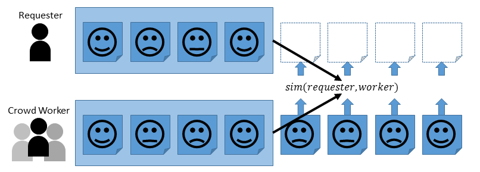
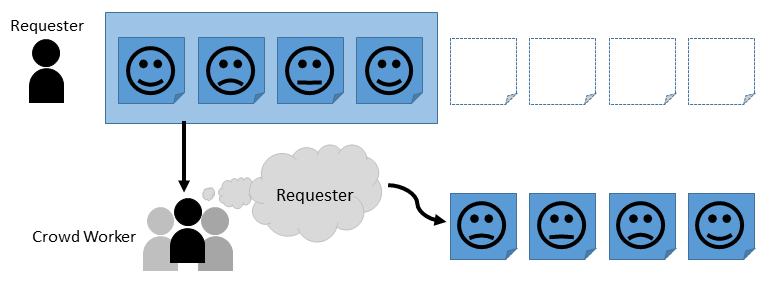
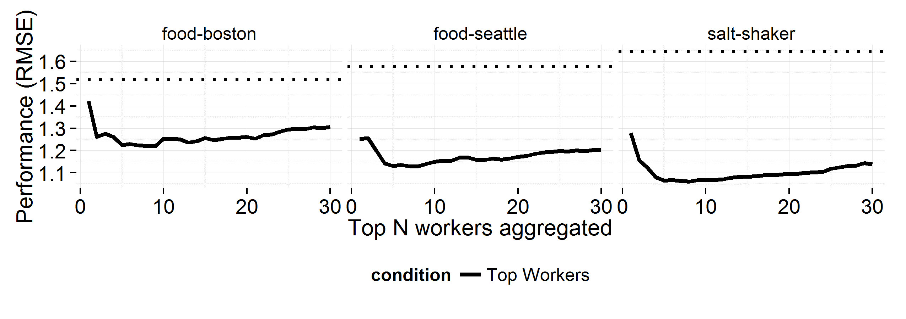
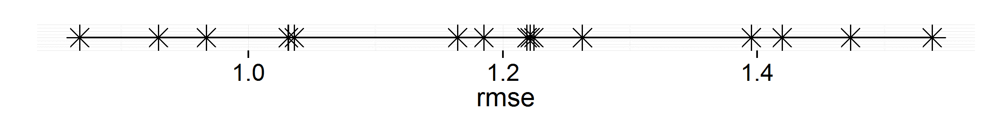
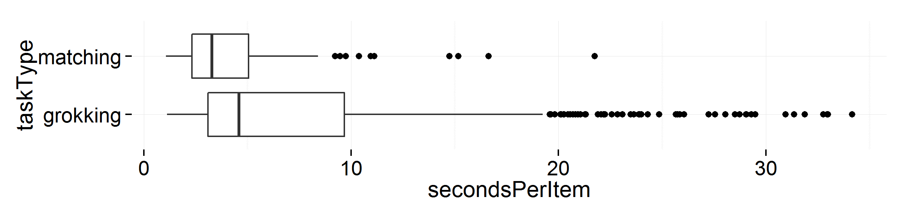
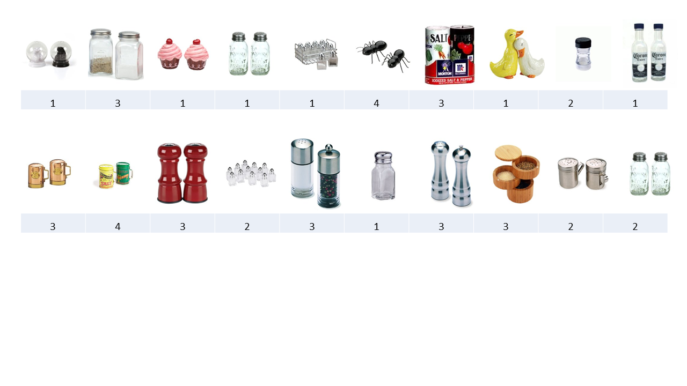
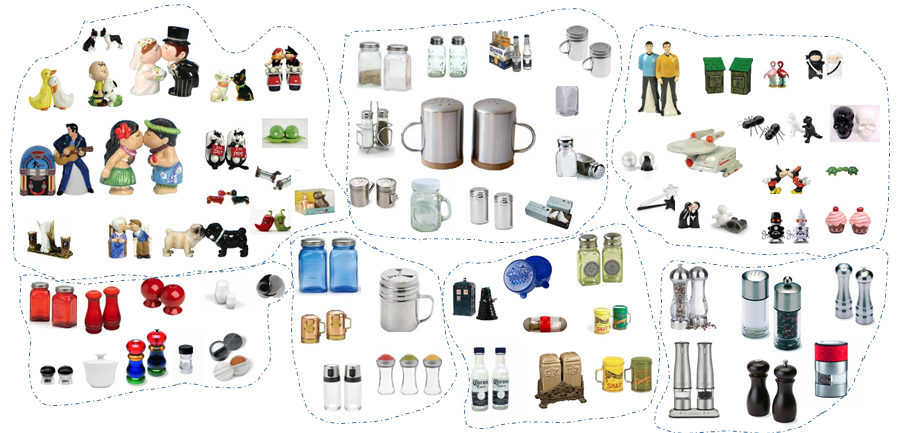
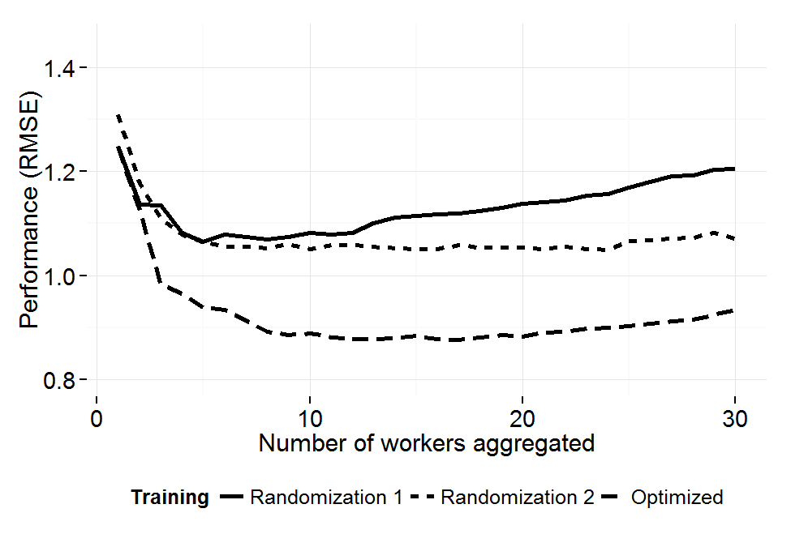
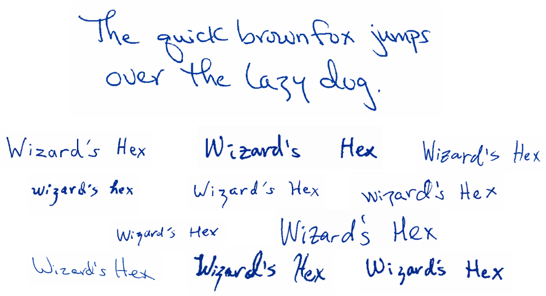
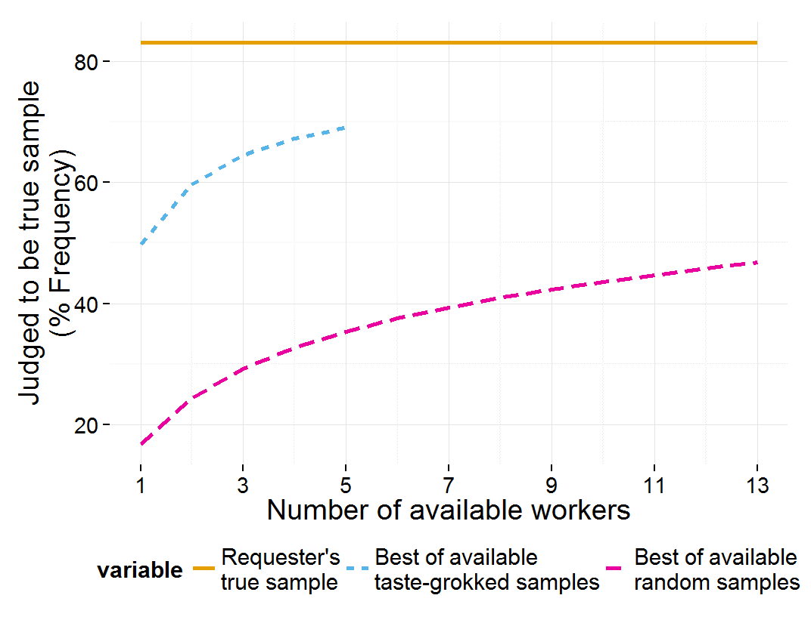

# Designing Tasks for Subjective Needs

[^HCOMPreference]: This chapter is a new reporting of work previously presented at HCOMP 2014, with co-authors Jaime Teevan, Susan Dumais, Robert C.
Miller, and Adam Tauman Kalai [@organisciak_crowd_2014].
Research was performed for Microsoft Research.
  This treatment includes additional data reporting, including discussion of costs and qualitative feedback, as well as an additional set of experiments around handwriting emulation.
  Co-authorship notes in appendix.

Not all crowdsourcing uses have a common goal or objective.
There are many needs that differ from person to person, and access to large crowd of diverse people can help us in parsing the variant needs of an individual.
In recent years, information systems have figured out how to successfully incorporate large-scale feedback from others for purposes such as good movie or product recommendations [@koren_bellkor_2009; @linden_amazon.com_2003], to personalize web search [@noll_web_2007], or even to support specific needs in crisis situations [@vieweg_microblogging_2010].
To do this successfully, these systems must account for the fact that not all people want the same thing.
Given enough behavioral data, systems like Netflix and Amazon have been able to successfully personalize their content to individual users by identifying other related users and showing them what those users have consumed.[^HCOMPreference]

While large-scale approaches to personalization have been successful,
they can only be applied to cases where significant behavioral data already exists.
For example, Netflix can do a good job recommending popular publicly released movies, but would have a much harder time recommending content from a small private collection.

With growing access to real-time human workers through paid crowd markets, a new opportunity to use information from others to address personal information needs is becoming feasible: *personalized crowdsourcing*.

As has already been established, crowdsourcing is commonly used for presumed objective tasks, such as for evaluation [e.g., @kiritchenko_sentiment_2014; @radinsky_learning_2012].
This chapter turns focus to its potential role for subjective uses, and examines how we may organize paid crowds for such purposes.

Recent work has begun to exploring crowdsourcing to solve person-specific problems, such as in travel planning [@zhang_human_2012], document editing [@bernstein_soylent_2010], and email management [@kokkalis_emailvalet_2013].
The approach taken by this chapter introduces personalized crowdsourcing as a general solution to this class of problem, applying human computation through paid crowdsourcing for on-demand personalization.

To explore how paid online crowds can be leveraged to personalize for individuals in sparse data settings, two protocols are presented:
*taste-matching*, where workers are matched in similarity to the requester, and
*taste-grokking*, where unfiltered crowd workers are asked to perform a task as if they were the requester.
It is shown that personalized crowdsourcing is feasible, within the scope of a number of evaluated task types and domains.
By studying personalized crowdsourcing for image recommendation, text summarization,
and handwriting emulation, this chapter offers insight into the relative strengths and weaknesses of each.

These protocol are introduced in more detail later, but the fundamental difference is that in taste-matching, the system finds people with the same opinions and tastes as the requester and asks them for their opinions as a proxy for the requester, while taste-grokking asks _any_ worker, similar or not, to make an educated guess about what the requester would like.

The primary goal in evaluating taste-matching and taste-grokking for various problems is to compare the space of possibility for personalized crowdsourcing: what works, what does not, and when.
Beyond the underlying philosophies of 'matching' or 'grokking' being compared in the two protocols, this chapter touches on training set size and selection, tasks of different complexity and in different domains, contribution granularity,
and inherent worker skill.

Finally, the details of when each is appropriate are discussed, including task complexity, profiling issues, and the amount of possible subjectivity.

Related Work
------------

The work presented here builds on existing crowdsourcing research, leading to a generalized treatment of previous approaches that have been taken to support subjective crowdsourcing.
This section provides an overview of relevant approaches in crowdsourcing, highlighting approaches that are particularly similar to the taste-matching and taste-grokking protocols introduced in this chapter.

\newthought{Crowdsourcing for subjective tasks} is common in volunteer crowdsourcing settings.
Some projects indulge in the variability of human contributions for artistic effect, such as the crowdsourcing fan film
*Star Wars* *Uncut* [@pugh_star_2009] and crowdsourcing music video *The Johnny Cash Project*.
More generally, certain patterns of reactive user-generated content are a familiar part of everyday information system use, such as rating, and commenting.
Casual online users contribute subjective opinions based on reactions to the content as well as the contributions of other people [@dellarocas_what_2006].
This parallels user-generated content contribution in general [@daugherty_exploring_2008], though a complication of volunteered subjective information is that it is biased.
For example, many online ratings exhibit a bimodal distribution, seeming to suggest that self-selected contributors tend to be either very negative or positive, with moderate contributors less like to contribute [@hu_can_2006; @dellarocas_what_2006].
Similarly, early contributors of opinion ratings or reviews tend to affect later opinions [@li_can_2009].

Paying workers may lower self-selection biases for subjective tasks.
However, the most common uses of paid crowds are in the style of human computation [@quinn_human_2011; @law_human_2011]: tasks such as evaluation dataset creation [e.g. @snow_cheap_2008; @novotney_cheap_2010; @alonso_crowdsourcing_2008].
As a result, much literature focuses on issues of reconciling multiple contributions into a trustworthy output [@sheng_get_2008; @wallace_who_2011; @eickhoff_increasing_2012];

\newthought{Though personalized crowdsourcing can be applied in numerous contexts},
it is particularly valuable in highly-specific on-demand settings: where a person might not have the time to spend on completing a task themselves, but the subjectivity of their needs alongside the specificity of the task means that there are few alternative options.
Some people do not find optimal completion of such tasks to be worthwhile, a factor influenced by the perceived value of their time and their enjoyment of the task [@marmorstein_value_1992].
This trade-off is present in areas such as price comparison shopping (ibid) and travel-planning [@gursoy_integrative_2004].
This study does not make any assumptions about where the target person's preferences lie in balancing the quality cost of not personalizing, time cost of completing the task themselves, or monetary cost of personalization.

The underlying assumption in taste-matching is that you can personalize for a person by finding similar people or groups of people, and using them as a proxy for the target person.
This mirrors the approach seen in collaborative filtering [@hofmann_latent_2004], one of the most common forms of recommendation.
Collaborative filtering is also similarly motivated at a higher-level, by the difficulty to predict people's subjective desires and needs purely by analyzing the content.
Where taste-matching differs is that workers contribute data on demand, sidestepping the common collaborative filtering problem of sparse data [@konstan_grouplens_1997].

The taste-grokking approach pursued in this study looks to generate personalized content by asking workers to understand the requester and guess at their tastes and needs; E.g., guessing a requester's opinion on a rating scale.
A similar approach was explored by @krishnan_who_2008, where the MovieLens collaborative filtering system was compared to human recommenders.
MovieLens, which functions like a more mature,
higher *n* version of taste-matching, was found to perform better.
Where humans did excel was in recommending for requesters with eclectic or novel tastes.

\newthought{Recent work has warned about expected} ground truth tasks having subjective components, biasing work around them [@alonso_are_2013].
Tasks such as selecting the best frame of a video [@bernstein_crowds_2011] or rating the similarity between objects [@tamuz_adaptively_2011] can be argued to contain requester- or worker-specific biases.
Some efforts have identified the need to subjective affordances, such as crowdsourced email assistant EmailValet [@kokkalis_emailvalet_2013], travel-planning system Mobi [@zhang_human_2012],
and parts of document-editing system Soylent [@bernstein_soylent_2010].
In all three of these cases, the systems allow requesters to communicate their particular tastes and needs with a natural language description.
In the taste-grokking protocol of this study, communication-by-example is used rather than free-text communication, but this explicit approach constitutes another approach to personalized crowdsourcing.
While paid crowdsourcing has dealt with subjective tasks before, a generalized approach has not been previously defined.

Personalized crowdsourcing has been pursued by prior projects, but not explicitly framed as such.
The work presented here differs from earlier work in providing a generalized treatment of personalized crowdsourcing,
comparing different approaches in different domains and subsequently presenting problems affecting general use of paid crowdsourcing.
Two protocols are presented for comparison, taste-matching and taste-grokking.
Taste-matching has precedent in other areas, though this chapter's implementation differs in applying the concepts to on-demand needs.
Taste-grokking offers a more novel approach relying on critical thinking by workers, capitalizing on the human core underlying crowdsourcing.

Taste-Matching and Taste-Grokking Protocols
-------------------------------------------

Two protocols are developed for personalized crowdsourcing:
*taste-matching* and *taste-grokking*.
Most basically, matching finds similar workers to the requester and uses their work as a proxy for the requester, while grokking asks workers to build a mental model of the requester and manually personalize against it.

Both protocols begin with a minimal profile of the requester – the target of personalization.

The profiling set is a set of tasks in the style that the workers will be expected to complete.
For example, for one of this paper's settings,
where personalized crowdsourcing is applied to predicting a requester's opinion of salt and pepper shaker products on a five-point scale, a set of rated salt and pepper shakers comprise the profiling set.
In the context of taste-matching, the requester profile is compared to worker profiles constructed against the same items.
For taste-grokking,
the requester profile is used to visually communicate the requester's tastes and needs to workers.

Profile construction is subject to variation from a number of parameters: the profiling set size, the profiling set selection, and the domain.
While information content increases with larger profiling sets,
working with humans restricts size based on considerations of attention,
time, and exhaustion [@rzeszotarski_inserting_2013].
For the requester particularly, the time cost of a large profiling set also works against the time and effort saving goals of many personalization settings.

The items acted upon in the profiling set are another profiling consideration.
If a film recommender only asks for a person's opinions of different action movies, for example, the information value of each response will be much lower than if they were to ask about a genre-spanning set of films.
Most basically, the profiling set may be selected randomly from the larger task set, as is done in this study,
though more complex selection strategies may be done.
Later, purposively sampled profiling sets are also considered.

Finally, the domain of the profiling set may differ from the eventual work.
In this study, requesters perform profiling work that is identical to the eventual personalization work: e.g., rating products or highlighting texts.
However, it is conceivable that cross-domain profiling can be used; e.g., taking a requester's book and film
'interests' from a social network and using that to aid taste-grokkers in recommending television shows.

In taste-matching, subjective tasks are performed by human workers that complete those tasks similarly to the requester.

The underlying intuition pursued by taste-matching is that people who perform similarly or express similar preferences on seen tasks will continue to be similar on future, unseen tasks.
Taste-matching pursues this notion by asking the requester being personalized for to complete a small task in the same manner as the workers will be expected to complete it.
The results of this task compose a profile of the requester.

 {#fig:matching-example1}

Figure @fig:matching-example1 illustrates a simple taste-matching setting.
As new workers arrive, they complete the same task set as the requester, and a similarity process is used to measure how similar their work is to the requester profile.
For example, in this study's product image recommendation task, the requester and workers both rate their preferences for a set of online shopping results on a five point scale,
then matched using Root-Mean-Squared-Error (RMSE) on a normalized version of their rating.

Depending on the similarity of the individual worker to the requester –
the taste-match – the system may choose to keep or reject the worker for further contributions.

Even if the intuition of continued similarity is true, there is the issue of adequately capturing the tastes of the requester and workers,
and adequately measuring their similarity.
This requires proper parameterization and user modeling, and can result in variation between taste-matching implementations.
In the settings evaluated for this chapter, efforts were made to base these decisions on precedents and realistic settings, but these are decisions rather than rules.
Two such decisions in taste-matching are the method for measuring similarity, and the method for representing worker contributions as personalized content.

Taste-grokking considers a different intuition than taste-matching: that workers can be adept at understanding – or grokking – the needs of a requester, even if they are not similar to the requester.

'Grokking', a term referring to interpreted understanding, belies the human activity underlying this protocol.
Whereas taste-matching performs an algorithmic similarity matching based on requester and worker profiles, taste-grokking leaves the personalization logic to worker interpretation.

 {#fig:personalizedXX2}

As illustrated in Figure @fig:personalizedXX2, taste-grokking workers are shown a requester's profiling set and asked a variant of the question, 'how do you think the requester would perform the next tasks?' For example, with the product image rating task, workers were shown a requester's ratings for a few items, and asked to rate what the requester's opinion would be for additional products.

As defined here, taste-grokking uses a 'train-by-example' approach to communicate a requester's taste to workers.
Other crowdsourcing studies that have personalized by communication have had the requester articulate their needs in written instructions, e.g., explaining email priorities [@kokkalis_emailvalet_2013] or travel preferences [@zhang_human_2012].
There are potential benefits and difficulties to this approach.
Taste-grokking trains by example due on presumed consistency, attempts to minimize requester effort, and concerns about the technique's sensitivity to hard to articulate decision factors.
While written requests may be dependent on the requester's skill, having a requester simply perform a small amount of the work does not have this confounding factor.
Still, a potential variant of taste-grokking could combine the train-by-example approach with an optional written articulation, as the latter is more explicit about what a requester cares or does not care about when effectively executed.

A benefit of taste-grokking is that it realigns a subjective task to a ground truth: all the workers are trying their best to make sense of the requester.
Since there is an assumed correct answer, taste-grokking is well-suited to error correction and quality metrics performed in more traditional, non-personalized paid crowd contexts.
For example, whereas with matching it is hard to differentiate between a cheating or poor worker and one with eclectic tastes, with taste-grokking a worker that is deviating from the consensus can more confidently be understood as a malicious or poor worker.
Additionally, taste-grokking is well suited to multi-contribution aggregation.
For example, in a simple aggregation case when predicting opinion ratings, suggestions from multiple workers may be collected for each rating, and the personalized prediction can be a voted rating (mode) or a mean.
Doing so smooths over individual errors, although at extra cost.

Before continuing, it is important to make some language clarifications regarding domain-specific words in this study.

-   *Requester*: To refer to the target person being personalized for,
    the term *requester* is borrowed from
    marketplace Mechanical Turk.
This appropriately conveys the
    on-demand context being pursued, where the target person is also the
    one requester the work.

-   *Worker*: Though personalized crowdsourcing and the protocols
    introduced are not necessarily specific to paid crowd contexts, this
    study focuses on paid crowds in order to control for motivation.
For
    this reason, the crowd contributors are referred to as *workers*.

-   *Profiling set*: In both protocols, requesters are profiled by
    performing work on a subset of items.
This is used generally as a
    training set, though one evaluation also collects data
    for cross-validation.
To stay consistent and because the 'training'
    is done in notably different ways in taste-matching and
    taste-grokking, this data is referred to as a *profiling set*.

Taste-matching and taste-grokking are used to answer the question, *can paid online crowds be leveraged for on-demand personalization?* These are only two possible protocols for personalized crowdsourcing and parameterized in a subset of possible ways, but beyond the question of feasibility, we contribute insights on the broader space, exploring how to maximize the effectiveness on personalized crowdsourcing, how task contexts affects the efficacy of the methods, and the concerns or consequences that follow.

Taste-matching and taste-grokking are evaluated over three problems.

-   *Image-based recommendation:* For a familiar, common context, image
    recommendation is performed.
The purpose is to guess a requester's
    opinions on images of 
    a) online shopping results (specifically, salt-shakers), and 
    b) restaurant meal offerings.

-   *Text-highlighting:* Measuring the protocols in a more difficult and
    complex setting, personalized crowdsourcing is evaluated for text
    summarized via highlighting.
Here, workers highlight film reviews
    for a requester.

-   *Handwriting imitation*: To measure a subjective context that is
    skill-based rather than opinion- or preference-based, a handwriting
    mimicry task is performed.

Each of these tasks sees whether an on-demand personalization approach is feasible, through either taste-matching or taste-grokking, for the particular problem.

Experiment #1: Image Recommendation
-------------------------------------

A popular type of personalization is recommendation, commonly performed in large and subjective topic spaces such as film, music, and literature.
This type of task attempts to predict what a target person will like or prefer.
For personalized crowdsourcing, taste-matching and grokking are evaluated in two domains with limited preference data.

In the first domain, online products – specifically, salt and pepper shakers – are recommended based on photographs.
The space of salt and pepper shakers is highly variable and expected to be subjective, but prior preference data would likely be sparse, because buying one is likely too trivial for much comparison shopping and few customers would reasonably buy more than one set.
For this task, 100 salt and pepper shaker images were used from the US version of the Amazon online store.

In the second evaluated domain, captioned images of restaurant food are recommended.
Whereas restaurant recommendations are common through services such as Yelp, Google Maps, or Foursquare, recommendation based on the actual offerings in those restaurants is more difficult, again because it is difficult to otherwise collect enough preference data.
Two datasets of 100 cuisine images and names each were collected from Foodspotting.com, one with food from Boston and the other from Seattle.

Worker contributions were collected through Amazon's Mechanical Turk paid crowd marketplace.
Workers were asked to rate 100 images in each task set.

For each task set of 100 ratings, workers were paid \$1.50.
To incentivize taste-grokking workers, who had a performance goal in trying to 'grok' the requester, the taste-grokking remuneration included bonuses paid against ranked performance.

\newthought{Requesters are first profiled.}
The profiling set size has to compromise between the system-end value of maximum data and considerations of requester effort expenditure and tolerance.
For image recommendation,
the profiling set was set to 20 randomly selected images.
This value was chosen instinctively, though this size-effort compromise is worthy of future study.

The requesters were simulated from paid crowd members.
That is, a crowd worker contributed 100 ratings, 20 of which were used as their profiling set, and the remainder used for measuring the effectiveness of recommendations.

\newthought{Workers in the taste-matching} group were asked to rate images based on their own opinion of how much they like the salt-shaker or how appetizing they find the pictured food.

As not all people have the same mental concept of the rating scale
(e.g., how much one has to like the item to give it five stars rather than four), taste-matching ratings were normalized
($r \rightarrow r^{'}$) as the deviation from each user's mean rating [@hofmann_latent_2004]:

\begin{equation}
r^{'} = \frac{r - \mu_{\text{rater}}}{\sigma_{\text{rater}}}
\end{equation}.

Normalization was not necessary for grokking because workers were performing against a target user's world-view rather than their own.

\newthought{Taste-grokking workers} were shown a profiling set of *10* items with the requester's opinions.
They were told that a single requester had contributed the judgments, and were asked to 'guess' what the same requester would think for the subsequent 90 items.

The fact that taste-matching trains a model while taste-grokking trains a human worker means that a realistic parameterization differs between the two.
Note that although *20* items had been collected for profiling,
the choice of a smaller training set for grokking was motivated by an expectation that it would be too difficult for a person to make sense of too many examples.
The other *10* items were kept for cross-validation,
to measure whether workers that were notably strong or weak at grokking.

### Measurements

Root-Mean-Squared Error (RMSE) was used both for a measuring similarity in the profiling set and for evaluating the quality of recommendations,
with a smaller RMSE representing better similarity or a better recommendation.

RMSE offers a measure of how much the predicted opinions for a requester deviate from the actual opinions.
It is calculated as,

$RMSE = \sqrt{\frac{1}{n}\sum_{i = 1}^{n}{({t - p)}^{2}}}$,

where $t$ denotes the requester's true opinion, and $p$ denotes the recommended opinion.

\newthought{A system that does not assume variation} across individuals would not personalize, and instead might use the opinions of any worker to make recommendations for the requester.
This is what comprises the baseline measure, performing at an average RMSE of 1.64 for the salt-shaker recommendation task, and 1.51 and 1.58 for the cuisine recommendation tasks in Seattle and Boston, respectively.
An error of 1.51-1.64 on a five-point scale is fairly high and shows that the tasks are notably subjective to begin with.

While considerable variation is seen across individuals, similarities between individuals are found to be consistent over time.
This can be seen in the correlation between worker-requester similarity on the profiling data and worker-requester similarity on the testing data.
Where a Pearson correlation coefficient would be 1 if the assumption is correct and the profiling set is perfect at finding people that are similar, the actual collected preference data has a Pearson correlation of $0.73$ for the salt and pepper shaker task, and $0.67$ and $0.71$
respectively for the cuisine in Seattle and Boston tasks.
This shows an imperfect but strong correlation.
Such a correlation could still exist if the task was not subjective, and is only insightful in combination with variation seen in the baseline RMSE.

### Taste-Matching

+--------------------------+--------------+-------------+-------------+
|                          | Products -   | Food -      | Food -      |
|                          | Salt shakers | Boston      | Seattle     |
+==========================+==============+=============+=============+
| Baseline: Prediction     |              |             |             |
| by any worker            | 1.64         | 1.51        | 1.58        |
+--------------------------+--------------+-------------+-------------+
| Best 3 workers overall   |              |             |             |
| (top 10%)                | 0.89 (-46%)  | 1.02 (-32%) | 1.19 (-25%) |
+--------------------------+--------------+-------------+-------------+
| Best matched worker from |              |             |             |
| random 5                 | 1.43 (-13%)  | 1.19 (-22%) | 1.26 (-20%) |
+--------------------------+--------------+-------------+-------------+
| Best matched worker from |              |             |             |
| random 10                | 1.35 (-18%)  | 1.08 (-29%) | 1.08 (-31%) |
+--------------------------+--------------+-------------+-------------+

Table: Taste-matching performance for recommendation task {#tbl:matching-performance}

Table @tbl:matching-performance shows the performance of recommendations predicted by taste-matching.
In both task types, taste-matching improved over the baseline, with stronger gains against the cuisine recommendation tasks.

The parameterizations were selected based on an expectation of a realistic task setting: the best worker from random five and ten.
In this setting, a requester starts a personalized crowdsourcing task, and *n*
workers are profiled.
Based on the profiling 'match', the best of these workers is retained to perform more work as a surrogate for the requester.
The amount of workers to profile is dependent on a requester's quality-cost trade-off.
Though there is no formal expectation of constant improvement, profiling additional workers nonetheless keeps improving performance.

With the parameters used in this study – payment of \$1.50 per 100 ratings and a profiling set of 20 items – profiling each worker comes to 30 cents, followed by 1.5 cents for every predicted rating by the matched worker.

Also shown is the average performance of the top three workers overall for each of the thirty requesters.
This value is included for comparison, of the best possible improvements if the matching process were to successfully identify these workers.
For the cuisine recommendation tasks, the matching does in fact work well, given that the best matched workers perform comparable to the ideal.
For the salt and pepper shaker recommendation task, the taste-matching improvements are not as strong as the ideal, suggesting that while good workers are being found by matching, they are not always the *best* workers.

### Taste-Grokking

+--------------------------+--------------+--------------+--------------+
|                          | Products -   | Food -       | Food -       |
|                          | Salt shakers | Boston       | Seattle      |
+==========================+==============+==============+==============+
| Baseline: Prediction by  |              |              |              |
| any worker               | 1.64         | 1.51         | 1.58         |
+--------------------------+--------------+--------------+--------------+
| Best 3 workers overall   | 0.87 (-47%)  | 0.78 (-48%)  | 0.79 (-50%)  |
+--------------------------+--------------+--------------+--------------+
| Average individual       | 1.29 (-21%)  | 1.53 (+1.3%) | 1.57 (-0.5%) |
+--------------------------+--------------+--------------+--------------+
| Aggregated prediction    |              |              |              |
| (mean, 5 random workers) | 1.07 (-34%)  | 1.38 (-9%)   | 1.28 (-19%)  |
+--------------------------+--------------+--------------+--------------+
| Aggregated prediction    |              |              |              |
| (mean, 5 top workers)    | 1.02 (-34%)  | 1.22 (-19%)  | 1.13 (-28%)  |
+--------------------------+--------------+--------------+--------------+

Table: Taste-grokking performance. {#tbl:grokking-performance}

Taste-grokking improves over the baseline in many settings, but not all.
In all cases, it works better for product recommendation than it does for cuisine recommendation, a reversal of what was seen with taste-matching.
Table @tbl:grokking-performance shows the average performance of taste-grokking when performed by any given worker, when aggregated from five worker contributions, and when aggregated from five workers that had been cross-validated as 'good grokkers' from a pool of thirty.

The performance of any single worker's grokking prediction averages an RMSE of 1.29 for salt and pepper shaker recommendation, and 1.53 and 1.57 for the cuisine recommendation.
The performance for cuisine recommendation shows no improvement over the baseline; thus, it is tricky to trust only one grokking worker for these tasks.

More effective than asking one grokking worker is to ask multiple workers and aggregate their predicted ratings.
This is sensible because all the workers are striving for the same ground truth, to understand the requester, but individuals vary in their grokking proficiency or make occasional errors.
For this chapter, workers'
recommended ratings were aggregated with a simple mean.
Aggregating through the mean of five workers' predictions provides improvements of 34% for salt and pepper shaker taste prediction, and 9% and 19% for the cuisine tasks.
The choice to aggregate 5 workers is motivated by a recommendation in @novotney_cheap_2010 for a different task type but with similar complexity.

 {#fig:top-grokkers}

Using a cross-validation set of ten ratings to identify and aggregate top workers improves the quality of predictions further, though at the cost and time of collecting additional recommendations.
Figure @fig:top-grokkers
demonstrates the improvement in performance as more of the top workers
(e.g., 2^nd^, 3^rd^, ..., 30^th^ best cross-validated worker included in prediction).
For each task domain there is an increase in performance followed by a gradual decrease, suggesting that even with good workers,
aggregation is an important approach for improving quality.

Taste-grokking does not include any fixed costs for profiling as with taste-matching.
With the intuitively chosen payment parameters in this study, taste-grokking remains more affordable with a single worker per recommendation.
However, while the salt and pepper shaker product recommendation task was well suited for single-worker taste-grokking,
the much improved performance with aggregation means that an ideal taste-grokking setting is more expensive after a few rating predictions.

### Worker Behavior

Given that in one protocol workers shared their own opinions of food and products while in the other they had to interpret another person, it was expected the time spent per contribution to be higher for taste-grokking tasks.
This was indeed the case, though the median time per grokked rating prediction was not drastically higher: 4.6 seconds (grokking) compared to 3.3 (matching).
The range of time spent per item is much larger for taste-grokking, as shown in the box plots in Figure @fig:subjTimeSpent.
Among crowd workers, it is common to find high-end time outliers due to casual workers that multi-task, but the length of the tail for grokking seems to suggest an additional effect.
Though it difficult to know with certainty,
it is possible that some workers have particular difficulty with the task or some workers perform the work very carefully, with much cross-checking with the profiling set.
Based on suggestions from voluntary feedback that taste-grokking is more interesting to some workers, the possibility of a subset of workers stepping back from time-
and profit- maximization to taste-grok is possible.

The time is measured from the start to end of the worker interaction,
for a set of 100 ratings for taste-matching or 90 rating predictions for taste-grokking.
As such, part of the time spent might be related to the reading of instructions, which may also contribute to differences between the two protocols.

 {#fig:tastegrokkingPerformance}

 {#fig:subjTimeSpent}

\newthought{When collecting taste-matching data}, a tertiary evaluation was done where workers were not only asked to provide a rating of their opinion,
but were also asked 'what is your reason for this rating?' It was found that by asking workers to contemplate and explicate their reasoning for judgments, their behaviors changed.
The mean worker ratings (i.e. each worker's average opinion) were more measured, with workers that were overall consistently negative or positive not represented.
This data was not used for the main evaluation, but serves to emphasize that unexpected variance when working with online crowds not only stems from their tastes and needs,
but also the contexts in which they contribute data.

\newthought{For all tasks, an optional feedback form} was provided to allow for workers to communicate with us.
These provided some qualitative insights into worker satisfaction and task issues.

In general, taste-grokking received more affirmative responses in the style of 'fun!' and 'that was really interesting'.
However, it also frustrated workers when the profiling set failed.
Particularly for the cuisine task, some workers lamented that the requester's opinions that were shown did not communicate enough about the requester.
For example, one worker reported, “I think a few more rated pictures would have been helpful in helping me to decide some of the choices, because there wasn't anything that similar in the rated items to those items such as the cappuccino, burgers, hot chocolate.” The taste profiling sets were selected randomly for each requester, and taste-grokking was tried with two different set per requester, but the salt and pepper shaker tasks appeared less likely to settle with a poor profiling set.
This feedback seems to align with the poorer grokking results for cuisine, which will be discussed below.

Figure @fig:tastegrokkingPerformance shows the performance of an all-worker aggregation for each individual taste-grokking experiment, in order to demonstrate the range of overall prediction quality related to different profiling sets.
For comparison, the worst optimized profiling set (described in next section) performance was RMSE=1.05.
Figure @fig:goodPoorGrokking offers an example of a successful profiling set alongside one where workers performed poorly.
The reason the bottom set in Figure @fig:goodPoorGrokking performed poorly is only speculative, though it is notable that it did not capture the workers' opinion of 'cute figurines', as the one above did with the cuddling bird and the cupcake salt and pepper shakers.
The taste cluster examples in Figure @fig:cluster-examples show that this is a large facet of the space.
However, of the nine workers that left feedback for the poorly recommended task, none expressed concerns about the training set.

 {#fig:goodPoorGrokking}

In the results presented, the items used for profiling and subsequently for profiling in taste-grokking were selected randomly.
Random selection can potentially fail when there are many decision dimensions to communicate, as was observed for taste-grokking over cuisine.
To measure how robust randomness is compared to alternative selection strategies, an evaluation was completed on taste-grokking over a more purposively sampled profiling set.

The alternative set used using stratified random sampling, from items clustered against opinions contributed by taste-matching workers.
K-means clusters was used, where the number of clusters *k* was equal to the profiling set size (i.e., *k=10*).
The clusters used as strata for sampling are partially shown in Figure @fig:cluster-examples.

For the profiling set, one item was randomly chosen from each strata.
The intention was to capture the breadth of tastes.

Using an optimized selection of items in the profiling set improved performance greatly over the salt and pepper shaker prediction task.
Figure @fig:aggregation shows the quality of aggregating 1-30 workers; for comparison to Table @tbl:grokking-performance, aggregating 5 random workers gave an RMSE of $1.04$.

 {#fig:cluster-examples}

 {#fig:aggregation}

Predicting a requester's rating was a suitable application of personalized crowdsourcing for two image recommendation tasks.
Both taste-grokking and taste-matching improved over the baseline.
However, the task domains mattered, and taste-grokking was stronger for salt and pepper shaker recommendation while taste-matching was strong for cuisine recommendation.
The complexity of the tasks seemed to have contributed to this disparity, where the richer decision space of food resulted in harder-to-understand profiling sets with taste-grokking.

Text Highlighting
-----------------

Rating prediction against a five-point scale is an easily controlled task,
making it well suited for personalized crowdsourcing.
To observe personalized crowdsourcing in a more complex setting, a new task was developed:
text highlighting to make film reviews easy to skim.
Highlighting texts has much more possible variation [@marshall_future_2000], and involved requester-specific *needs* in addition to requester-specific *opinions*.

Many settings call for people to digest large amounts of texts, such as in academia, medicine, law, and business.
To varying degrees, different individuals may look for different information in the same texts.
Can online crowds be leveraged to highlight texts for target requesters, for the purpose of summarization?

Film reviews were chosen as a generally useful domain where people having varying information needs and opinions, as well as one that may be interesting to workers.
Thus, it is expected to be an easy domain for a difficult task, providing insight into the tractability of text highlighting.

The texts for highlighting were six professional film reviews from *The A.V.
Club*, averaging 456 words each.

Workers were recruited on Amazon Mechanical Turk and contributed highlights through a custom web interface.
As with the item recommendation task, crowd workers stood in as requesters.

### Measurement

The F1 measure is used to measure how similar a worker's highlights are to the requesters'.

F1 is the harmonic mean between precision and recall, measured by word overlap.
Precision is the proportion of a worker's highlighted words that overlap with the requester's highlights, and recall is the proportion of the requester's highlights that are highlighted in the worker's highlights.

\begin{equation}
F_{1} = 2*\frac{\text{Precision}*\text{Recall}}{\text{Precision} + \text{Recall}}
\end{equation}

A worker that highlights everything will receive perfect recall but poor precision, while a single word highlight that happens to overlap with a requester's highlights will be very precise but have poor recall.
The goal of F1 is to balance these two measures.

The motivation in using F1 is to capture not only when the same passages were highlighted, but also similarity in brevity: how much is highlighted.
Highlighted text that overlaps with the target highlights is rewarded, while irrelevant text is punished.

As the baseline, the average performance of a predicted highlight without matching or grokking was used.
The performance of a non-personalized highlighting, measured from 200 highlighted reviews,
was $F1 = 0.32$.

### Profiling

In a realistic setting, the purpose of personalized crowdsourcing for text highlighting is to lower the effort necessary for a requester to seek a desired set of information.
Given this, profiling is difficult in this instance because of the effort required to highlight even a single review.
Thus, the size of the profiling set was$\ 2$ highlighted film reviews.

### Taste-Matching

For taste-matching, workers were asked, “if somebody gave you a summary of this review, what would you like to know to help you decide if it is movie worth seeing?” Highlights were collected for 50 requesters.

Workers were matched to requesters based on the overlap over their highlights with the requester's highlighting, using F1 as a measure of similarity.
One concern with this approach is the conceivable setting where two lines of the review have practically the same information, but the requester highlights one line and a worker highlights the other.
The relatively short average length of reviews may limit this effect, though a real-world setting would require a more robust similarity metric.

### Taste-Grokking

                        Performance (F1)
----------------------- -----------------
Baseline                0.32
Best-matched workers    0.39 (+20%)
5 best-matched workers  0.38 (+17%)

Table: Taste-matching text highlighting results. {#tbl:matching-highlights}

                          Performance (F1)
------------------------- ------------------
Baseline                  0.32
Any worker                0.30 (-7%)
Best workers (pool of 5)  0.52 (+62%)

Table: Taste-grokking text highlighting results. {#tbl:grokking-highlights}

Taste-grokking workers were shown a single film review highlighted by a requester and asked to highlight additional reviews for that requester.
The review that was shown was randomly selected from the two profiling examples that requesters had provided, though data was collected for each profiling example.

The broad space, highlighting a custom set of words from approximately 456 words, did not lend itself easily to aggregation.
For example,
majority voting among multiple workers would be expected to shrink the predicted highlights to less than any individual's highlights, hurting recall and measured performance.
More complex possibilities would require study beyond the scope of this paper, so no aggregation was performed.

### Results

Table @tbl:matching-highlights shows the performance of the best-matched and average performance of the five best-matched workers in each condition.
Taste-matching workers that matched well also performed well for the matching.

In contrast, taste-grokking suffered from the difficulty of the task,
and the lack of aggregation.
The typical recommended highlight was actually *worse* than the baseline.
Grokking workers, it seems, over-fit their mental models of the requester, providing worse highlights than if they had simply highlighted of their own accord.
Though the improvements from taste-matching show some degree of subjectivity, the poor performance of grokking may also be due to less than anticipated requester-specific variance.

For comparison, the best taste-grokking workers from random sets of five are shown.
This uses posterior information that was not known at collection, but serves to emphasize the very high theoretical performance of workers with a mean $62\%$ improvement.
It seems, while most taste-grokking workers were poor at the task, some very effective
'super-grokkers' were observed.

Handwriting Imitation
---------------------

Despite adopting the term 'taste' in taste-matching and taste-grokking, there are many non-normative tasks that do not refer to subjective taste but nonetheless are requester-specific and may be suited for personalization.
Two additional areas may be characterized as those affected by *style* and *biases*.
By way of example, a small handwriting imitation study was performed, looking at the ability of strangers to personalize text in a person's handwriting.
This is more a question of style than of taste.

Handwriting samples and imitations were collected from requesters and workers in person, rather than online, to avoid differences in pen and paper type biasing the evaluation.
The hypothetical goal of such a system would be to produce a sample of arbitrary text in something that looks like the requester's handwriting.
For simplicity, a single phrase was focused on.
The *training phrase*, “The quick brown fox jumps over the lazy dog,” was used to communicate the requester's handwriting style.
The *target phrase*, “Wizard's hex,” represents an example of arbitrary text one may desire.

Nine requesters each provided a profiling phrase sample in their own handwriting, as well as a target phrase sample for evaluation.

###  Measurement

Similarity evaluation here raises two interesting points.
First, unlike ratings, where similarity differences can easily be evaluated numerically, similarity in handwriting samples is more difficult to judge automatically.
Hence, paid crowd workers were recruited to judge handwriting similarity.

Second, similarity can be judged across examples and from a single sample pair, even if the text is different.
This obviates the need to rank overall similarity between users as one can simply use similarity between sample pairs.

To evaluate similarity between any given sample pair of training and target phrases, one hundred workers on Mechanical Turk were shown the two samples.
Regardless of the test sample was written by the requester
(the person who wrote the training sample), an imitator, or an independent person in their own handwriting, the worker was asked, “Do you think these two samples were written by the same person? (Y/N)”.
The proportion of one-hundred evaluators that answered “Yes” to the question is referred to as the *score*.

### Style-Matching

 {#fig:handwriting-example}

Handwriting was assumed to be too varied for workers to match well to requesters within a reasonable worker pool size.
Matching was nonetheless measured for comparison: how similar any given sample is to the requester's, and whether more similar handwriting on the target phrase predicts similarity on the testing phrase.
For taste (style)
matching, the similarity of the true requester sample was evaluated against 13 samples in other people's handwriting.

### Style-Grokking

For taste (style) grokking, five grokking workers attempted to imitate the requester's handwriting, for each of the nine requesters.
They were shown the requester's writing of the profiling phrase, and imitated that style for the target phrase.
Prior to performing these imitations, the five imitators wrote the target phrase in their own handwriting.
This gave us a total of 14 target phrase samples in people's own handwriting.

While handwriting similarity evaluation is subjective in itself, the question phrasing makes it clear that there is an objective ground truth correct answer.
This means that one could potentially evaluate workers on their ability to correctly distinguish authentic from forged handwriting.
Furthermore, it is possible that some workers will try harder simply knowing that their work may be objectively scrutinized.

As a baseline, the non-imitated handwriting of a random person scored
$0.17$ - i.e., 17% of the time workers thought that the evaluated sample was written by the requester.
This was low, but expected, given how different handwriting may be.
On the upper end, the requester's true handwriting scored $0.83$ providing an insight into the cautiousness of evaluators.

 {#fig:handwriting-success}

Matching ranked as poorly as expected.
Figure @fig:handwriting-success shows the score of the best of $k$ random samples in people's own handwriting.
Even for
$k$=13, this number is below 0.50.
For this reason, matching was determined to be intractable.

Interestingly, there were cases where a grokking worker's target sample was judged to be at least as similar to the training sample as that of the requester themselves.
This is possibly due to internal inconsistencies present in a requester's casual handwriting, whereas a methodical worker would not include such quirks.
For example, in the most drastic example, it was found that a requester wrote the profiling phrase with a crossed 'z', but the test phrase without the line through it.
An evaluator would likely be looking for a crossed 'z' each time,
while grokkers are likely to mimic that.

On average, individual grokkers scored $0.50$, well below the $0.83$,
average score of a requester on their own sample pair.
There was a large variation in imitation ability among grokking workers, with average scores ranging from $0.38$ to $0.67\ $for the five individual grokkers.
For comparison, the best grokked sample for each condition achieved a score of $0.69$.
Figure @fig:handwriting-success shows how this varies across $k$, with
$k = 1$ being a random single imitator and $k = 5$ being the best of the five.

Discussion
----------

Taste-matching and taste-grokking provide insights on personalized crowdsourcing for on-demand subjective needs.
They generally provided improvements over a non-personalized baseline,
but the appropriateness and effectiveness of the protocols was subject to considerations such as the number of decision-making dimensions, task and domain enjoyability, how manifest and easily communicated the factors of a requester's needs were, and the cost or time needs.
Evaluating two protocols provided a comparison of these issues; this section generalizes from what was observed.

One way to consider personalization tasks is as a mixture of numerous latent and manifest decision factors, and tempered by the bandwidth of the contribution metric.
Handwriting is a highly granular task, where every angle of the pen can change the output, while rating cuisine on a five-point scale has low granularity: five different possibilities.
However, what motivates the style of work, whether an opinion,
highlight, or a handwritten phrase, can be highly explicit (manifest) or powered by unseen latent factors.
Consider a highlighted passage that a film is “a great family film” and the difficulties of parsing the highlighter's intention: do they highlight because they find it generally informative, or do they prefer information of that particular length, or is the family-context very specifically what they were looking for? In contrast, the salt and pepper shaker recommendation seemed motivated by manifest factors related to its appearance.
This can be seen when clustering items by opinions: the clusters are qualitatively visually coherent.

A consideration of decision factors and contribution bandwidth helps anticipate the choice of taste-grokking or taste-matching.
Taste-grokking worked best for tasks that were manifest, and poorly when there are difficult-to-parse decision factors.
When performing the same clustering by opinion as above against opinions in the cuisine dataset,
the relationships are more unexpected.
A taste-grokker might not expect the correlation between liking shawarma and those that enjoy wheat beer,
while a well-matched worker would represent it naturally.
It is only at around 14 clusters that the food clusters start to look qualitatively coherent.

While taste-matching is better suited for tasks where the subjective component is more latent, the ability to match is complicated by high-bandwidth tasks.
The handwriting imitation task demonstrates that high-bandwidth tasks can be handled by taste-grokking workers, but the chance of a good match increases when the space of possible approaches to a task increases.
However, while task bandwidth seems to be a consideration conceptually, this study did not compare bandwidth for the same task (e.g., matching vs.
grokking for opinions on 10-point vs.
2-point rating scales).

In settings with lower-quality workers, taste-grokking allows for more straightforward quality control metrics.
While taste-matching has no conceptual ground truth to judge worker quality, only suspicious behaviors, taste-grokking takes subjective tasks and grounds them in the specific needs of a single requester.
Since all workers are striving to do the same thing, traditional quality control metrics can be used more easily, such as aggregation (by voting, average, or other method),
worker weighting, and cross-validation.

Taste-matching is more robust to scaling on-demand tasks to large numbers of requesters or many workers.
This is because taste-grokking contributions are explicitly conditioned on the requester, while workers contributing tasks in their own style or opinions can be reused for new requesters, and for modelling person-types.
Scaling worker counts to large numbers of workers provided better improvements with taste-matching, almost monotonically improving with each additional worker.

Taste-matching at scale bridges the protocol to its conceptual antecedent: collaborative filtering.
Taste-matching follows the same intuitions as collaborative filtering and can be interpreted as on-demand collaborative filtering for contexts where no pre-existing data exists.
Mature collaborative filtering systems, like Netflix, make sense of large numbers of opinion data from their users; for a context like filtering one's vacation photos or buying a salt shaker, this rich data does not exist and it is hard to imagine a robust system around it.

One challenge in collaborative filtering is data sparsity when a new user joins, when new items are added, or both, when the system is brand new.
On-demand personalization through taste-matching can be used to bootstrap a system as it grows.

Personalized crowdsourcing is a new area of focus which will benefit from further study.
This work has contributed an initial set of observations,
which lead to new questions.
One such set of questions regards optimization strategies around taste-grokking, to further understand good workers and what makes them strong.
How do the personal preferences of workers affect their grokking ability? Do better matched workers taste-grok better? How does one identify and nurture 'super-grokkers'?

Selecting the profiling set size and items was found to affect the quality of personalization.
An initial study of optimized item selection shows that purposive strategies can improve personalization, though the methods presented here require prior data for clustering; content-based strategies
(e.g., analyzing images or metadata) may yield similar improvements.
A poor profiling set was found to particularly frustrate grokking workers,
who at times asked for a large set.
Deciding on the balance between enough and too many examples – for both protocols – was outside of the current study's scope, but is an important need at the nexus of qualitative considerations (time, stamina, interest) and modeling needs.

In all three task types, the best taste-grokking workers performed remarkably well compared to the average.
One worker's handwriting imitations fooled evaluators two-thirds of the time, while the best text-highlighting grokkers far surpassed the ineffective random worker.
The difficulty with 'super-grokkers' is that while they may be observed after collection, it is difficult to anticipate them a priori without ground truth.

Finally, the application of personalized crowdsourcing in different contexts, different domains, and for different tasks remains to be seen.
This chapter focused on personalized item recommendation, with additional consideration paid to a more complex task (text highlighting), and a style-based personalization task (handwriting imitation).

Conclusions
-----------

The ability to reach large online crowds and efficiently manage them in a common task has impacted the scale of problems that can be solved without automation and made possible for on-demand human-in-the-loop systems.
While crowdsourcing has been notably applied to ground-truth tasks, this study turned the lens on a less-studied type of problem, one which human workers are especially well-positioned to address: subjective, person-specific tasks.
*Personalized crowdsourcing* is discussed as an additional facet of crowdsourcing, one that is well-suited to on-demand personalization.

In the space of on-demand personalization, two notably different approaches were contrasted – *taste-grokking* and *taste-matching* –
over three task types: opinion prediction for the purpose of recommendation, text highlighting for the purpose of summarization, and handwriting imitation to view style-based subjectivity.
It was found that within these spaces, personalized crowdsourcing is feasible.
Understanding that, the question of which technique is better was less consistently answered.
Taste-matching proved to be capable for tasks with less manifest decision factors and, as implemented here, more cost-effective.
Taste-grokking worked particularly well for product recommendation and usually was responsible for the best single-worker recommendations, albeit with difficulties in anticipating this a priori.
Taste-grokking is a promising but less-explored protocol, and while the experiments presented here provided initial insights on how to communicate to and organize grokking workers, additional questions remain about sufficient communication sets and on making use of the task's greater engagement.

We demonstrate that the area of personalized crowdsourcing is promising for on-demand personalization, able to provide person-specific work such as recommendations and filtering without prior data.
