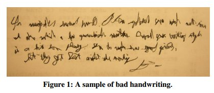
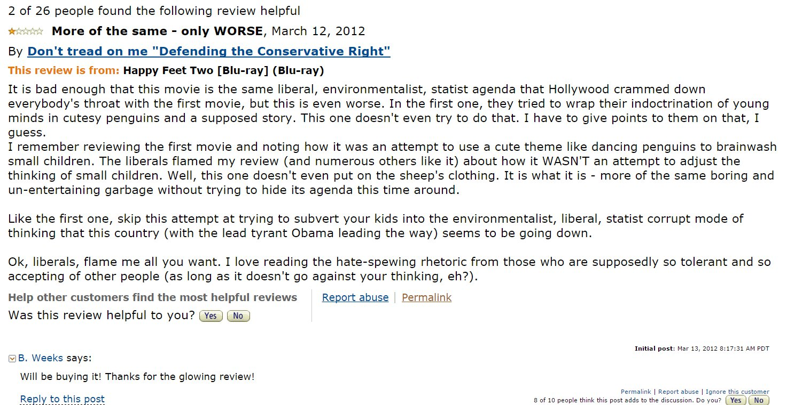

% Crowdsourcing metadata
% _Peter Organisciak_
% Oct 15, 2014

_Committee_

 - Chair: Michael B. Twidale
 - Miles Efron
 - J. Stephen Downie
 - Jaime Teevan

<!--% Reliably augmenting documents by collecting and interpreting amateur contributions-->

# Introduction

## Crowdsourcing

> - When groups of people, connected by technology, contribute to a common product 

Today I'm going to talk about when people create things online.
I'm referring, of course, to crowdsourcing.
You may already know this term; Wolf Blitzer knows it, and your parents may too.
If you're unfamiliar with it, that's okay, I'll explain more as I go along.
Most basically, it refers to when many people, connected by technology, contribute to a common product.
Sometimes this is as volunteers -- an act as deliberate as Wikipedia editing or reviewing products on Amazon, or as incidental as teaching Facebook about quality posts by clicking the 'like' button.
Other times, crowdsourcing involves paid crowds, such as those that participate in the micro-task marketplace called Mechanical Turk.

## Crowdsourcing for Metadata

Crowdsourcing as a _reactive_ act, capturing human interpretations and reactions to information

Today, however, I'm talking about a specific use of crowdsourcing: to teach us more about existing information objects.
Our focus today is on place crowdsourcing as a _reactive_ act, capturing human interpretations and reactions to information, teaching us more about the nature of the object.

## Why <!-- Problem -->

* Digitized and born-digital information is outpacing our ability to clean, annotate, organize it
<!-- TODO cite -->
* Poses problems for information retrieval, for connecting information-seeking users to the proper content
\
\
Crowdsourcing is increasingly being used to address these problems

This is becoming increasingly important
The growth of digital collections has outpaced the ability to comprehensively clean, transcribe, and annotate the data.

Make no mistake, this lack of restriction is often good; the laissez-faire approach of the world wide web, for example, is what made it so appealing over the alternatives.

However, the lack of strong descriptive metadata poses an obstacle for information retrieval, which must infer the aboutness of a document in order to surface it for an interested user.
Crowdsourcing is increasing being used to address this problem.

--------

Many of the benefits of crowdsourcing follow from the fact that humans approach tasks in qualitative and abstract ways

Humans are good at things algorithms aren't

While there is a whole area on so-called human computation, with humans performing tasks in the mode of computing and which can conceivably be automated one day, even there there is an underlying understanding that humans are very complex.

 

--------

_question and answers website_

A mixture of fact-based and opinion-based questions; not restricted to "right" answers.

----

--------

-------

In cultural heritage institutions, crowds can...

 - contribute classifications that better reflect the information needs of users
    - user-tagged images better match colloquial user needs than professional classification [@springer_for_2008; @trant_investigating_2006]

> - fill in where algorithms fail [e.g. @von_ahn_recaptcha_2008; @holley_many_2009]

> - parse non-text materials [e.g. @moyle_manuscript_2010; @causer_transcription_2012] or higher-level latent concepts

> - judge or react to content quality

## Transcribe Bentham { data-background='images/bentham1.jpg' }

[@moyle_manuscript_2010; @causer_transcription_2012]

## { data-background="images/bibliocommons2.jpg" }

\
\
\
-
 
### Bibliocommons

Comparison of social OPACs: @spiteri_social_2011

## PageRank

Classic example of humans for quality judgment, trustworthiness (by proxy) in addition to aboutness

----

Benefits to libraries [@holley_crowdsourcing_2010]:

 - Achieving goals the library would never have the time, financial or staff resource to achieve on its own.
 - Achieving goals in a much faster timeframe than the library may be able to achieve if it worked on its own.
 - Building new virtual communities and user groups.
 - Actively involving and engaging the community with the library and its other users and collections.
 - Utilising the knowledge, expertise and interest of the community.
 - Improving the quality of data/resource (e.g. by text, or catalogue corrections), resulting in more accurate searching.
 - Adding value to data (e.g. by addition of comments, tags, ratings, reviews).
Making data discoverable in different ways for a more diverse audience (e.g. by tagging).

-------

Benefits to libraries [@holley_crowdsourcing_2010]:

 - Gaining first-hand insight on user desires and the answers to difficult questions by asking and then listening to the crowd.
 - Demonstrating the value and relevance of the library in the community by the high level of public involvement.
 - Strengthening and building trust and loyalty of the users to the library. Users do not feel taken advantage of because libraries are non-profit making.
 - Encouraging a sense of public ownership and responsibility towards cultural heritage collections, through user's contributions and collaborations.

## In sum,

Online crowds are useful because they're _quick_ and _accessible at large-scales_, but also

 - perceptive
 - clever
 - critical

Humans can provide latent information about documents that would not be possible to ascertain computationally, such as quality judgments or higher-level thematic description.
They are also adept at critical actions such as correcting, describing in different language, or inferring relationships with other documents.
More importantly, crowdsourcing looks at human contribution at scales that are potentially useful for retrieval.

# In other words, _human_

## _The_ Question { data-background='rgba(200,60,60,1)'}

How do we collect and interpret qualitative user contributions in an inherently quantitative system?

This creates difficulties in collecting and using their contributions in an algorithmic way, however.

This, of course, is a large, overarching question, and I'll get into my study's particular scope in a moment.
What I'm hinting at here, however, is that 

## Study in two parts

1. On _collecting_ reliable contributions

> How does the way you ask change the contributions you receive?

\

2. On _using_ crowd contributions

> How should a system interpret crowd contributions?

1. How does the way you ask change the contribution you receive?
   - Here, this work will perform a comparative study of crowdsourcing task design for the same task, looking at the effect of changes to the consistency and reliability of user-contributed information.
  * This is a problem that has been noted often by other studies, but not directly measured.

2. How should a system interpret crowd contributions?
  * Here, this work will focus on information retrieval for a system that is heavy on user contributions but light on other textual information. 
  * The system I look at, image bookmarking site Pinterest, is also an example of the loosely constrained form of crowdsourcing contribution that is often required to encourage participation, a trade-off that is less structured than would be preferable for retrieval model.

<!-- REMOVED
## Goals

To provide a comprehensive resource for understanding crowdsourcing for descriptive metadata, tying together existing research, while filling knowledge dark spots with new research.
-->

## Assumptions, Scoping, and Biases

A humanistic system-end view of crowds, colored by my environment in information science and my focus on information retrieval.

## Assumptions, Scoping, and Biases

This study works within an assumption of _honest-but-biased_ crowds.

> - Bad, malicious, and inattentive contributors are a reality in crowdsourcing, but a well-studied reality. [e.g.  @sheng_get_2008; @whitehill_whose_2009; @welinder_online_2010; @raykar_supervised_2009; @organisciak_evaluating_2012]

> - In other "threats to reliability", the director is responsible: bad codebooks, inadequate training, or fatigued [@neuendorf_content_2002]

<!-- # Crowdsourcing { data-background="images/mountains3-glitched.png" }

* Alonso
* Watts -->

# Collecting crowd contributions { data-background="images/mountains2-glitched.png" }

<!---

-->

## On-demand crowd contributions 

Controlled metadata collection increasingly being done on paid crowdsourcing platforms

- custom evaluation datasets (i.e. relevance judgments) - see @alonso_crowdsourcing_2008
- Also used for collecting metadata, such as by @chen_improving_2013 and @finin_annotating_2010

These tasks tend to be make _objective_ or _normative_ assumptions.

In information science and especially information retrieval, there is an increased use of paid crowdsourcing through services like Mechnical Turk, where you pay people to do part of your task. 

Beyond some recent work, these tasks tend to be make _objective_ or _normative_ assumptions

----

>- @howe_crowdsourcing_2008 discussed real-world examples where tweaking the text soliciting contributions had notably effects on the how many contributions were made
>- @mason_financial_2010 find that tying tasks too closely to financial incentives results in less enjoyment by the contributors

What we're seeing, however, is that the conclusions you come to change based on how you ask it

-----

### How do we understand qualitative user contributions in a quantitative system?

--------

> This is the most important part of the [Mechanical Turk] experiment design: how to ask the right questions in the best possible way. At first, this looks pretty straightforward, but in practice the outcome can be disastrous if this is performed in an ad-hoc manner. 

@alonso_design_2011

> - Study found it's own adverse effects of design 

- They go on to advise starting from the Mechanical Turk UI guidelines

Even in the study where they discuss this, on designing relevance judgment tasks, they found their own adverse effect from interface design: Making a feedback form mandatory resulted in shorter, less helpful answers 

-------

### This direction follows from my own work

> - Workers that spend more time reading instructions do a better job [@organisciak_evaluating_2012]
> - Asking people to explain their actions _changes_ how they act: they are more moderated, less extreme in their opinions [incidental finding from @organisciak_personalized_2013]
> - Rating distributions for the same products are different between two systems: one with an easy interface, and one with additional hurdles [@organisciak_incidental_2013]
> - Attaching finer instruction to a rating interface improves the quality of music similarity judgements (unpublished recent work) 

----

This chapter asks,

### What effect does task design have on the shape of the resulting data?

▼

__RQ__: Is there a significant difference in the quality, reliability, and consistency of crowd contributions for the same task collected through different collection interfaces?

Secondary research questions will look at satisfaction and generalizability.

## Approach

Compare a metadata encoding task, with identical data and goals, but collecting in different manners

## The "control" task

Twitter topic classification task

>  "Is this tweet about topic $X$?"

Twitter is a notably truncated, colloquial, and timely medium, posing difficulties for understanding the aboutness of a tweet

  * Hashtags are used by users to describe the topic, theme, or context of a tweet [@efron_hashtag_2010] - this usage is uncontrolled and informal
  - Twitter internally uses paid crowds to identify the context of newly introduced concepts for IR and ad purposes [@chen_improving_2013]
  - @finin_annotating_2010 have used paid crowdsourcing for annotating named entities on Twitter

For context, the control task will be to identify the topic of a short message, a realistic task similar to things done at Twitter and in other studies.

<!--## Typical metadata encoding tasks-->

## Four interfaces

- Baseline interface
- Training interface
- Feedback interface
- Time-limited interface

Based on what complements other work, this chapter compares:

## Baseline interface

Following the standard layout of encoding tasks in crowdsourcing:

 * __Goal__ statement/question. _e.g. "Is this page relevant to query `q`?", "Find the topic of a tweet."_
 * __Instructions__ for performing the task.
 * one or more __Items__ that worker responds to. _e.g. webpage snippets, microblogging messages_
 * __Action__, one per item: the data collection mechanism.

<!---
## Steps for worker

 1. Worker $w$ arrives at task page
 2. $w$ is shown a preview of task $t$
 3. Worker $w$ accepts the task $t$ 
 4. Work performs task $t$ and submits
 5. A new task $t'$ is chosen and, worker is taken back to _step 2_ or _step 3_

## Facets on which a task can change 

 * __Task__
    * Payment.
    * Bonuses. 
    * Number of tasks available.
 * __Goal__
 * __Instructions__
    * Clarity.
    * Restrictive vs. interpretable.
    * Length.
 * __Item__
    * Number of items in a task.
 * __Action__
    * Complexity of action. e.g. granularity.

You can imagine task designs can change significa

----

- Experience
- Skill
- Self-confidence and decisiveness
- Attentiveness and fatigue
- Perceived importance of task
- Time spent on task

---

- @grady_crowdsourcing_2010 looked at modifying _pay_, _bonus_, _terminology_ (formal vs casual), and _query_ (short versus descriptive)
- @mason_financial_2010 looked at retention and satisfaction relative to pay, effect of pay per task set vs pay per individual task
- @organisciak_evaluating_2012 and @grady_crowdsourcing_2010 notes negligible effect of worker experience per task

Other studies have looked a parameterization: what if I change the payment, or the bonus, or the wording.

## Basic Interface

Show workers goal, description, and ten items to classify -->

## Training Interface

First task set will test and adjust worker's perception of the task

> Answers on the first task evaluated against a gold standard, correctness will shown, and incorrect selections will be accompanied by an explanation of why they are wrong

Following from my past work, finding that workers sometimes have different contects of 'correctness' than desired...

## Feedback Interface

Workers are shown feedback about their estimated performance
 
> Honest-but-biased: does feedback encourage workers to think more carefully about their contributions? Does it make them competitive? Does it have the effect of surveillance?

## Time-limited Interface

Workers try to complete as many tasks as they can in a minute

> A push toward visceral contribution and flow

Whereas the last one tries to make workers more careful, measured, this one pushes contributing from the gut.

## Evaluation

 - Mean agreement between workers
 - Internal consistency
 - Qualitative: satisfaction
\
\ 

### Secondary questions

 * Time spent
 * Longevity of interaction
 - Cost per paid contribution

# Using crowd contributions in an online system  { data-background="images/mountains3-glitched.png" }

----

What if you already have data, and have less control over how it was collected?

This is more common in volunteer crowdsourcing

---

This chapter asks,

### How do you model a collection of loosely-structured and subjective human contributions into a normative crowd opinion, one that can be used to describe objects in a corpus?

▼

__RQ__: How can crowdsourced metadata be incorporated into an information retrieval model, and to what effect?

It's common to see differences in the habits of contributors that are trying to achieve the same thing.

Which, viewed through the lens of information retrieval...

## Crowdsourcing for information retrieval in the wild

- linking behaviors as proxy for trust [@page_pagerank_1999]
- microblogging discussion of the web documents as additional information [@dong_time_2010]
- social tags for retrieval [@lamere_social_2008]
- implicit relevance feedback for identifying ranking problems [@agichtein_improving_2006]

------

Speaking about tagging in the context of information retrieval, @zhou_exploring_2008 warn that "a tag represents an abstract of the document from a _single_ perspective of a _single_ user."

## Approach

On a website composed of crowd-contributed data _about other content_, develop and compare retrieval models for reconciling individual "perspectives" into a larger crowd classification.

Callback to @zhou_exploring_2008 on perspectives

## Data

I considered a number of websites to study, briefly pursuing the social Library Catalogue of NYPL, before settling on...

## Data {data-background="images/pinterest.jpg"}

Pinterest: a website of curated images ("visual bookmarking")

- majority of content is crowd contributed information about websites or online images
- organized into "pins", consisting of image, url, title, and uncontrolled text description
- pins grouped into "boards", consisting of a title, description, and category
- also 'repin', 'like', social integration 

Sample out of _107.5 million users, 571 million boards, and 207.5 million pins_

------

- Boards are curated lists, akin to:

The explicit forms of descriptive crowdsourcing that are seen on Pinterest are:

## Descriptive crowd activities

 * Describing pins: description field, choice of board membership
 * Describing boards: title, description, category, fields
 * Social contribution: commenting on pins, repinning, 'liking', Facebook integration 

## Baseline

Basic unigram model [@ponte_language_1998; @song_general_1999]:

- document language model $P(q|d)$ assumed to be a distribution based on the description+title text for each pin
- $P(d)$ assumed constant
- $P(term|corpus)$ used as fallback model for unseen terms
- Linear smoothing between $P(term|document)$ and $P(term|corpus)$, using $\lambda$ based on @zhai_study_2001

## Assuming list relationships

Co-occurring documents in lists (i.e. pins in boards) assumed to give more information about the given document

- $P(term|board)$, smoothed against $P(term|corpus)$ used as fallback model for unseen terms
  - Based on cluster approach seen in @liu_cluster-based_2004

- $P(t|d)=[\lambda*P_{ml}(t|d)+(1-\lambda)(\beta*P_{ml}(t|b)+[1-\beta]P(t|C))]$

## Assuming item relationships

Quirks of individual users smoothed by their text contributions with other user's own interpretations of the same items

- $P_{ml}(t|d_i)$ replaced with $\frac{1}{n} \sum_{j=1}^{n} P(t|d_{i,j})$

Where $N$ is the number of different user-specific pins for that source document.

## Sharing as qualitative judgment 

$P(d)$ is estimated as proportional to times saved, repinned, or liked

## Evaluation

- Measured using Normalized Discounted Cumulative Gain (against pooled results)
- Because of the scale of the data, binary relevance is a low bar; graded relevance is more sensitive to better performance

<!--## Queries

-------------------------------------------------------------------------------
appetizers, art,
ab workout, animals, apartment decorating, christmas, christmas decorations,
chicken recipes, crockpot recipes, christmas crafts, diy, dinner recipes,
dresses, desserts, disney, easter, engagement rings, elf on the shelf ideas,
eye makeup, easter crafts, food, fashion, funny, funny quotes, fall, garden,
gift ideas, gluten free, girls bedroom, gardening, hair styles, hair, healthy
recipes, halloween costumes, halloween, inspirational quotes, interior design,
ikea, i love you, italy, jewelry, jennifer lawrence, jello shots, jeans, jokes,
kitchen, kitchen ideas, kids crafts, kitchen decor, kids, love quotes, love,
living room, long hair, lingerie, makeup, medium hair styles for women, mothers
day, mothers day gifts, master bedroom, nail art, nails, nail designs, nail art
designs, nail art for short nails, ombre hair, organization, organization tips,
outfits, organizing, prom dresses, pregnancy, prom hair, paleo, puppies, quotes,
quinoa, quinoa recipes, quilts, quotes about change, recipes, red hair, rings,
relationship quotes, rustic wedding, spring fashion, shoes, short hair styles
for women, short hair, sexy, tattoos, thanksgiving, tattoo ideas, thanksgiving
recipes, travel, updos, updo hairstyles, ugly christmas sweater, updos for
medium length hair, valentines ideas, valentines day gifts for him, valentines
day, vintage, valentines crafts, wedding, wedding dresses, wedding hair,
wedding rings, wedding ideas, xmas, x, xmas crafts, xmas decorations, x rated,
yoga, yoga poses, yoga pants, yellow, yoga workout, zucchini recipes, zucchini,
zac efron, zara, zucchini bread

-------------------------------------------------------------------------------
Popular queries on Pinterest
-->

# Conclusion

## Takeaway

A reader of the proposed work will understand the issues related to using crowdsourcing contributions for improving document metadata, particularly for information retrieval; particularly

1. the effect of different designs of crowdsourcing collection tasks the collected data
  - particularly designs that train workers, give them feedback, or hurry them

2. ways to use loosely-structured crowd contributions for retrieval,
  - particularly user-curated lists

# Thank You { data-background="images/14892129119_97860d8a3d_k-glitched-a99-s74-i8-q90.png" } 

## Image Credits

- Melodysheep - https://www.flickr.com/photos/melodysheep/4918358272
- David See - https://www.flickr.com/photos/dave_see/9231275034

# References

------
 
 \
